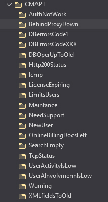

## СИСТЕМА ОПОВЕЩЕНИЙ или АЛЕРТИНГ

Система представляет собой программный код, чья основная задача, следующая из его названия — оповещать пользователя СМАРТа по определенным каналам связи об определенных событиях, 
происходящих на подконтрольных СМАРТу объектах в режиме реального времени с заданной частотой и случающихся при определенных условиях или комбинации условий на установках ИСС или онлайн-доступах. 

Используемые каналы связи — электронная почта (одна или несколько) и созданный для каждого пользователя СМАРТа (или нескольких в рамках одной организации-дистрибьютора) телеграмм-чат.

Система обучена распознавать немалое количество триггерных ситуаций на подконтрольных установках и/или онлайн-доступах, когда участие клиента-пользователя СМАРТа в сопровождении установок/доступов своих клиентов-пользователей ИСС становится в той иной степени насущным. 

Степень срочности участия варьируется от «информационный» до «критический». 

Получая тот или иной алерт по указанным каналам связи, пользователь СМАРТа сам решает насколько срочно необходимо вмешательство.

Настоятельно рекомендуется в используемом почтовом сервисе или почтовой программе, куда приходят алерты, настроить фильтрацию этих алертов из общей папки входящей почты (и тем более, если по какой-то причине такие письма падают в спам-папку) и автоматическую их последующую раскладку по тематически выделенным папкам (по типу алерта и/или по клиенту и/или по менеджеру этого клиента). 

Причина — проверенное на практике более удобное и оперативное восприятие поступающего алерта. 

Как следствие — его эффективная последующая обработка, более упорядоченное получение и хранение алертов.

### _Рис.1 – Пример фильтрации и тематической сортировки алертов средствами используемой почтовой программы._

_В данном случае используется почтовая программа Mozilla Thunderbird v.102.9.0. 
Были созданы папки в соответствии с названиями приходящих алертов, созданы правила фильтрации всей входящей почты. 
Правила проверяли тему письма И от кого письмо. 
Если письмо соответствовало обоим установленным правилам, то письмо переносилось в соответствующую папку и выделялось как непрочитанное для привлечения внимания._ 

Обращаю внимание, что:
-	количество создаваемых папок и правил сортировки входящей почты – сугубо индивидуально; 
-	на скриншоте отражены далеко не все алерты, так как папки и правила сортировки формировались в процессе использования СМАРТа.

Полный перечень всех алертов с их описаниями, используемых на момент написания данного Руководства вы найдете в [Приложении №1](000-appendix-1.md) к данному Руководству.

[Читай дальше](040-grafana.md)

[Вернуться к Оглавлению](Readme.md)
