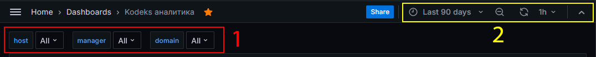
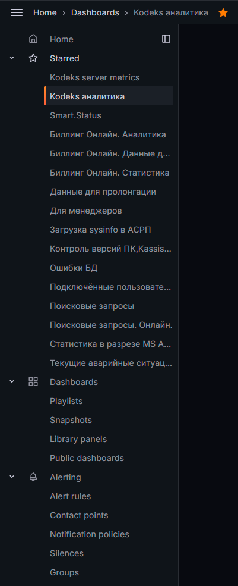
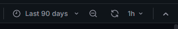
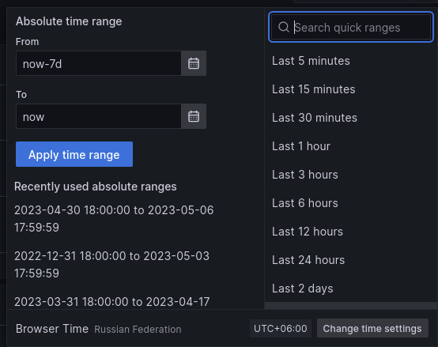

# Использование Grafana для визуализации данных

Рис.3 Настройки Grafana

Блок с Настройками предельно минималистичен и содержит все необходимое для комфортной работы пользователя СМАРТа с Grafana.

На рисунке выше настройки Grafana можно условно разделить 2 части:
1. Фильтры информации на дашбордах;
2. Ограничения по времени для фильтрации информации на дашбордах.

Фильтры информации используются для отсеивания/выделения типов конкретной информации на том или ином дашборде.
В зависимости от открытого дашборда наборы таких фильтров могут быть разные, а именно:
- Manager – менеджер пользователя СМАРТа, к которому принадлежит тот и иной объект, контролируемый СМАРТом, используется 
не на всех дашбордах;
- host - список адресов/объектов, поставленных под контроль СМАРТа;
- Domain – список всех, когда-либо попавших из отчетов sysinfo в СМАРТ, групп пользователей установок ИСС Кодекс/Техэксперт 
(фиксируется в ПК ИСС Кодекс/Техэксперт из Active Directory), используется не на всех дашбордах;
- Клиент - объект, который контролируется СМАРТом, используется не на всех дашбордах;
- Логин пользователя – учетная запись пользователя ПК ИСС Кодекс/Техэксперт, когда-либо попавшая в собранный отчет 
sysinfo и, соответственно, зафиксированная в Grafana, используется не на всех дашбордах;
- Response – метка об успешности или провале исполнения автоматической отправки собранных sysinfo в АСРП пользователя 
СМАРТа, используется только на дашборде «Загрузка sysinfo в АСРП»;
- Тип ошибки – список ВСЕХ созданных на момент написания этого Руководства алертов, доступных пользователю СМАРТа, 
используется только на дашборде «Текущие аварийные ситуации»;
- Приоритет – список приоритета алертов, используется только на дашборде «Текущие аварийные ситуации».

_По умолчанию все параметры будут в положении All_

Слева от графиков/таблиц того или иного открытого дашборда присутствует свеого рода оглавление.

Рис.3.2. – Настройки Grafana (дашборды).

Как видно из скриншота, левая панель содержит доступ ко всем дашбордам (ссылка Dashboards), быстрый доступ к "избранным" дашбордам,
те, которые помечены пиктограммой звезды, а также доступ к иным функциям Garfana.

По умолчанию всегда первым открывается дашборд "Кодекс аналитика", он же по умолчанию уже выделен как избранный.
При необходимости это свойство может быть изменено.
Настоятельно рекомендуется для повышения комфорта взаимодействия с Grafana практически все дашборды вывести в избранные 
(как это показано на скриншоте).
Экономия времени - краеугольный камень СМАРТа и одна из причин его возникновения вообще.

С течением времени и развитием СМАРТа будут появляться новые дашборды, рекомендуется также их добавлять в избранные.

Пиктограмма логотипа Grafana – клик по данной пиктограмме откроет страницу с установленным по умолчанию дашбордом, 
то есть откроется дашборд "Кодекс аналитика".

Здесь же, в левой панели, над оглавлением есть пиктограмма трех горизонтальных полос. Клик по этой пиктограмме скроет левую панель,
дав таким образом больше экранного места для самих графиков и таблиц того или иного дашборда.

Рядом с пиктограммой трех горизонтальных линий указан "путь" до открытого на данный момент дашборда (смотрим на скриншот выше).
Клик по ссылке "Home" откроет дашборд по умолчанию, т.е. "Кодекс аналитика".
Клик по ссылке "Dashbords" откроет список всех доступных дашбордов.
Клик по имени текущего открытого дашборда будет своего рода обновлением страницы (обновит дашборд).

На скриншоте выше части оглавления в одной строке с "Home" (там еще рядом с этим словом пиктограмма домика) есть пиктограмма закрепления 
левой панели. По умолчанию левая панель закреплена (склеена) с самой страницей и всегда отображается.
Как было описано выше, клик по пиктограмме трех горизонтальных полос принудительно уберет левую панель. Это будет иметь
эффект на любом дашборде.

Если же такое поведение левой панели неудобное, то можно кликнуть как раз по этой пиктограмме закрепления левой панели, и она
скроется с глаз долой. Клик снова по пиктограмме трех горизонтальных полос выведет левую панель теперь _*поверх*_ 
открытого в моменте дашборда.
Клик снова по пиктограмме закрепления левой панели вернет поведение левой панели к варианту "всегда закреплена слева",
которое является поведением по умолчанию.

## Управление временем в дашбордах

Рис.3.4. – Настройки Grafana (время).

Пиктограмма часов – клик по этой пиктограмме вызывает выпадающее меню, в котором возможно:
- выбрать свой период времени в полных сутках, в течение которого необходимо отразить тот или иной дашборд, или 
конкретный график/таблицу этого дашборда;
- выбрать предустановленные временные периоды, с точностью от прошедших 5 минут до 2 лет назад (при условии наличия исходной
информации для построения графиков/таблиц за такой давний период, иначе будет пусто);
- выбрать ранее отображенные временные периоды.

Слева и справа от отображаемого периода есть кнопки «влево» и «вправо» - клик по ним сместит выбранный период на 10 дней 
ранее («влево») или на 10 дней позднее («вправо), безотносительно того, был ранее задан свой период или выбран предустановленный.

 

Рис.3.5. – Настройки Grafana (время).

При назначении индивидуального периода времени следует нажать на кнопку «Apply time range», чтобы установленный период 
применился на открытом дашборде. 
При выборе предустановленного временного интервала, его применение происходит сразу же.
После применения желаемого временного периода Grafana сама автоматически обновит открытый дашборд на соответствие 
выбранному периоду, однако в некоторых случаях можно дополнительно обновить саму станицу, нажав F5 или Ctrl + F5 на клавиатуре.

Кроме того, имеется еще одна возможность назначения произвольного временного отрезка графическим способом. 
Способ работает только на графиках. 
Для этого:
- открыть необходимый дашборд и раскрыть в нем интересующий график, если он по умолчанию скрыт;
- с помощью мышки/тачпада на графике выделить интересующий отрезок, зажав и протащив курсор по желаемым временным границам;
- выбранный временной интервал применится сразу, как только выделение будет окончено.

Следует помнить, что графический метод выбора временного периода будет применен ко всем открытым графикам дашборда.
Если на момент выбора периода были отображены все графики дашборда - выбранный интервал примениться на всех графиках.
Если на момент выбора был раскрыт (через пункт View выпадающего меню при клике по названию графика) только конкретный 
график - выбранный период примениться только к нему.
При этом по клавише Esc для выхода из режима просмотра конкретного графика, новый период примениться ко всем 
графикам/таблицам выбранного дашборда.

Пиктограмма "Лупа" со знаком минус внутри - клик по этой пиктограмме означает расширение выбранного периода:
- на +10 дней в начале периода и +10 дней в конце периода, если был задан свой период времени;
- на следующую позицию вниз по списку предустановленных временных периодов, если был выбран один из них (укрупнение временного периода).

Пиктограмма "Круговые стрелки" - клик по этой пиктограмме произведет обновление текущего открытого дашборда. 
Можно применять самостоятельно эпизодически или при введении нового периода времени. 
Клик по кнопке рядом со стрелочкой вниз вызовет выпадающее меню, где можно выбрать периодичность автоматического обновления 
дашборда ("свою" периодичность задать нельзя, только выбрать из предложенного списка): от 5 секунд до 1 суток.

Клик по стрелке вверх, находящейся рядом настройкой автоматического автоообновления открытого дашборда приведет к тому, что
верхняя полоса с поисковой строкой будет скрыта.
Здесь же станет доступным пиктограмма монитора, с помощью которой можно использовать другие способы отображения дашбордов на экране.

Пиктограма "Монитор»" - клик по этой пиктограмме производит смену схем наполняемости текущего дашборда элементами управления и настройки. 

Существует 3 схемы:
- Схема «Полная» - отображаются все элементы управления и настройки, все таблицы и графики и наименование открытого дашборда, 
данная схема используется и отображается по умолчанию на всех дашбордах;
- Схема «Только наименование» - отображаются все графики и таблицы открытого дашборда, отображается наименование открытого 
дашборда, элементы управления и настройки не отображаются, кроме возможности поменять временной период, за который необходимо 
отобразить графики и таблицы дашборда, а также остальные элементы этого блока с настройками;
- Схема «Минималистичная» - отображаются только все графики и таблицы открытого дашборда и ничего больше.
Чтобы выйти из любого режима, отличающегося от «Полного» необходимо нажать кнопку Esc на клавиатуре – будет отображена схема «Полная».

Урезанные схемы отображения дашбордов целесообразно применять на презентациях либо для постоянной демонстрации на весь 
отдел какого-либо из дашбордов, как источник рабочей информации. 
Полноценную схему целесообразнее использовать для более индивидуальной работы непосредственно пользователем СМАРТа, 
для получения аналитической и статистической информации.

[А теперь переходим к самому важному - к ДАШБОРДАМ](060-dashboards)

[А если стало интересно как это внедрять, до того как это применять, то тебе сюда](050-intro-smartuload-smartstatus)

[Или может тебе стало интересно, что коллеги твои делают со СМАРТом, как применяют? Тогда тебе сюда](100-smart-real-cases-1.md)
[и сюда](000-fuckups.md)

[Вернуться к Оглавлению, если стало страшно](Readme.md)