# Внедрение СМАРТ-Мониторинга (smartupload) у клиентов

В данной главе описан процесс внедрения smartupload на установке у клиента-пользователя ИСС.
Процесс сей несложный, не требует каких-то специальных навыков и при "набитой руке" выполняется в среднем минут за 15-20, 
а то и быстрее.

СМАРТ-Мониторинг (smartupload) условно можно разделить на 2 части:
- скрипт smartupload.bat (для ОС Windows) или smartupload.sh (для ОС Linux);
- вспомогательная общедоступная бесплатная утилита Сurl.

Скрипт smartupload выполняет следующие функции:
- получение из текущей установки файла sysinfo;
- сохранение его в заданную для скрипта рабочую папку; 
- отправка в хранилище СМАРТ-Мониторинга для последующей обработки. 

Скрипт написан на языке shell cmd. 
Скрипт содержит в себе параметры, обеспечивающие сортировку файлов по дистрибьюторам-пользователям сервиса и установкам 
каждого конкретного дистрибьютора.

Скрипт работает вместе с утилитой Curl. 
Ее функционал - обеспечивать отправку собранного отчета sysinfo по заданному в скрипте адресу к хранилищу и обработчику СМАРТ-Мониторинга. 
Больше описания утилиты Curl можно найти тут https://ru.wikipedia.org/wiki/CURL или где угодно на просторах Интернета.

Весь процесс внедрения условно можно разделить на несколько этапов.
Для удобства навигации оглавление представлено ниже:

Процесс внедрения состоит из следующих этапов:
- [Подготовка скрипта smartupload, его размещение](051-smartupload-implementation-windows.md#подготовка-скрипта-smartupload)
- [Скачивание утилиты Curl](051-smartupload-implementation-windows.md#скачивание-утилиты-curl)
- [Разворачивание утилиты Curl, внедрение скрипта](051-smartupload-implementation-windows.md#разворачиваyие-утилиты-curl-внедрение-скрипта)
- [Тестовый запуск, оценка результатов запуска](051-smartupload-implementation-windows.md#тестовый-запуск-оценка-результатов-запуска)
- [Автоматизация исполнения скрипта](051-smartupload-implementation-windows.md#автоматизация-исполнения-скрипта)

Для целей эффективности и быстроты внедрения специалисту, выполняющему внедрение smartupload желательно быть на уровне 
Уверенного Пользователя ПК (для ОС Windows).

В случае затруднений всегда можно обратиться к разработчику СМАРТ-Мониторинга за консультацией и/или помощью с внедрением.

Процесс внедрения smartupload в ОС Windows и ОС Linux радикально ничем не отличается, однако имеет свои небольшие нюансы.

Если тебе нужно внедрить smartupload в ОС Windows, то читай [дальше.](051-smartupload-implementation-windows.md#подготовка-скрипта-smartupload)

Если тебе нужно внедрить smartupload в ОС Linux, то тебе [сюда.](052-smartupload-implementation-linux.md)

## Подготовка скрипта smartupload

Скрипт, ввиду его функционала, содержит исходные данные, индивидуальные для каждой конкретной установки и каждого дистрибьютора, которую необходимо 
поставить под контроль сервиса.

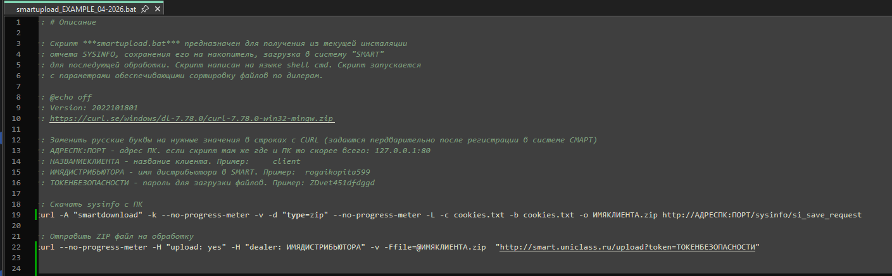

Как видно из скриншота - есть некоторые данные, которые необходимо поменять, заменив русские буквы на английские:
- АДРЕСПК:ПОРТ - здесь заменить на адрес ПК, на котором развернута установка, подлежащая мониторингу.
Адрес может быть как в виде IP-адреса, так и в виде имени компьютера в сети.

Этот параметр задается и контролируется дистрибьютором-пользователем сервиса.

Изменение этого параметра также необходимо проводить вручную самим дистрибьютором.

---

***ВАЖНО!!!*** 
Если скрипт размещается на физически той же машине, на которой развернут ПК ТЭ, то IP-адрес следует писать 
127.0.0.1:ПОРТ. 

---

- НАЗВАНИЕКЛИЕНТА - имя клиента для последующей корректной сортировки его обработчиком СМАРТ-Мониторинга и успешной идентификации 
его потом в Grafana на ее таблицах и графиках.

Этот параметр задается и контролируется дистрибьютором-пользователем сервиса.

Допускает использовать: 
- ТОЛЬКО английские буквы верхнего и нижнего регистра;
- цифры;
- спецсимволы, не противоречащие общим правилам для имен файлов в любой ОС (см. таблицу этих символов ниже).

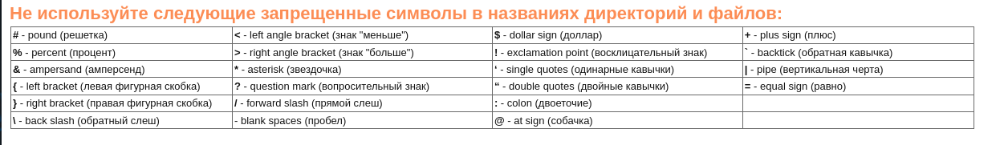

Имя должно быть максимально понятным и сходу однозначно трактуемым.

---

***ВАЖНО!!!*** 
Имя клиента здесь должно быть идентично имени клиента, подаваемого в *.csv файле разработчику СМАРТ-Мониторинга для регистрации в системе.
Иначе невозможно будет сопоставить отчеты из обработчика с графиками для такого клиента в Grafana.

----

- ИМЯДИСТРИБЬЮТОРА - имя дистрибьютора-пользователя сервиса, с которым заключен договор на СМАРТ-Мониторинг.
Этот параметр задается разработчиком СМАРТ-Мониторинга и передается пользователю сервиса для внесения в скрипты.

Этот параметр уникален для каждого дистрибьютора и не подлежит обмену между дистрибьюторами, во избежание путаницы.

Этот параметр в скриптах служит своего рода меткой, необходимой для корректной сортировки всех приходящих отчетов обработчиком 
СМАРТ-Мониторинга.

Параметр задается по маске XXXXYYYYYYYY, где:
    - XXXX это код дистрибьютора;
    - YYYYYYYY это краткое, но однозначно трактуемое имя дистрибьютора.

- ТОКЕНБЕЗОПАСНОСТИ - параметр, служащий проверочным ключом при сортировке и валидации поступающих в обработчик СМАРТ-Мониторинга отчетов.
Уникален для каждого дистрибьютора.
Един для всех скриптов СМАРТа у каждого дистрибьютора.
Не подлежит обмену между дистрибьюторами, так как может привести к нарушению процесса проверки и сортировки приходящих 
отчетов внутри обработчика СМАРТа.

Этот параметр задается и контролируется разработчиком СМАРТ-Мониторинга и передается пользователю сервиса для внесения последним этого 
параметра в скрипты СМАРТ-Мониторинга.

Подготовленный скрипт smartupload может находиться:
- на той же машине (виртуальной или физической), где развернут ПК К/ТЭ;
- где-то на локальной сети, в которой доступен ПК;

Для удобства и повышения быстродействия рекомендуется его размещать на той же машине, на которой развернут ПК К/ТЭ.
Можно даже в той же директории, где развернут ПК.
Работе самого ПК это НИКАК не помешает.

Для удобства и однозначности восприятия папку с файлами для smartupload рекомендуется так и назвать - smartupload.

НАСТОЯТЕЛЬНО рекомендуется в имени каталога для smartupload использовать ТОЛЬКО английские буквы, верхнего или нижнего 
регистра, без цифр, без спец.символов.

## Скачивание утилиты Curl

Вторая часть smartupload это утилита Сurl.
Ее функционал - отправлять собранный через smartupload отчет sysinfo по заданному маршруту в обработчик СМАРТ-Мониторинга.

Утилита Curl бесплатная и относится к категории свободного ПО.

Скачать ее можно с ее официального ресурса: https://curl.se/download.html

На странице представлены архивы и приложения для установки практически по всем известным или менее известным операционным средам, существующим на данный момент.

Для целей внедрения утилиты Curl рядом с smartupload необходимо скачать АРХИВ утилиты, подходящей под твою ОС.
Сохранить скачанный архив можно куда угодно на машине.

Для удобства поиска желаемого архива на сайте утилиты используй Crtl+F (для поиска по ключевым словам на странице сайта).

## Разворачивание утилиты Curl, внедрение скрипта

После загрузки архива, распакуй его там же, где лежит сам архив.
Далее нужно содержимое папки bin. Оно находится в разархивированном каталоге. Содержимое папки копируется в тот же каталог, 
в котором находится скрипт smartupload.
Должно по итогу это выглядеть вот так:

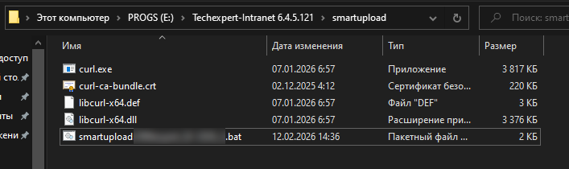

## Тестовый запуск, оценка результатов запуска

После того как нужные файлы были размещены в верных папках, необходимо произвести тестовый запуск и оценить его резальтат.

Алгоритм тестового прогона:
- Необходимо запустить командную строку Windows от имени администратора.

Для этого нажимаем кнопку "Пуск", далее в строке поиска приложения набираем cmd. 
В предложенных вариантах видим приложение cmd.exe, кликаем по нему правой кнопкой мыши и в выпавшем меню выбираем "Запуск от имени администратора".

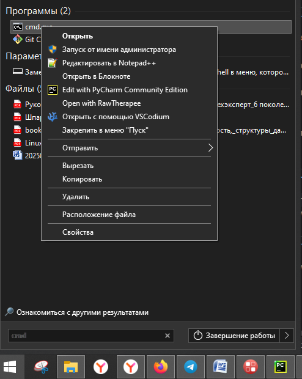

Откроется окно командной строки Windows с отображением активного пути по умолчанию (для администратора).
Нужно перейти в директорию, где лежит smartupload.bat, скорректированный под клиента.

Для этого нужно ввести следующую команду и нажать Enter:

cd /d <абсолютный путь до ПК\smartupload>

__Лайфхак__: чтобы вручную не вводить этот путь, его можно скопировать из Проводника и по клику правой кнопки мыши на курсоре 
в консоли скопировать из буфера этот путь. Так можно будет избежать очепяток в пути.

После того как командная строка покажет введеный путь (это будет означать что мы сейчас в нем "находимся"), то нужно далее
в этой строке где мигает курсор, ввести имя исполняемого скрипта smartupload и нажать Enter. Таким образом, будет подана
команда на исполнение этого скрипта с правами администратора с выводом процесса исполнения и результата прямо в этом же окне консоли.

__Лайфхак__: чтобы вручную не вводить имя скрипта и/или не копировать его имя из проводника, можно нажимая кнопку Tab на
клавиатуре, перебирать все файлы, находящиеся в этой папке и выполнить в итоге нужный на скрипт. Это позволит избежать
очепяток при ручном вооде или копировании.

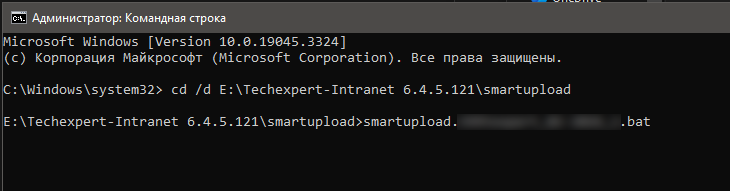

Путь на скриншоте показан как пример.

После нажатия кнопки Enter и "беготни" ("беготня" иногда будет замирать - это нормально) строк в итоге можно будет наблюдать вот такой результат:

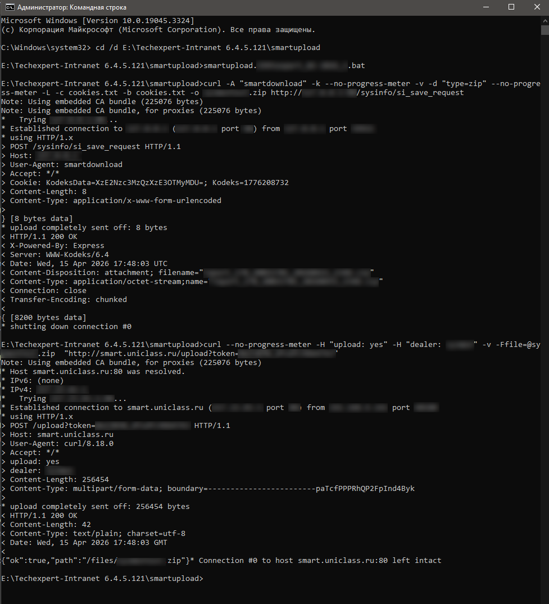

Как можно заметить, в результатах можно увидеть HTTP-коды результатов.
Если отображен код 200 - все ок, скрипт отработал успешно и полностью.
Далее можно ожидать отражение данных из отчета на графиках и таблица в Grafana (через некоторое время).

Если отображен код 404 или любой другой HTTP-код, говорящий о сетевых ошибках, то:
- проверить скрипт на предмет ошибок в адресе ПК и/или адресе куда отсылать собранный отчет;
- если в скрипте все верно, а выполнение все равно с ошибкой, то необходимо сделать скриншот и связаться с разработчиком 
СМАРТ-Мониторинга для дальнейшего решения проблемы.

Еще одним фактором успешной отработки скрипта является тот факт, что в той же папке, где находится скрипт, появились файлы: 
собранный отчет и файл cookies.txt.

При успешности выполнения этого этапа можно переходить к автоматизации последующего исполнения корректного скрипта по расписанию.

## Автоматизация исполнения скрипта

После того как первый тестовый запуск smartupload прошел успешно - можно этот процесс автоматизировать.

В ОС Windows это можно сделать с помощью стандартного средства самой ОС - Планировщик заданий.

Пуск -> Панель управления -> Администрирование -> Планировщик задач

Далее в планировщике необходимо создать задачу (не выбирать создать ПРОСТУЮ задачу!!!) со следующими настройками (см. картинки ниже):

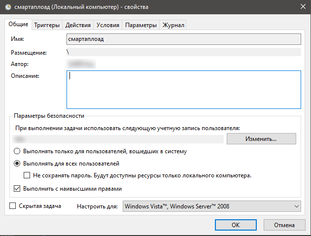

Обязательно выставить задачу smartupload на исполнение вне зависимости от пользователя и с наивысшими правами - 
при некоторых настройках групповых и локальных политик безопасности, программе может оказаться невозможно писать файлы в свою же папку.
Кроме того каждый запуск скрипта будет сопровождаться мелькающим на секунду окном консоли. Довольно быстро это начнет
раздражать пользователей самого ПК К/ТЭ и/или вызывать неудобные вопросы у системного администратора клиента.
Ни то, ни другое недопустимо.

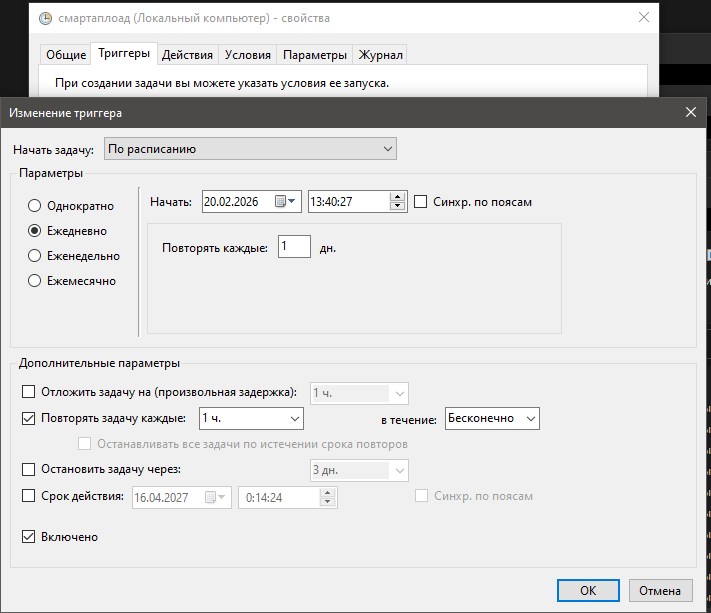

Периодичность выполнения задачи - каждый час, бесконечно.

Здесь важно выдержать хронометраж выполняемых фоновых заданий - чтобы задача smartupload не пересекалась с ежедневными 
процедурами самого ПК К/ТЭ: бэкап, перезапуск, обновление.
В эти моменты ПК может быть недоступен.

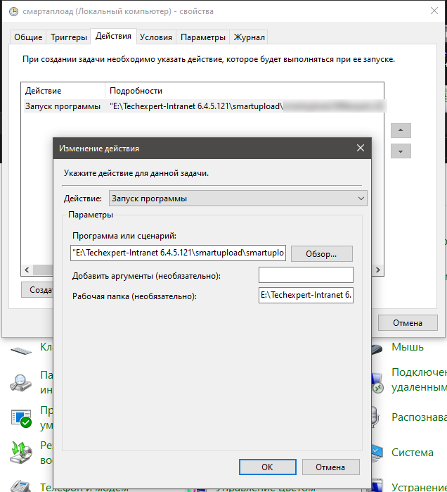

Здесь задается параметр того, что должно быть выполнено в рамках данной задачи - в нашем случае это "Запуск программы", 
а именно запуск smartupload.bat.

Пути указываются абсолютные.

---

**ВАЖНО!!!** Обязательно необходимо указать рабочую папку, в которой лежит сам файл smartupload.bat.
Если этого не сделать, то скрипт не сможет сохранить собранный отчет, и, следовательно, его отправить.
Таким образом, скрипт не будет работать как положено.

---

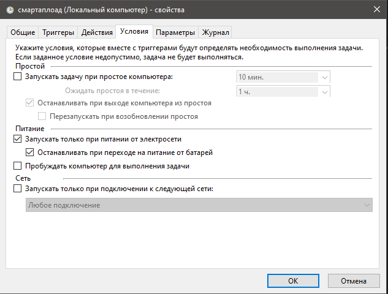

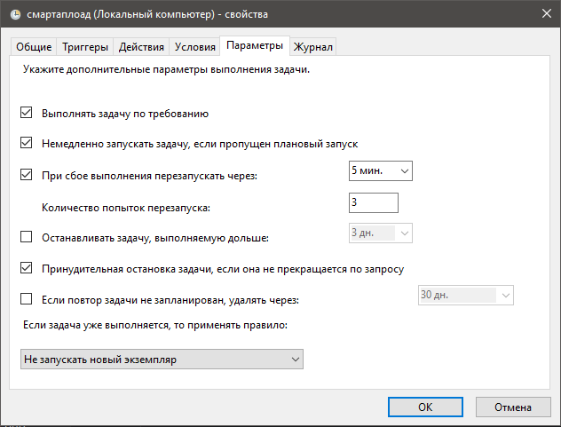

На этих двух скриншотах показано, какие еще должны быть выставлены условия для запуска и функционирования задачи.

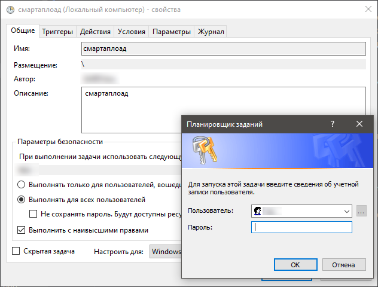

После всех настроек задачи система спросит пароль, если была выставлена галочка "Выполнять с наивысшими правами".

Если учетка, под которой заводилась задача, обладает локальными правами администратора, то ввести ее пароль.
Иначе - ввести имя и пароль такой учетки, чьи права позволяют завершить создание задачи в планировщике.

После постановки задачи, успешность ее исполнения можно отследить в журнале планировщика, а также в Grafana: спустя некоторое
время ам начнут строиться графики и таблицы на основе собираемого с такой установки отчета sysinfo.
Такое развитие событий будет означать, что все работает верно.

После загрузки sysinfo на сервер потребуется от 10 минут на его обработку.
На графиках обновлённые данные появятся где-то в этом промежутке.
Аварийные сообщения имеют различный период срабатывания\задержки поэтому появятся позднее.

[Вернуться к началу](050-intro-smartuload-smartstatus.md)

[Вернуться к Оглавлению, если стало страшно](Readme.md)

