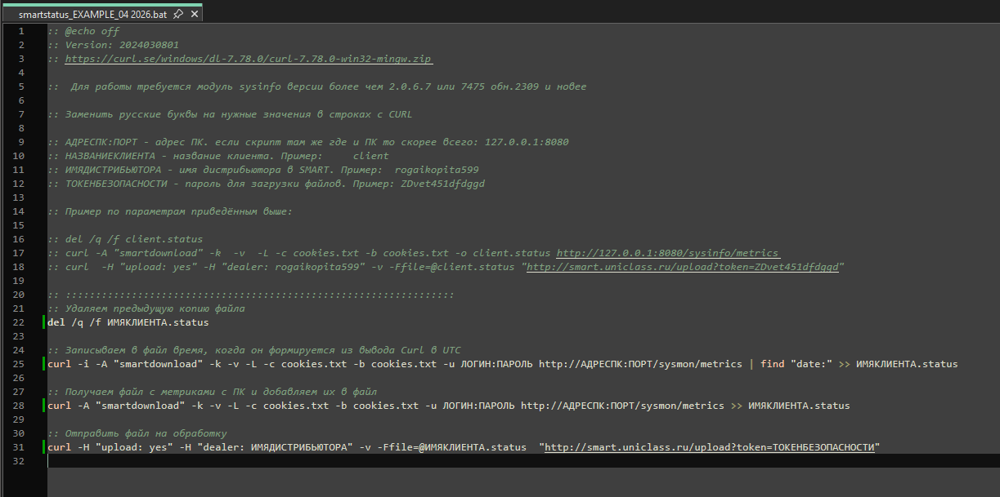
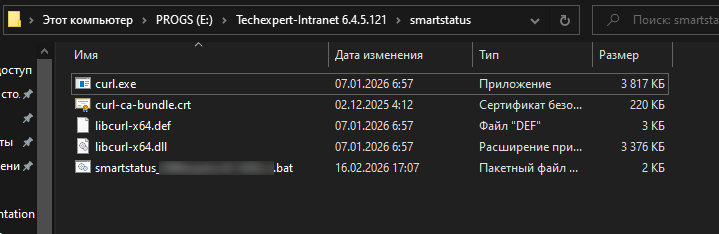
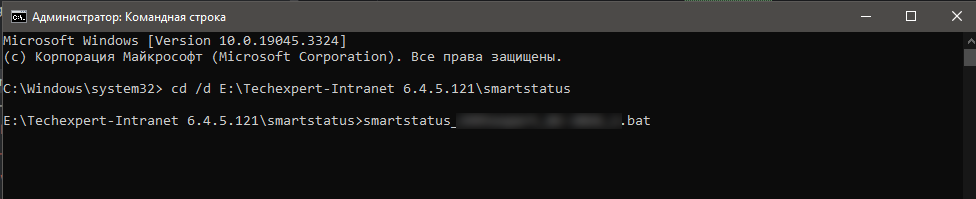
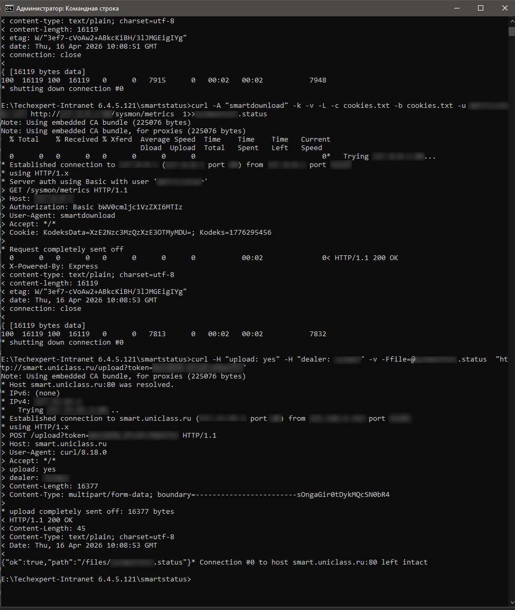
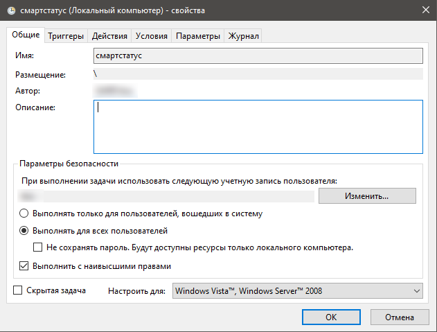
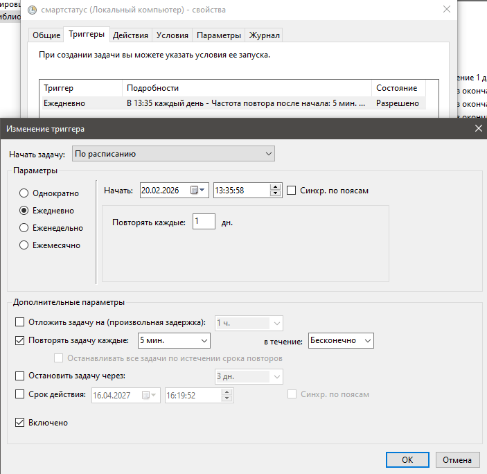
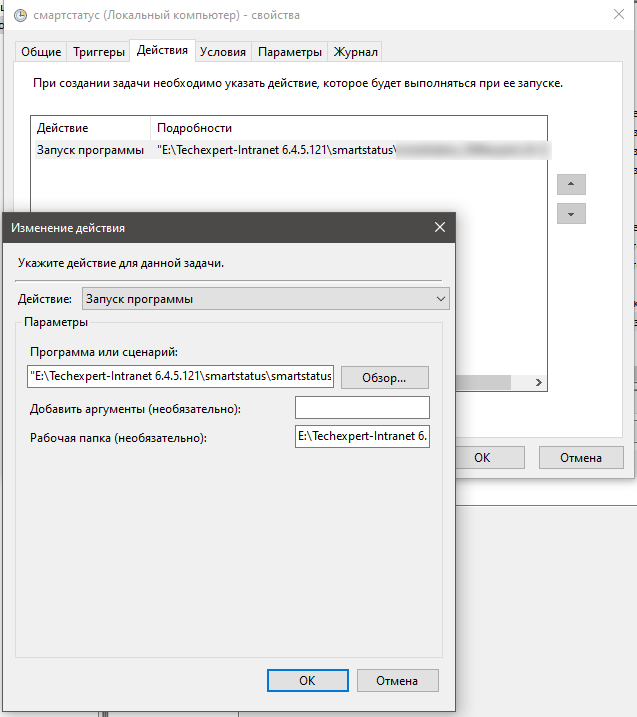
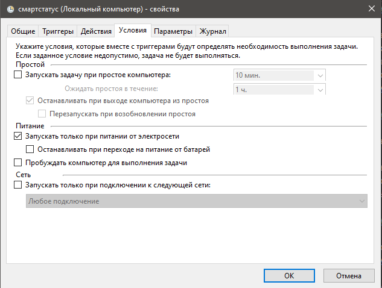
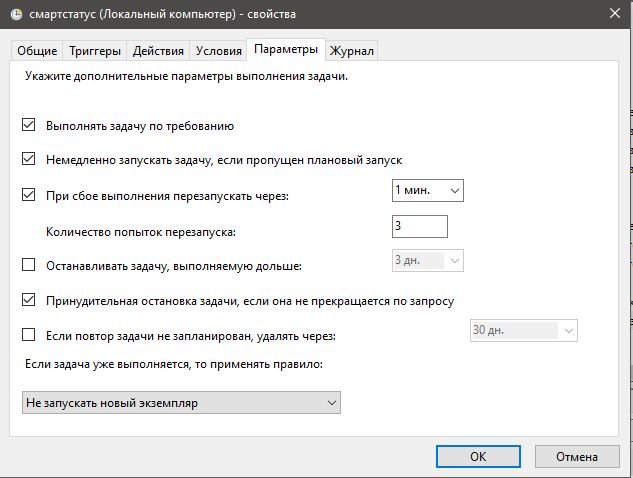
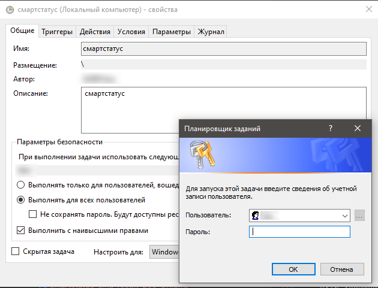

# Внедрение СМАРТ.Статус у клиентов в ОС Windows

Скрипт smartstatus.bat своим назначением призван собирать метрики о техническом (и не только) состоянии подконтрольной
установки с целью последующего оперативного контроля за "здоровьем" такой установки, а также с целью построения статистических
аналитических графиков и таблиц для оценки качества внедрения установки в бизнес процессы клиента и поиска точек допродаж.
Ранее необходимые метрики можно было получать из запроса к каталогу /sysinfo/metrics, однако количество получаемых оттуда метрик
было скудно и малоинформативно.

С первого квартала 2026 года программный комплекс ИСС Кодекс/Техэксперт получил новый отдельный модуль sysmon.knm aka 
Подсистема Мониторинга и если версия ПК К/ТЭ была 6.4.5.127 или новее, то через запрос к этой подсистеме стало возможно
получать кратно больше метрик о техническом (и не только) состоянии подконтрольной установки. Это нововведение открыло
путь к качественно новому уровню проактивного контроля за такими установками, и СМАРТ-Мониторинг оперативно эволюционировал
для эффективной работы с этой новой подсистемой и отдаваемыми ею метриками.

Скрипт smartstatus.bat основным своим назначением преследует цель отслеживания технического состояния подконтрольных установок, 
имеющих выход в интернет путем сбора метрик с модуля sysmon.

Под техническим состоянием здесь понимается:
- работает или нет ПК (доступен ли);
- корректно собрана или нет Главная Старинца ПК;
- имеются или нет ошибки в виртуальных каталогах, где собраны комплекты;
- имеется ли факт отказал в доступе для того или иного пользователя ТЭ (исчерпание р.м., количественно);
- и многие другие метрики.

Smartstatus отслеживает подконтрольные ему установки в режиме реального времени, каждые 15 минут, с задержкой до 10 минут, 
необходимой на обработку поступающих отчетов.

Функционал скрипта smartstatus:
- собирает необходимую информацию с самого ПК; 
- формирует свой собственный отчет на основе собранных данных;
- отправляет его на сервер СМАРТ-Мониторинга для последующей обработки.

Общий принцип внедрения скрипта smartstatus весьма похожа на [принцип внедрения smartupload](051-smartupload-implementation-windows.md).

Для работы скрипта в пару ему так же необходима утилита curl.

Кроме того, до внедрения smartstatus необходимо убедиться, что: 
- версия ПК К/ТЭ 6.4.5.127 или новее; 
- в административной панели развернут и настроен каталог /sysmon;
- в административной панели среди пользователей заведен пользователь smartlogin с правом доступа к метрикам из каталога /sysmon

Так же как и smartupload, smartstatus может работать как в ОС Windows, так и в ОС Linux.
Принципиальной разницы в скриптах в зависимости от ОС нет, есть нюансы в процессе внедрения, обусловленные самой ОС, но 
никак не скриптом.

Если нужно внедрить smartstatus в ОС Windows, то [читай дальше.](053-smartstatus-implementation-windows.md#подготовка-скрипта-smartstatus)

Если нужно внедрить smartstatus в ОС Linux, то [тебе сюда.](055-smartstatus-implemetation-linux.md)

## Подготовка скрипта smartstatus

Скрипт, ввиду его функционала, содержит исходные данные, индивидуальные для каждой конкретной установки, которую необходимо 
оставить под контроль smartstatus.

Как видно из скриншота, для подготовки скрипта нужно определить и заменить в самом скрипте некоторые входные данные:
- ИМЯКЛИЕНТА - имя клиента, установку которого необходимо поставить под контроль smartstatus.

---

**СТРОГО ОБЯЗАТЕЛЬНО** использовать такое же название клиента, которое использовалось при внедрении smartupload.
Эта рекомендация обусловлена сквозным именованием клиента в Grafana и соотнесения с данными от smartupload в рамках одного клиента.
Т.е. чтобы видеть картину целиком по одному клиенту с обоих "сторон".

---

С точки зрения функционирования обоих скриптов совершенно все равно какое будет ИМЯКЛИЕНТА, если только имя не 
противоречит общим правилам именования файлов в любой ОС.

Этот параметр задается и контролируется пользователем СМАРТ-Мониторинга.

- АДРЕСПК:ПОРТ - здесь заменить на адрес ПК, на котором развернута установка, подлежащая контролю с помощью smartstatus.
Адрес может быть как в виде IP-адреса, так и в виде имени компьютера в сети.
Этот параметр задается и контролируется пользователем СМАРТ-Мониторинга.

Если с течением времени возникла необходимость поменять порт, через который должен будет работать ПК, 
то после его замены в административной части самого ПК, актуальный порт также необходимо прописать и в этом скрипте вручную.
- ЛОГИН:ПАРОЛЬ - здесь вписывается тот логин и паролль, которым дан доступ к метрикам в административной части ПК.
Не указывать это нельзя, потому что сама парадигма работы Подсистемы Мониторинга архитектурно так устроена, что доступ к метрикам
должен быть строго идентифицированному и легальному пользователю и только тому, кто имеет право на этом.

Этот параметр задается и контролируется пользователем СМАРТ-Мониторинга.

- ИМЯДИСТРИБЬЮТОРА - наименование предприятия-дистрибьютора, с которым заключен договор на СМАРТ-Мониторинг.
Этот параметр уникален для каждого дистрибьютора, задается (и контролируется) разработчиком СМАРТ-Мониторинга и передается 
пользователю СМАРТ-Мониторинга для внесения в скрипты.

Этот параметр в скриптах служит своего рода меткой, необходимой для корректной сортировки всех приходящих отчетов 
обработчиком СМАРТ-Мониторинга между всеми действующими пользователями СМАРТ-Мониторинга.

Параметр задается по маске XXXXYYYYYYYY, где:
    - XXXX это код дистрибьютора;
    - YYYYYYYY это краткое, но однозначно трактуемое имя дистрибьютора.

Обмен этим параметром между дистрибьюторами запрещен, так как может привести к нарушению процесса проверки и сортировки 
приходящих отчетов внутри обработчика СМАРТ-Мониторинга.

- ТОКЕНБЕЗОПАСНОСТИ - параметр, служащий проверочным ключом при сортировке и валидации поступающих на обработку отчетов.

Этот параметр уникален для каждого дистрибьютора, задается (и контролируется) разработчиком СМАРТ-Мониторинга и передается 
пользователю СМАРТ-Мониторинга для внесения в скрипты.

Един для всех скриптов СМАРТ-Мониторинга у каждого дистрибьютора.

Обмен этим параметром между дистрибьюторами запрещен, так как может привести к нарушению процесса проверки и сортировки 
приходящих отчетов внутри обработчика СМАРТ-Мониторинга.

Подготовленный скрипт smartstatus может находиться:
- на той же машине (виртуальной или физической), где развернут ПК;
- где-то на локальной сети, в которой доступен ПК;
ОС не имеет значения.

Для удобства и повышения быстродействия рекомендуется его размещать на той же машине, на которой развернут ПК.
Можно даже в той же директории, где развернут ПК.
Работе самого ПК это НИКАК не помешает.

Для удобства и однозначности восприятия папку с файлами для smartstatus рекомендуется так и назвать - smartstatus.

НАСТОЯТЕЛЬНО рекомендуется в имени каталога для smartstatus использовать ТОЛЬКО английские буквы, верхнего или нижнего 
регистра, без цифр, без спец.символов.

## Разворачиваyие утилиты Curl, внедрение скрипта

Для разворачивания утилиты Curl можно и нужно использовать ту же последовательность действий, которая [описана для smartupload.](051-smartupload-implementation-windows.md#разворачивание-утилиты-curl-внедрение-скрипта) 

В итоге должно получится вот такое:

## Тестовый запуск, оценка результатов запуска

После того как размещение успешно выполнено, можно попробовать запустить скрипт smartstatus.bat (запускать от имени 
администратора) и оценить результаты тестового запуска.

Что делаем:
- Необходимо запустить командную строку Windows от имени администратора.

Для этого нажимаем кнопку "Пуск", далее в строке поиска приложения набираем cmd. 
В предложенных вариантах видим приложение cmd.exe, кликаем по нему правой кнопкой мыши и в выпавшем меню выбираем "Запуск 
от имени администратора".

Откроется окно командной строки Windows с отображением активного пути по умолчанию (для администратора).
Нужно перейти в директорию, где лежит smartstatus.bat, скорректированный под клиента.

Для этого нужно ввести следующую команду и нажать Enter:

cd /d <абсолютный путь до ПК\smartstatus>

__Лайфхак__: чтобы вручную не вводить этот путь, его можно скопировать из Проводника и по клику правой кнопки мыши на курсоре 
в консоли скопировать из буфера этот путь. Так можно будет избежать очепяток в пути.

После того как командная строка покажет введенный путь (это будет означать что мы сейчас в нем "находимся"), то нужно далее
в этой строке, где мигает курсор, ввести имя исполняемого скрипта smartstatus и нажать Enter. Таким образом, будет подана
команда на исполнение этого скрипта с правами администратора с выводом процесса исполнения и результата прямо в этом же окне консоли.

__Лайфхак__: чтобы вручную не вводить имя скрипта и/или не копировать его имя из проводника, можно нажимая кнопку Tab на
клавиатуре, перебирать все файлы, находящиеся в этой папке и выполнить в итоге нужный на скрипт. Это позволит избежать
очепяток при ручном вводе или копировании.

Путь на скриншоте показан как пример.

После нажатия кнопки Enter и "беготни" ("беготня" иногда будет замирать - это нормально) строк в итоге можно будет наблюдать вот такой результат:

Как можно заметить, в результатах можно увидеть HTTP-коды результатов.
Если отображен код 200 - все ок, скрипт отработал успешно и полностью.
Далее можно ожидать отражение данных из отчета на графиках и таблица в Grafana (через некоторое время).

Если отображен код 404 или любой другой HTTP-код, говорящий о сетевых ошибках, то:
- проверить скрипт на предмет ошибок в адресе ПК и/или адресе куда отсылать собранный отчет;
- если в скрипте все верно, а выполнение все равно с ошибкой, то необходимо сделать скриншот и связаться с разработчиком 
СМАРТ-Мониторинга для дальнейшего решения проблемы.

Еще одним фактором успешной отработки скрипта является тот факт, что в той же папке, где находится скрипт, появились файлы: 
собранный отчет с расширением *.status и файл cookies.txt.

При успешности выполнения этого этапа можно переходить к автоматизации последующего исполнения корректного скрипта по расписанию.

## Автоматизация исполнения скрипта

После того как первый тестовый запуск smartupload прошел успешно - можно этот процесс автоматизировать.

В ОС Windows это можно сделать с помощью стандартного средства самой ОС - Планировщик заданий.

Пуск -> Панель управления -> Администрирование -> Планировщик задач

Далее в планировщике необходимо создать задачу (не выбирать создать ПРОСТУЮ задачу!!!) со следующими настройками (см. 
картинки ниже):

Обязательно выставить задачу smartstatus на исполнение вне зависимости от пользователя и с наивысшими правами - 
при некоторых настройках групповых и локальных политик безопасности, программе может оказаться невозможно писать файлы в свою же папку.
Кроме того каждый запуск скрипта будет сопровождаться мелькающим на секунду окном консоли. Довольно быстро это начнет
раздражать пользователей самого ПК К/ТЭ и/или вызывать неудобные вопросы у системного администратора клиента.
Ни то, ни другое недопустимо.

Периодичность выполнения задачи - каждые 15 минут, бесконечно.

Здесь важно выдержать хронометраж выполняемых фоновых заданий - чтобы задача smartstatus не пересекалась с ежедневными 
процедурами самого ПК К/ТЭ: бэкап, перезапуск, обновление.
В эти моменты ПК может быть недоступен.

Здесь задается параметр того, что должно быть выполнено в рамках данной задачи - в нашем случае это "Запуск программы", 
а именно запуск smartstatus.bat.

Пути указываются абсолютные.

---

**ВАЖНО!!!** Обязательно необходимо указать рабочую папку, в которой лежит сам файл smartstatus.bat.
Если этого не сделать, то скрипт не сможет сохранить собранный отчет, и, следовательно, его отправить.
Таким образом, скрипт не будет работать как положено.

---

На этих двух скриншотах показано, какие еще должны быть выставлены условия для запуска и функционирования задачи.

После всех настроек задачи система спросит пароль, если была выставлена галочка "Выполнять с наивысшими правами".

Если учетка, под которой заводилась задача, обладает локальными правами администратора, то ввести ее пароль.
Иначе - ввести имя и пароль такой учетки, чьи права позволяют завершить выставление задачи в планировщик.

После постановки задачи, успешность ее исполнения можно отследить в журнале планировщика, а также спросив разработчика 
СМАРТа о регулярности поступления отчетов с этой установки.
Кроме того, если по этой установке стали строиться графики в Grafana - значит все верно настроено.

После загрузки отчета на сервер потребуется от 10 минут на его обработку.
На графиках обновлённые данные появятся где-то в этом промежутке.
Аварийные сообщения имеют различный период срабатывания\задержки поэтому появятся позднее.

[Вернуться к началу](050-intro-smartuload-smartstatus.md)

[Вернуться к Оглавлению, если стало страшно](Readme.md)