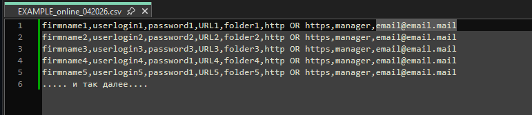

# Внедрение СМАРТ.Онлайн у клиентов

Здесь не потребуется никаких технических или других особых навыков.
Не потребуется ничего делать на устройствав клиента, с которых он обычно осуществляет вход в свой онлайн-Техэксперт.

Здесь потребуется только заполнить csv-файл с данными по адресам тех онлайн-доступов, которые необходимо отслеживать.

[Шаблон csv-файла можно скачать тут](https://disk.yandex.ru/d/KsVJ2Cj0-wrSVg)

- firm1, firm2, firm3....firmN - краткое наименование клиента (юр.лицо), кто является пользователем онлайн-доступа.
Можно использовать кириллицу, латиницу, верхний и нижний регистр, цифры и спец.символы в количестве и качестве,
не противоречащем здравому смыслу и однозначности трактовки имени.

Помни, что это имя потом будет отражено на гарфиках и таблицах Grafana  и чем короче и понятнее будет имя, тем проще, 
легче и однозначнее оно будет опознано в Grafana.

Не усложняй себе жизнь, где это не нужно.

- user1, user2, user3.....userN - логин для входа в онлайн-доступ.
Выдается ДЦ при регистрации клиента как пользователя онлайн-доступа.
- password1, password2, password3....passwordN - пароль для входа в онлайн-доступ.
Выдается ДЦ при регистрации клиента как пользователя онлайн-доступа.
- URL1, URL2, URL3.....URLN - веб-адрес для входа в онлайн-доступ.
Выдается ДЦ при регистрации клиента как пользователя онлайн-доступа.
Из выданного ДЦ полного веб-адреса формата "поддомен.домен.зона/каталог" сюда вписать только "поддомен.домен.зона".
- folder1, folder2, folder3.....folderN - часть веб-адреса для входа в онлайн-доступ.
Выдается ДЦ при регистрации клиента как пользователя онлайн-доступа.
Из выданного ДЦ полного веб-адреса формата "поддомен.домен.зона/каталог" сюда вписать только "каталог" (без /).
- http - остается неизменным, если только полный веб-адрес, выдаваемый ДЦ, не содержит https, тогда заменить соответственно.
- менеджер - вписать менеджера, ответственного за указанного клиента.
Если помимо СМАРТ.Онлайн было внедрение smartupload и/или smartstatus и в СМАРТ заводился этот менеджер как пользователь СМАРТа - использовать его же в этом параметре.
Менеджеров может быть больше чем один.
- email@email.ru - вписать e-mail менеджера, ответственного за указанного клиента.
Если помимо СМАРТ.Онлайн было внедрение smartupload и/или smartstatus и в СМАРТ заводился этот менеджер как пользователь СМАРТа - использовать его же в этом параметре.
Электронных почт, равно как и менеджеров, может быть больше чем один.
Главное не перепутать их между собой.
На указанные почты будут приходить алерты, касающиеся контроля за онлайн-доступами.

Заполнять файл настоятельно рекомендуется в простых текстовых редакторах, среди функций которых есть возможность выставления кодировки - должна быть UTF-8.
НЕ РЕКОМЕНДУЕТСЯ для заполнения файла использовать Microsoft Excel или его аналоги, так как велик риск, что кодировка будет изменена, 
и последующая обработка файла СМАРТом может быть некорректной.
НЕ РЕКОМЕНДУЕТСЯ между или вместо запятых вставлять пробелы и/или иные знаки препинания - это нарушает форму и успешность обработки файла СМАРТом.

Заполненный файл следует передать разработчику СМАРТа в твоем личном с ним чате техподдержки, чтобы он загрузил его в обработчик СМАРТа для последующей обработки 
и построения графиков и таблиц в дашборде [Биллинг. Онлайн.](063-billing-online-statistics.md)

[Вернуться к началу](050-intro-smartuload-smartstatus.md)

[Вернуться к Оглавлению, если стало страшно](Readme.md)
