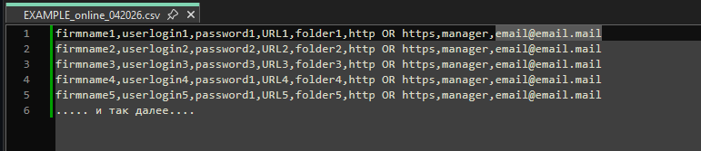

# Внедрение СМАРТ.Онлайн у клиентов

Disclaimer: в этом разделе идет речь о простых онлайн-доступах для пользователей ИСС Кодекс/Техэксперт. Под этими доступами
подразумеваются онлайн-доступы, развернутые на серверах разработчика ИСС Кодекс/Техэксперт.
В ином случае, если пользователю ИСС Кодекс/Техэксперт предоставляется онлайн-доступ, но развернут он в ЦОД самого дистрибьютора,
то для постановки такого клиента под контроль СМАРТ-Мониторинга следует перейти к [соответствующей главе.](056-smartupload-implementation-TEcloud.md)

Для постановки под контроль СМАРТ-Мониторинга простых онлайн-доступов не потребуется никаких технических или других особых навыков.
Также не потребуется ничего делать на компьютерах клиента, с которых он обычно осуществляет вход в свой онлайн-Техэксперт.
Единственное, что, возможно, требуется сделать на компьютере пользователя онлайн-доступа в его Техэксперт это сделать закладки 
в браузере и/или ярлыки на рабочий стол для цели быстрого входа. Но эта задача не относится к СМАРТ-Мониторингу, равно
как не может быть им проконтролирована напрямую.

Для постановки под контроль СМАРТ-Мониторинга онлайн-доступов клиента необходимо заполнить csv-файл с данными по адресам 
тех онлайн-доступов, которые необходимо отслеживать.

[Шаблон csv-файла можно скачать тут](https://disk.yandex.ru/d/89F_Ngh3c_gHVQ)

- firmname1, firmname2, firmname3....firmN - краткое наименование клиента (юр.лицо), кто является пользователем онлайн-доступа.
Можно использовать кириллицу, латиницу, верхний и нижний регистр, цифры и спецсимволы в количестве и качестве,
не противоречащем здравому смыслу и однозначности трактовки имени.

При именовании клиента следует помнить, что это имя потом будет отображаться на графиках и таблицах в Grafana, поэтому
крайне не рекомендуется делать имя слишком длинным и/или сложновыдуманным.

- userlogin1, userlogin2, userlogin3.....userN - логин для входа в онлайн-доступ.
Выдается ДЦ при регистрации клиента как пользователя онлайн-доступа.
- password1, password2, password3....passwordN - пароль для входа в онлайн-доступ.
Выдается ДЦ при регистрации клиента как пользователя онлайн-доступа.
- URL1, URL2, URL3.....URLN - веб-адрес для входа в онлайн-доступ.
Выдается ДЦ при регистрации клиента как пользователя онлайн-доступа.
Из выданного ДЦ полного веб-адреса формата "поддомен.домен.зона/каталог" сюда вписать только "поддомен.домен.зона".
- folder1, folder2, folder3.....folderN - часть веб-адреса для входа в онлайн-доступ.
Выдается ДЦ при регистрации клиента как пользователя онлайн-доступа.
Из выданного ДЦ полного веб-адреса формата "поддомен.домен.зона/каталог" сюда вписать только "каталог" (без /).
- http OR https - следует оставить тот протокол, который присутствует в выданном ДЦ адресе.
- manager - вписать менеджера, ответственного за указанного клиента.
Если помимо СМАРТ.Онлайн было внедрение smartupload и/или smartstatus и в СМАРТ заводился этот менеджер как пользователь 
СМАРТа - использовать его же в этом параметре. Менеджеров на одного дистрибьютора может быть больше чем один.
- email@email.mail - вписать e-mail менеджера, ответственного за указанного клиента.
Если помимо СМАРТ.Онлайн было внедрение smartupload и/или smartstatus и в СМАРТ заводился этот менеджер как пользователь 
СМАРТа - использовать его же в этом параметре. Электронных почт, равно как и менеджеров, может быть больше чем один.
Главное не перепутать их между собой.
На указанные почты будут приходить алерты, касающиеся контроля за указанными онлайн-доступами.

Заполнять файл настоятельно рекомендуется в простых текстовых редакторах, среди функций которых есть возможность выставления 
кодировки - должна быть UTF-8.

---

***ВАЖНО!!!***
НЕ РЕКОМЕНДУЕТСЯ для заполнения файла использовать Microsoft Excel или его аналоги, так как велик риск, что кодировка будет 
изменена, и последующая обработка файла СМАРТом может быть некорректной.
НЕ РЕКОМЕНДУЕТСЯ между или вместо запятых вставлять пробелы и/или иные знаки препинания - это нарушает форму и успешность 
обработки файла СМАРТом.

---

Заполненный файл следует передать разработчику СМАРТа в твоем личном с ним чате техподдержки, чтобы он загрузил его в 
обработчик СМАРТа для последующей обработки и построения графиков и таблиц в дашборде [Биллинг. Онлайн.](063-billing-online-statistics.md)

[Вернуться к началу](050-intro-smartuload-smartstatus.md)

[Вернуться к Оглавлению, если стало страшно](Readme.md)
