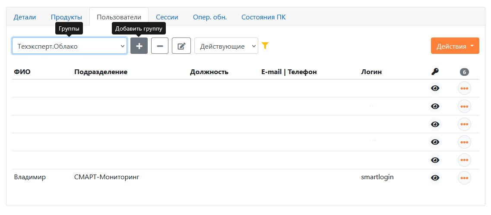
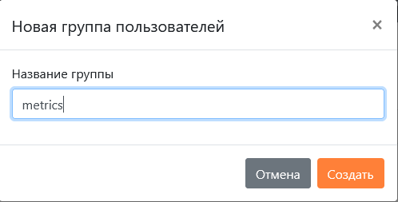
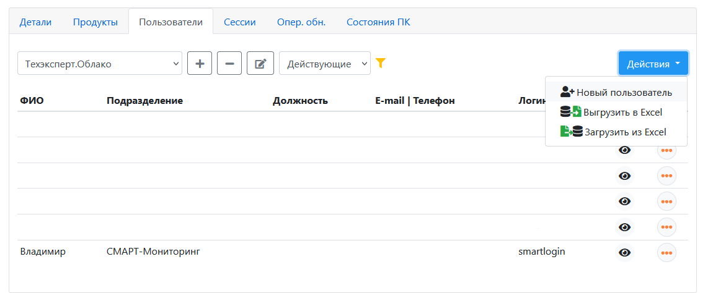
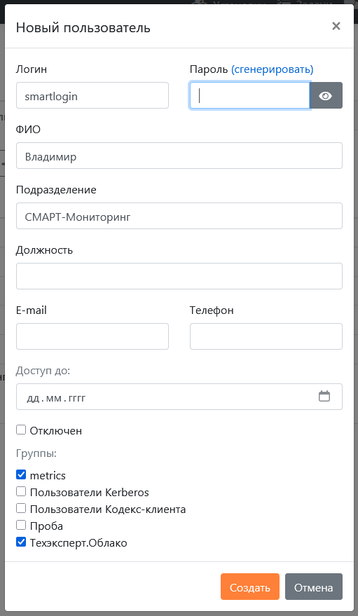
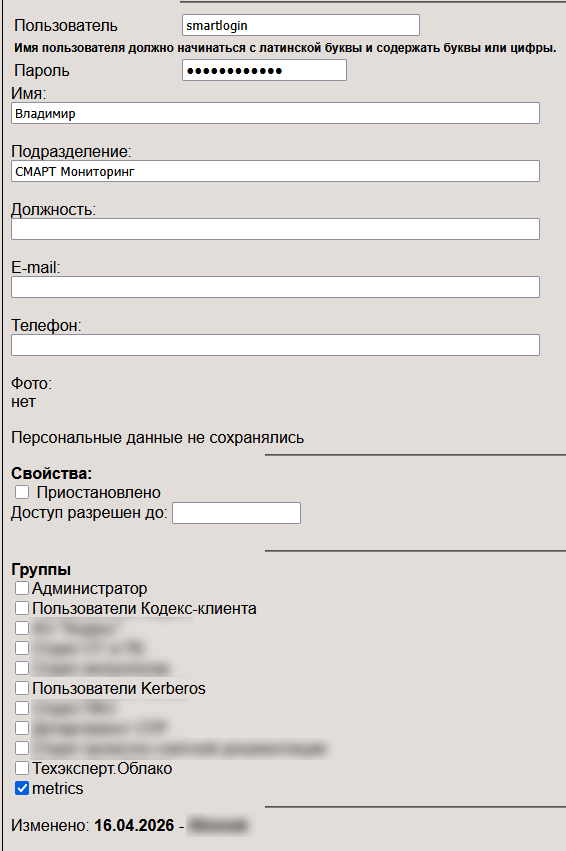
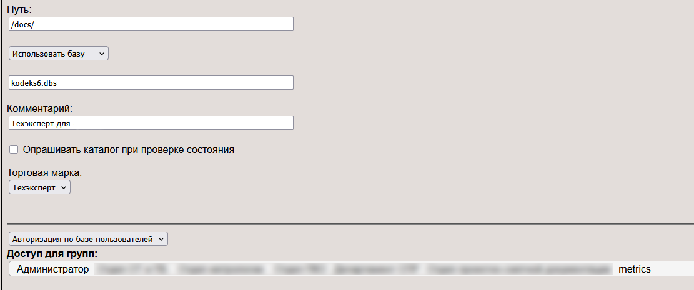
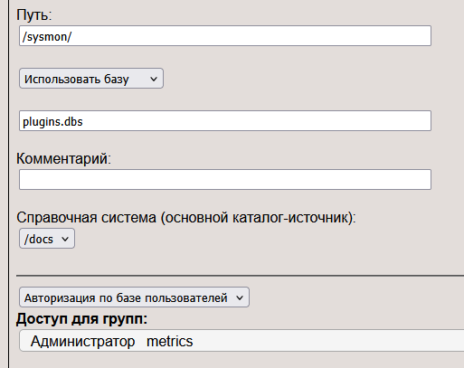
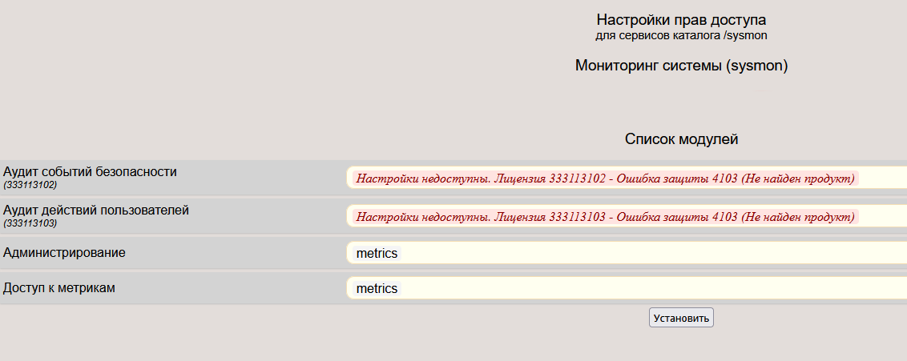

# Внедрение СМАРТ-Мониторинга на установке, размещенной в сервисе "Техэксперт.Облако"

---

__Disclaimer:__ здесь и далее по состоянию на середину апреля пойдет речь только том, как настроить сбор sysinfo с облачных
установок. Сбор метрик через Подсистему Мониторинга с таких установок сейчас (16.04.2026) находится в активной разработке
и будет реализован в рамках весны 2026 года. Тем не менее, в рамках настроек ниже будут предприняты шаги к подготовке
сбора метрик с облачных установок, пусть даже самого такого функционала со стороны СМАРТ-Мониторинга еще не реализовано
на коммерческой основе.

To be concluded...

---

В связи с тем что сервис "Техэксперт.Облако" активно развивается, в том числе в части удобства личного кабинета каждого
дистрибьютора, являющегося пользователем такого сервиса, постановка таких "облачных" объектов под контроль СМАРТ-Мониторинга 
имеет свои особенности. Однако, для реализации внедрения не требуется никаких особых знаний и/или технических навыков, отличных 
от уровня просто пользователя компьютера.

До момента когда нужно "облачную" установку поставить под контроль СМАРТ-Мониторинга, подразумевается, что она там корректно
развернута, настроена в соответствии с условиями договора на такую установку с клиентом дистрибьютора.

Шаблон файла можно [найти здесь.](https://disk.yandex.ru/d/RmdbcB8n1xwSNA)

Как заполнять такой файл, [можно почитать здесь.](058-smart-implementation-experience-tech.md#как-заполнять-файлы-managersexamplecsv-и-onlineexamplecsv)

После того как csv-файл из ссылки выше был корректно заполнен, но до отправки его разработчику
СМАРТ-Мониторинга нужно провести минимальные настройки самой "облачной" установки, чтобы она могла отдавать данные в
СМАРТ-Мониторинг, после того как обработчик СМАРТ-Мониторинга начнет их запрашивать, основываясь на том самом заполненном 
файле.

---

***ПРИМЕЧАНИЕ***
До относительно недавнего момента на "облаках" у дистрибютора-пользователя этого сервиса была возможность по умолчанию
зайти в административную панель Техэксперта и производить там необходимые действия. Потом эту возможность убрали, но могут
организовать по запросу, если будет создано соответствующее обращение в техподдержку сервиса "Техэксперт.Облако".
При этом немалую (но не всю и работы в этом направлении продолжаются) часть функционала из административной панели отразили 
в личном кабинете сервиса.
Поэтому далее алгоритм будет отражать оба пути настройки внедрения.

---

### Алгоритм (если нет прямого доступа к административной панели И версия ПК там 6.4.5.127 или новее):

1. Создать группу пользователей metrics

2. Создать пользователя smartlogin (пароль от него генерируется ТОЛЬКО разработчиком СМАРТ-Мониторинга), заполнить карточку
пользователя по примеру ниже:

---

***ВАЖНО!!!*** Пользователь smartlogin должен быть обязательно включен И в группу "Техэксперт.Облако" или в группу "Администратор" 
или в иную группу, имеющую доступ к каталогу /docs, И в группу metrics, для корректной работы СМАРТ-Мониторинга.

---

3. Написать запрос в Техподдержку сервиса "Техэксперт.Облако" о том, чтобы они к каталогу /docs и каталогу /sysmon дали
дали доступ новой группе.
4. Ожидать ответа Техподдрежки об успешности выполнения задачи.
5. Отправить разработчику СМАРТ-Мониторинга заполненный csv-файл.
6. Через некоторое время наблюдать в Grafana как стали наполняться графики и таблицы данными с такой установки. 

Вот и все :)

### Алгоритм (если есть прямой доступ к административной панели И версия ПК там 6.4.5.127 или новее):

1. Убедиться, что версия ПК 6.4.5.127 или свежее, если это не так, то обеспечить апгрейд версии стандартными средствами 
в личном кабинете "Техэксперт.Облако".
2. Пройти по адресу http://АДРЕСУСТАНОВКИ:ПОРТ/admin, где:
АДРЕСУСТАНОВКИ:ПОРТ - адрес облака, который по умолчанию формируется как ХХХХХХ.te-cloud.ru (ХХХХХХ здесь это рег.номер 
клиента без префикса дистрибьютора)
3. Перейти слева по ссылке "Группы" и создать группу metrics
4. Перейти слева в раздел "Пользователи" и создать нового пользователя smartlogin по примеру ниже, добавив его только в группу metrics:

---

***ВАЖНО!!!*** Пользователь smartlogin должен быть обязательно включен И в группу "Техэксперт.Облако" или в группу "Администратор" 
или в иную группу, имеющую доступ к каталогу /docs, И в группу metrics, для корректной работы СМАРТ-Мониторинга.

---

5. Убедиться что у группы metrics есть право доступа к каталогу /docs и к каталогу /sysmon, а также эта группа имеет доступ к метрикам:

6. Отправить разработчику СМАРТ-Мониторинга заполненный csv-файл.
7. Через некоторое время наблюдать в Grafana как стали наполняться графики и таблицы данными с такой установки. 

Вот и все. :)

[Вернуться к началу](050-intro-smartuload-smartstatus.md)

[Вернуться к Оглавлению, если стало страшно](Readme.md)
