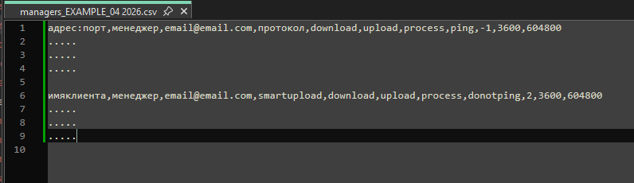

# Подготовка к внедрению. Рекомендации для технических специалистов

Коллега.

До того как начинать процесс внедрения СМАРТ-Мониторинга, тебе необходимо знать информацию о том, а какие именно клиенты должны оказаться
под его контролем.
Эту информацию тебе должны принести менеджеры по сопровождению/сбыту (ну или ты сам собираешь ее исходя из рекомендаций
[вот отсюда.)](057-smart-implementation-experience-manager.md)
Ну хотя бы имена юр.лиц.
Может быть они даже дадут тебе информацию о том, какой именно формат предоставления системы тот или иной клиент использует
или апробирует:
- простой ли онлайн (в количестве скольки доступов, адреса доступов, логины-пароли к этим доступам);
- сетевая ли установка (IP машины, на которой развернут ПК); 
- если сетевая, то развернута ли на мощностях клиента (иметь удаленный доступ к "телу") или в сервисе "Техэксперт.Облако" 
(адрес установки) или у вас свой ЦОД для этого (очень удобный вариант).

Но в зависимости от их круга обязанностей, они могут не обладать такой информацией, поэтому ее, возможно, придется взять
из других источников.
Каких?
Ну, наверное, ваша внутренняя CRM может содержать такую инфу. 
Или иное аналогичное хранилище.
Ну или письма из ОТС от ДЦ, на худой конец.

Рекомендуется построить 3 списка, с указанием в них, где чей клиент:
1. список тех, у кого простой онлайн-доступ;
2. список тех, у кого сетевая установка на мощностях клиента И
3. список тех, у кого установка в сервисе "Техэксперт.Облако" И/ИЛИ в вашем ЦОДе.

Если менеджеры из списков выше не зарегистрированы в ЛК СМАРТ-Мониторинга - необходимо это сделать, сообщив об этом разработчику СМАРТ-Мониторинга.
Можно даже прям вот ВСЕХ. Это не влияет на цену за СМАРТ-Мониторинг, как в тестовом периоде, так и в коммерческом использовании.

Информацию о том, что вот такой список менеджеров необходимо зарегистрировать - передать разработчику СМАРТ-Мониторинга.
Хотя он и сам спросит об этом первым, наверняка.

Далее используя информацию с этих списков тебе необходимо заполнить 2 файла.csv (можешь скачать их по ссылкам ниже, это шаблоны):
- [managers_example.csv](https://disk.yandex.ru/d/RmdbcB8n1xwSNA)
- [online_example.csv](https://disk.yandex.ru/d/89F_Ngh3c_gHVQ)

#### Как заполнять файлы managers_example.csv и online_example.csv

На скриншотах показаны примеры как следует заполнять файлы managers.csv и online.csv

Рекомендуется в имени самого файла:
- добавить имя твоей компании-дистрибьютора, которое тебе присвоил разработчик СМАРТ-Мониторинга.
Он сам тебе ее должен сказать, так как является первоисточником такой информации.
- добавить в конце метку даты очередного изменения, чтобы вести таким образом "версионность" всех итераций изменений.

Пример имени файла: kodeks_manager_20260417.csv а так же tecexpert_online_20260416.csv

Содержимое файла manager.csv состоит условно из 2 блоков: 
- блок с данными по клиентам в сервисе "Техэксперт.Облако" ИЛИ те, кто размещен в вашем ЦОДЕ, буде таковой у вас имеется;
- блок с данными по клиентам, у кого ПК развернут на мощностях самого клиента (это может быть даже закрытый контур).

Настоятельно не рекомендуется перемешивать меду собой строки из этих блоков. И хотя при этом СМАРТ-Мониторинг и его обработчик
все равно все обработают корректно - "мешанина" будет мешать тебе самому.

***Что значат все эти термины на скришоте manager.csv:***

- адрес:порт - адрес в интернете к самой установке, развернутой в сервисе "Техэксперт.Облако" или в ЦОДе дистрибьютора, 
порт чаще всего 80 или 443 но могут быть варианты;
- менеджер - имя менеджера, зарегистрированного в ЛК СМАРТ-Мониторинга и ответственного именно за эту (в том числе) клиентскую установку;

Менеджеров, зарегистрированных и имеющих свои личные кабинеты в СМАРТ-Мониторинге (на доступ к дашбордам) может быть один человек,
а может быть несколько от одного дистрибьютора. Это по необходимости.
Имя менеджера необходимо для целей сортировки всех входящих отчетов в СМАРТ-Мониторинг с подконтрольных СМАРТ-Мониторингуу установок.

- email@email.com - почта того же менеджера, ответственного за эту конкретную клиентскую установку;

Почта может быть индивидуальная для каждого менеджера или общая на всех.

- http/https - выбрать и оставить в тексте нужный протокол;
- download,upload,process,ping,-1,3600,604800 и smartupload,download,upload,process,donotping,2,3600,604800 - эти параметры 
есть константы, самовольно менять запрещено;
- -1 - корректировка часового пояса по отношению к МСК в сравнении с Саратовым (+1 от МСК): например, если на машине с ПК 
стоит часовой пояс на +3ч от мск, значит с Саратовым будет +2ч, поэтому необходимо поставить 2; если же машина с ПК находится 
в том же часовом поясе с МСК, то тогда здесь нужно писать -1;

Корректировка часового пояса необходима для верного отображения временных меток из приходящих отчетов sysinfo, 
обрабатываемых СМАРТ-Мониторингом.

- имяклиента - короткое имя клиента.

---

***ВАЖНО!*** Короткое имя клиента следует придумать такое, которое будет однозначно толкуемое и понимаемое как именно
этого клиента.
В имени разрешено использовать только латинские буквы, верхнего и нижнего регистра.

---

[Рекомендации о том, как заполнять файл online_example.csv размещены вот тут.](054-smartonline-implementation.md)

После всех заполнений обоих файлов, передай их любым удобным способом разработчику СМАРТ-Мониторинга.
Далее он их загрузит в систему, и через некоторые время (до часа, если не было ошибок в заполнении файлов) менеджеры
могут уже начинать изучать графики, дашборды и инфу на них.

Настоятельно рекомендуется провести первичное обучение-знакомство.
Для ускорения понимания и усвоения информации.

Дай им отмашку об этом, и на этом твое участие в этом заканчивается....скорее всего ;) 

_Ну ты понял_

## Внедрение. Для технических специалистов, работающих "в полях"

Собранная в предыдущих подготовительных пунктах информация (по каждому пункту или выборочно) передаётся разработчику СМАРТа, 
который вносит все переданные списки и входящие данные в настройки системы. 
После этого система начинает опрашивать доступные через интернет установки, обрабатывать входящие отчеты sysinfo и 
выстраивать график и таблицы в Grafana.

- [Как внедрить smartupload на клиентской установке под управлением ОС Windows?](051-smartupload-implementation-windows.md)
- [Как внедрить smartupload на клиентской установке под управлением ОС Linux?](052-smartupload-implementation-linux.md)
- [Как внедрить smartupload на установке, размещенной в сервисе "Техэксперт.Облако"?](056-smartupload-implementation-TEcloud.md)
- [Как внедрить smartstatus на клиентской установке под управлением ОС Windows?](053-smartstatus-implementation-windows.md)
- [Как внедрить smartstatus на клиентской установке под управлением ОС Linux?](055-smartstatus-implemetation-linux.md)
- [Как внедрить СМАРТ.Онлайн?](054-smartonline-implementation.md)

[Вернуться назад](050-intro-smartuload-smartstatus.md)

[Вернуться к Оглавлению, если стало страшно](Readme.md)
