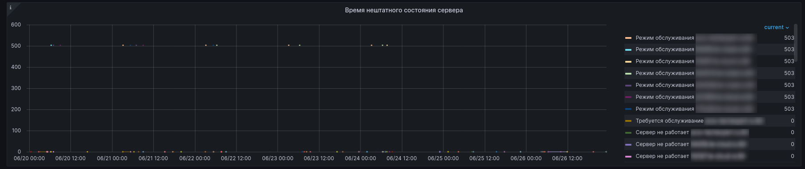

## Kodeks server metrics

Таблицы и графики дашборда Kodeks server metrics предназначены по большей части для отладки и отслеживания состояния самого СМАРТа, а также для технического контроля за подконтрольными СМАРТу установками.

Клик по названию таблицы/графика в этом дашборде приведет к выпадающему меню. 

Выбор в выпадающем меню пункта View (на прочие пункты выпадающего меню не обращай внимания, они нас не касаются) приведет к тому что будет отображаться только выбранный график/таблица.
Соответственно, все последующие манипуляции касательно временных отрезков (ручных или предустановленных), выбора host, manager, checktype и их комбинаций приводят к изменению отображаемой информации строго в выбранном графике/таблице.
Выход из такого состояния в снова отображение всех графиков/таблиц открытого дашборда происходит очень просто - достаточно нажать клавишу Ecs на клавиатуре.

### Время нештатного состояния сервера

График служит для отображения времени когда ПК находился в состояниях:
- Режим обслуживания
- Требуется обслуживание
- Сервер не работает
- Ключ не найден
- Сервер не стартовал
- Ошибки на сервере
- Кончились лицензии

График можно строить по временной шкале путем:
- выбора предустановленного периода;
- ввода своего периода через календарь;
- выбрав на самом графике временной отрезок.

После ввода временного отрезка график перестроится автоматически (в крайнем случае нажать F5 / Ctrl+F5 / Обновить страницу).

Интерпретация значений:
- 0 значит все хорошо, описанных выше нештатных состояний не было обнаружено на подконтрольных установках;
- любое число, отличное от 0 (кроме отрицательных значений) - возвращенный http код обнаруженной ошибки, т.е. код состояния http

Полный список возможных обнаруженных ошибок можно почерпнуть тут:

[Список кодов состояния HTTP](https://w.wiki/3WBN)

Данные с графика могут быть использованы техническими специалистами для оценки и прогнозирования технического состояния подконтрольных установок.
Если на установке слишком часто стали случаться ошибки - это повод обратить внимание на его программное и/или аппаратное состояние для нивелирования потенциальных проблем в ближайшей перспективе.
Кроме того, данные с графика могут быть использованы для оценки ситуации в прошлом, если работа с клиентом, для которого эта установка развернута, требует получения такой информации.

### Разделы с менее чем 10Gb свободного места

График/таблица задуман как средство отслеживания оставшегося свободного места в каталоге, в котором развернут и работает сам ПК.

Для реализации данного функционала на сервер с ПК необходимо устанавливать и настраивать дополнительное ПО [telegraf](https://www.influxdata.com/time-series-platform/telegraf/).

Обсуждение по настройке данного функционала осуществляется индивидуально.

### Статусы on-line проверок

График предназначен для отображения состояния проверок на аварийные состояния. 
Интерпретация значений:
- "0" - когда проверка закончилась ошибкой
- "1" - когда проверка прошла успешно и аварийного состояния нет.

График отображает информацию о состоянии проверки по времени.
График отображает состояние "работает / не работает" по каждому отслеживаемому нештатному состоянию в разрезе каждой подконтрольной СМАРТу установки.

На легенде слева от графика показан список всех проверок по каждой подконтрольной СМАРТу установке.
Поэтому если что-то пошло не так, то через график всегда можно увидеть какая именно из проверок не закончилась успехом.
Клик по любой позиции из легенды приведет к отображению на графике кривой по конкретно выбранной позиции из легенды.

Данные с графика могут быть использованы в том случае когда необходимо убедиться в корректной работе проверок СМАРТа после нововведений/исправлений аварийных падений
или первоначальной настройке.
Таким образом, данный график отображает состояние ПК каким его видит СМАРТ.
Можно использовать для сигнализирования разработчику СМАРТа в индивидуальные чаты или в общий чат по СМАРТу о том, что по твоему мнению что-то пошло не так.

#### ВНИМАНИЕ

При определённых состояниях ПК НЕСКОЛЬКО проверок могут принять значение "0" и это не приведёт к возникновению аварийной ситуации.
Например, в режиме обслуживания проверки авторизации и главной страницы будут иметь значение 0, но при этом это "нормальное" состояние ПК.
При отсутствии авторизации пользователя "smartlogin" проверка ключа и варнинг так же будет 0, хотя сам ПК видит ключ. 
Матрица зависимостей большая и выходит за рамки этой инструкции, но в индивидуальном порядке может быть объяснена.

Не проходи мимо. 

Все мы в одной лодке.

Телеграмм-чат «СМАРТ-мониторинга» - https://t.me/+uRkrNE_SNYY0YTUy

[Углубляемся еще дальше](062-kodeks-analytics.md)

[Вернуться назад](060-dashboards.md)

[Вернуться к Оглавлению, если стало страшно](Readme.md)
