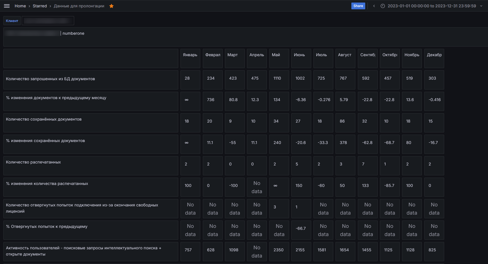

# Данные для пролонгации

Данный дашборд состоит (пока что) из сводной таблицы с данными для аналитики результатов эксплуатации пользователями 
внедренной системы К/ТЭ. Таблица отображает данные по каждой установке К/ТЭ, находящейся под контролем СМАРТа.
Данные в этой таблице можно и нужно использовать для оценки качества внедрения и эксплуатации установки К/ТЭ, а также
для прогнозирования и планирования работ по дальнейшему сопровождению того или иного клиента.

Наибольшую ценность таблица представляет в период пролонгации клиента, перезаключении с ним договора на новый период
его сопровождения, т.к. таблица дает статистическую информацию, которую можно и нужно включать в отчеты ЛПРу (если
таковая практика используется), а также доносить клиенту/пользователям, как объективное обоснование загруженности
внедренной установки на должном уровне и объективное обоснование расширения состава обслуживания (в части р.м., например)

**ВНИМАНИЕ!** Система выбирает данные за длительный период времени, и данные в ячейках могут появляться с некоторой
задержкой. Обычно это не более 30 секунд. Если появляется треугольный значок с восклицательным знаком справа от таблицы - 
обновите страницу (Ctrl + F5 или F5). В случае невозможности получить данные - обратитесь в свой канал поддержки
СМАРТ-мониторинга.

## Нюансы обращения с таблицей, интерпретации данных в ней

Таблица отражает данные за полные года, даже если в рамках выбранного года тот или иной клиент неполный год был под
контролем СМАРТа. Поэтому для корректной работы таблицы следует выбирать интервалы времени в фильтре времени, равные
полному календарному году, т.е. с января по декабрь, даже если на момент построения таблицы конец выбранного периода
еще не наступил (т.е. он в будущем).

Пример №1. Нам надо просмотреть как установка эксплуатировалась **за 2023 год**.
Для этого мы:
1. Фильтром "Клиент" выбираем нужного нам клиента. Ждем пока таблица обновится. На этом этапе данные в ней еще могут быть
неверными.
2. Фильтром времени (иконка часиков) выбираем **период с 2023-01-01 по 2023-12-31** и кликаем по кнопке Apply time range.
Ждем пока таблица просчитается и простроится, это буквально несколько секунд.
3. Оцениваем результаты

Пример №2. Нам надо поглядеть, как сейчас, и в недавнем прошлом установка эксплуатировалась (т.е. **в 2024 году**).
Для этого:
1. Фильтром "Клиент" выбираем нужного нам клиента. Ждем пока таблица обновится. На этом этапе данные в ней еще могут быть
неверными.
2. Фильтром времени (иконка часиков) выбираем **период с 2024-01-01 по 2024-12-31** и кликаем по кнопке Apply time range.
Ждем пока таблица просчитается и простроится, это буквально несколько секунд.
Да-да, конечный период временного отрезка лежит хронологически в будущем, которое еще не наступило. Просто принять как
факт. Здесь это так работает (с).
3. Оцениваем результаты

Под таблицей есть актуальная инструкция по использованию.

Следует помнить, что для этой таблицы все расчеты и извлечения данных СМАРТ проводит, основываясь на данных из sysinfo.
Если клиент не был добавлен в мониторинг, то данных по документам, активности и некоторым другим параметрам нет в системе.

Ячейки таблицы будут заполняться цифрами, полученными и/или рассчитанными. 

Формула расчёта значений "% ХХХХХХ к предыдущему ":  **(Предыдущее - Текущее) / (Текущее / 100 )**. Если
выводится знак бесконечности - значит в предыдущий месяц значение было ноль (на ноль делить нельзя).

Если ячейка содержит **No data**, значит для ее заполнения нет данных, так как данные в этот период мониторинг не собирал.

Если ячейка таблицы содержит знак бесконечности, значит в предыдущий месяц значение было ноль. Обычно это можно увидеть
в ячейках месяца Январь и/или если в предшествующей в той же строке ячейке стоит No data.
Такое поведение ячеек является нормой. Математика упрямая штука.

Если ячейка содержит отрицательные значения (актуально для тех строк таблицы, где считается % использования чего бы то 
ни было), то это означает падение такого показателя по отношению к прошлому месяцу. Соответственно, положительные значения
там же следует интерпретировать как рост того иного показателя.

## Использование таблицы при составлении отчёта ЛПР

### Количество отвергнутых попыток подключения из-за окончания свободных лицензий

При составлении отчёта кроме сухих цифр количества отвергнутых подключений из таблицы этого дашборда рекомендуется 
обратиться к [дашборду "Для менеджеров"](066-for-managers.md) к таблице в нем со списком пользователей которые не смогли 
подключиться к системе (содержит время когда это произошло).

### Статистика работы KAssist

Для обогащения данными по работы подсистемы **kassist** рекомендуется обратиться к [дашборду "kAssist. Аналитика".](078-kassist.md) 

[Листай дальше](065-disk-space.md)

[Вернуться назад](060-dashboards.md)

[Вернуться в Оглавление](Readme.md)
