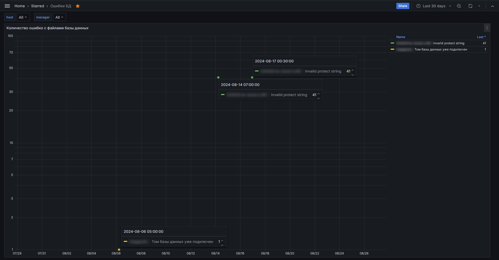

# Ошибки БД

Данный дашборд состоит из 1 одноименного графика.

График отображает количественные значения по зафиксированным ошибкам, связанным с базами данных, за определенный период 
времени. Количественное значение при этом равно тому количеству баз, по которым была зафиксирована та или иная ошибка.

Графику доступны фильтры:
- host - фильтрация по адресу/имени подконтрольной установки;
- manager - фильтрация по ответственному менеджеру.

К графику, как и ко всем прочим можно применять фильтр времени.

Так же, справа от графика присутствует легенда, где расшифрованы все цветовые метки, попавшие на график: кому какие 
принадлежат.
Кликая по одной строке в легенде или нескольким (зажав shift) можно увидеть отображение либо только одной выбранной кривой, 
либо выборочно нескольких.
По умолчанию на графике отображаются все зафиксированные метки.

В паре с этим графиком работают алерты:
- [KodeksDBerrorsCode1](http://smart.uniclass.ru/docs/errors/KodeksDBerrorsCode1.md)
- [KodeksDBerrorsCode1Count](http://smart.uniclass.ru/docs/errors/KodeksDBerrorsCode1Count.md)
- [KodeksDBerrorsCode2007](http://smart.uniclass.ru/docs/errors/KodeksDBerrorsCode2007.md)
- [KodeksDBerrorsCode2007Count](http://smart.uniclass.ru/docs/errors/KodeksDBerrorsCode2007Count.md)
- [KodeksDBerrorsCodeXXX](http://smart.uniclass.ru/docs/errors/KodeksDBerrorsCodeXXX.md)
- [KodeksDBerrorsCodeXXXCount](http://smart.uniclass.ru/docs/errors/KodeksDBerrorsCodeXXXCount.md)

Алерты приходят в почту ответственного менеджера, а также - в телеграм канал этого дистрибьютора-пользователя СМАРТ-мониторинга.

Полный список ВСЕХ алертов (по состоянию на 27.08.2024) можно найти [здесь.](000-appendix-1.md)
Раздел, связанный именно с алертами касательно БД - [тут.](000-appendix-1.md#алерты-на-ошибки-с-базами-данных-и-operup)

Полный список ВСЕХ ошибок, связанных с базами данных, да и работой ПК в целом, можно увидеть в [Приложении №2.](000-appendix-2.md)
Раздел, связанный именно с ошибками касательно БД - [тут.](000-appendix-2.md#ошибки-возникающие-при-работе-с-томами-бд)

[Дальше](071-connected-users.md)

[Назад](060-dashboards.md)

[Вернуться в Оглавление](Readme.md)