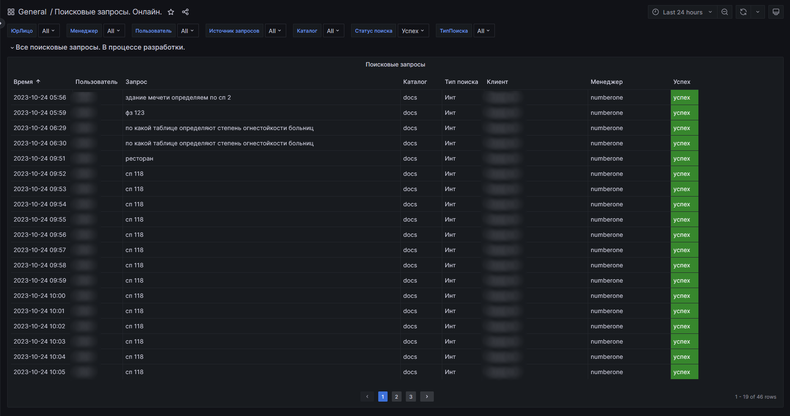
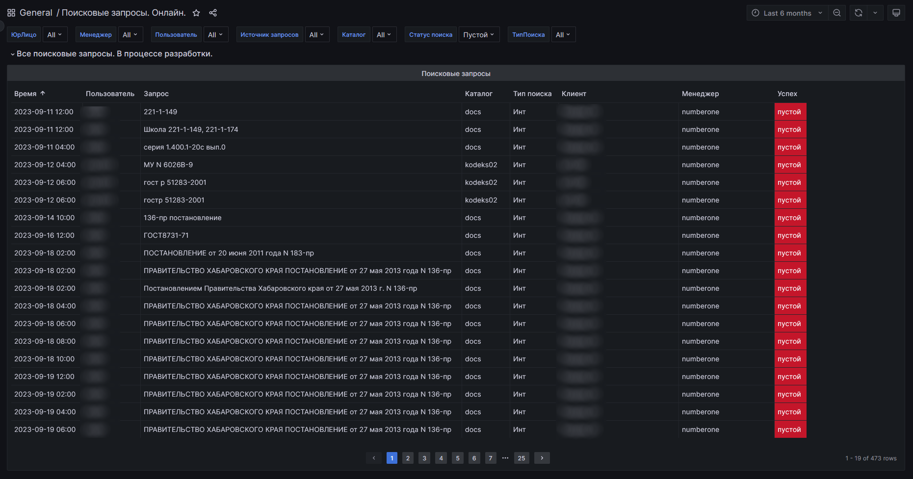

# Поисковые запросы. Онлайн

На скриншотах выше представлены два состояния таблицы в данном дашборде - когда по подконтрольным онлайн-доступам есть
пустые запросы и когда - есть успешные запросы.

Пустым запросом считается такое состояние ПК, когда поисковая машина ПК не нашла НИЧЕГО в ответ на запрос пользователя.
Соответственно, успешным запросом считается такое состояние ПК, когда поисковая машина ПК нашла хоть что-то на запрос
пользователя.

При этом не имеет значения какой именно поиск использовался - интеллектуальный или атрибутный. Учитывается и тот, и тот.
Тип использованного поиска отражается в таблице в одноименном столбце.

Статус результата поиска - "успех" или "пустой" - отражается в соответствующем столбце таблицы.

Данные для этого дашборда собираются с подконтрольных доступов раз в сутки, ночью.
Сделано так по техническим причинам, никоим образом не зависящих от работоспособности СМАРТа - это нюанс работы именно
онлайн-доступов.
Если что - все вопросы к разработчику Техэксперта, в чьей зоне ответственности лежит контроль за техническим состоянием
онлайн-доступов, развернутых на его мощностях.

Данные с таблицы этого дашборда можно применять различными способами.
Например:
- если поставлена задача о допродажах клиентам, то таблицу с данными о пустом поиске можно использовать как инфоповод к
допродаже/замене новых комплектов: использовать фильтр "ЮрЛицо" для выделения данных по конкретному клиенту, использовать 
фильтр "Статус поиска -> Пустой", задать интересующий временной период и оценить полученные результаты;
- если поставлена задача об оценке качества внедренных комплектов, то таблица с данными об успешном поиске может помочь
 в этом: использовать фильтр "ЮрЛицо" для выделения данных по конкретному клиенту, использовать 
фильтр "Статус поиска -> Успех", задать интересующий временной период и оценить полученные результаты;
- если поставлена задача о контроле за клиентами конкретного менеджера, чтобы оценить качество работы последнего, то 
таблица с соответствующими отфильтрованными данными может помочь в этом: использовать фильтр "Менеджер" и "Статус поиска", 
сравнить полученные результаты и использовать их для построения последующих выводов в отношении деятельности того или
иного менеджера или группы оных (выбрать несколько менеджеров);
- разные другие варианты, дать волю фантазии в паре с поставленными задачами ;)

Как видно, коллега, таблица весьма информативна и полезна.

[Листай дальше](074-billing-online-analytics.md)

[Вернуться назад](060-dashboards.md)

[Вернуться в Оглавление](Readme.md)