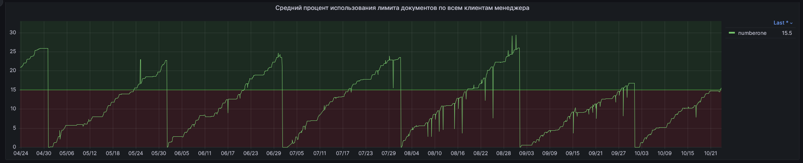
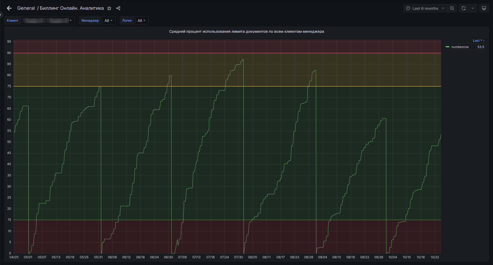
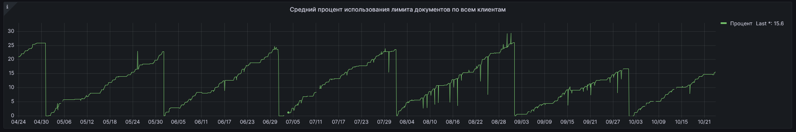
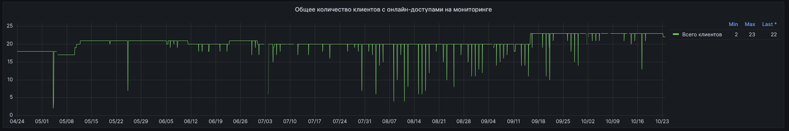

# Биллинг Онлайн. Аналитика

Данный дашборд касается только клиентов с простыми онлайн-доступами.
Дашборд содержит 3 (пока что) графика, содержащих аналитическую информацию о том, насколько внедренные онлайн-доступы
востребованы клиентами.

Для простоты понимания, можно провести смысловую параллель между этим дашбордом и дашбордом [Kodeks analytics.](062-kodeks-analytics)
Они оба примерно об одном и том же - аналитика действий клиента с внедренным у него Техэкспертом и построение выводов
на основе представленных в дашбордах данных для целей дальнейшего построения тактики и стратегии сопровождения клиента.

Дашборд пока что состоит из:
- график ["Средний процент использования лимита документов по всем клиентам менеджера"](074-billing-online-analytics#средний-процент-использования-лимита-документов-по-всем-клиентам-менеджера);
- график ["Средний процент использования лимита документов по всем клиентам"](074-billing-online-analytics#средний-процент-использования-лимита-документов-по-всем-клиентам);
- график ["Общее количество клиентов потокового сбыта на мониторинге"](074-billing-online-analytics#общее-количество-клиентов-с-онлайн-доступами-на-мониторинге).

Дашборд будет полезен как самим менеджерам по сопровождению, так и их руководству, для контроля результатов работы менеджера
с его подопечными клиентами.

Данные графиков на дашбордах можно фильтровать исходя из доступных на этом дашборде фильтров:
- Клиент: фильтрация данных на графиках по конкретному клиенту;

***ВНИМАНИЕ!!! Данный фильтр при применении может трансформировать назначение графиков от "глобально по всем клиентам" до
"точечно по конкретному клиенту". Своего рода "два режима" если так понятнее: при выборе "All", графики будут отражать 
средние значения по ВСЕМ онлайн-клиентам; при выборе конкретного клиента или нескольких - графики будут отображать средние 
значения только по этим клиентам.***

- Менеджер: фильтр по менеджеру; если у дистрибьютора-пользователя СМАРТа из заведено в СМАРТ больше чем один, то фильтр имеет смысл;
- Логин: фильтр по конкретному пользователю, точнее - по его логину.

## Средний процент использования лимита документов по всем клиентам менеджера

На графике отображается кривая о том, насколько "в среднем по больнице" внедренные онлайн-доступы востребованы, качественно
внедрены у всех клиентов определенного менеджера.

Для построения графика берутся данные по показателю количественного исчерпания лимита "Документы" с каждого онлайн-доступа,
находящегося под контролем СМАРТа и далее высчитывается среднее значение за каждый месяц, с учетом дифференциации по менеджерам.
Полученные значения выстраивают график.

Так как показатель исчерпания лимита "Документы" имеет свойство каждое первое число месяца восстанавливать свое значение
до положенного по выбранному тарифу, то график будет иметь пилообразный профиль.
Как, например, на скриншоте - на нем график выстроен за период в 6 месяцев: от текущей даты и полгода назад.

Исходя из особенности накопления показателя лимита "Документы", логичен вывод о том, что ставить период времени меньше 1 месяца -
не совсем целесообразно с точки зрения информационной полезности, хоть технически это и возможно.

График подчиняется ограничениям по времени, задаваемым как в соответствующем фильтре, так и вручную выделяемом прям на графике.

График подчиняется фильтрам, определенным для данного дашборда.

Как видно из скриншота - график может иметь цветовую дифференциацию пороговых значений.
Достигнуть такого отображения можно тогда, когда в фильтре "Клиент" выбрать одного или нескольких клиентов.
После введения значения в этом фильтре график автоматически перестроится (если этого не происходит - рекомендуется обновить
страницу принудительно).

Цветовые пороговые границы имеют следующие значения:
- менее 15%: говорит о низком качестве внедренного онлайн-доступа, низкой вовлеченности (клиент мало открывает документов);
рекомендуется провести работы с конечным пользователем доступа, которые приведут к увеличению вовлеченности;
- более или равно 15%, но менее 75%: говорит о хорошей вовлеченности, востребованности доступа;
- более или равно 75%, но менее 90%: говорит о высокой вовлеченности; с одной стороны это хорошо, но с другой это может говорить о том,
что внедренным онлайн-доступом пользуется более одного человека, рекомендуется это выяснить объективнее и провести работу
по допродаже доступов, особенно если есть срабатывания алерта о досрочном исчерпании лимита по документам;
- более или равно 90%: вероятность, что внедренным онлайн-доступом пользуется больше чем 1 человек выше чем в предыдущих 
границах, рекомендуется проводить допродажные работы, особенно если есть срабатывания алерта о досрочном исчерпании 
лимита по документам.

Цифры границ взяты из Стандарта сопровождения, а также из практического опыта по внедрению и сопровождению онлайн-доступов.

## Средний процент использования лимита документов по всем клиентам

График по схож с вышеописанным графиком, но с той лишь разницей, что не имеет дифференциации по менеджерам и отражает общую
картину качества внедренных онлайн-доступов у клиентов, использующих оные.

Для построения графика берутся данные по показателю количественного исчерпания лимита "Документы" с каждого онлайн-доступа,
находящегося под контролем СМАРТа и далее высчитывается среднее значение за каждый месяц, без учета дифференциации по менеджерам.
Полученные значения выстраивают график.

Так как показатель исчерпания лимита "Документы" имеет свойство каждое первое число месяца восстанавливать свое значение
до положенного по выбранному тарифу, то график будет иметь пилообразный профиль.
Как, например, на скриншоте - на нем график выстроен за период в 6 месяцев: от текущей даты и полгода назад.

Исходя из особенности накопления показателя лимита "Документы", логичен вывод о том, что ставить период времени меньше 1 месяца -
не совсем целесообразно с точки зрения информационной полезности, хоть технически это и возможно.

График подчиняется ограничениям по времени, задаваемым как в соответствующем фильтре, так и вручную выделяемом прям на графике.

График подчиняется фильтрам, определенным для данного дашборда.

## Общее количество клиентов с онлайн-доступами на мониторинге

График отражает общее количество онлайн-доступов, находившихся и находящихся под контролем СМАРТа.

График будет полезен больше руководителям отделов, для отслеживания доли онлайн-доступов, находящихся на контроле и
сопровождении.

График подчиняется ограничениям по времени, задаваемым как в соответствующем фильтре, так и вручную выделяемом прям на графике.

График подчиняется фильтрам, определенным для данного дашборда, однако среди этих фильтров и исходя из назначения графика,
полезен будет фильтр "Менеджер". Его применение покажет тенденцию в отношении конкретного менеджера или для получения картины
в целом по всем менеджерам и онлайнам.

[Листай дальше](075-active-directory-statistics.md)

[Вернуться назад](060-dashboards.md)

[Вернуться в Оглавление](Readme.md)