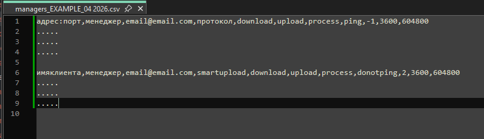

# Рекомендации по подготовке к внедрению СМАРТ-мониторинга, СМАРТ.Статус и СМАРТ.Онлайн у клиентов

Коллега, в зависимости от размера твоей компании-дистрибьютора, организационной структуры и круга обязанностей менеджеров отделов сопровождения и сбыта,
имеются некоторые нюансы подготовки.

## Компании-дистрибьютор небольшого размера - 1-10 установок

Обычно такие компании характеризуются 1-2 сотрудниками, которые осуществляют полный цикл сопровождения клиентов.
Здесь нет разделения по обязанностям. 
Технические проблемы с ПК решаются обычно или админами клиентов совместно с отвественными за того или иного 
проблемного клиента сотрудникам или тех.поддержкой сервиса "Техэксперт.Облако" в случае размещения установки на этом сервисе.

### Подготовка внедрения

- составляется список адресов установок, доступных через интернет; 

Обычно это URL-адрес установки, размещенной в сервисе "Техэксперт.Облако" или список имен установок, размещенных у клиентов.

- составляется список клиентов, у которых ПК развёрнут в "закрытом контуре" или не имеет выхода в интернет;
- составляется таблица с клиентами онлайн на площадке ДЦ - логины-пароли, адреса и каталоги;

Определяется почтовый адрес, на который будут идти алерты, связанные с этими клиентами.
Почтовый адрес может дублироваться из списка в список, в случае если один менеджер ответственен ха разные "типы" установок.

- определяется почтовый адрес, на который будут поступать высокоприоритетные уведомления - падения ПК, битые OperUP и т.д., 
то есть такие алерты, которые говорят о полной или частичной неработоспособности ПК и требуют немедленного вмешательства;
- определяется почтовый ящик, на который будет идти информация о пустом поиске и других моментах связанных с работой пользователей.

Почтовый адрес может дублироваться из списка в список, в случае если один и тот же менеджер ответственен полностью за установку своего клиента.
То есть в его зоне ответственности и решение технических проблем, и аналитика использования установки.

## Крупные компании

Обычно это такие компания, где роли по поддержке распределены между несколькими сотрудниками: 
- обучение, 
- сопровождение, 
- онлайнщики, 
- системный администратор.

В этом случае следует проявить больше внимательности при составлении списков клиентов в части указания почтовых адресов 
для рассылки алертов соответственно зонам ответственности того или иного сотрудника.
В случае выявленных позднее ошибок в этой части их легко исправить.
Достаточно лишь написать об этом разработчику СМАРТа в личный твой с ним чат.

### Подготовка внедрения

Подготовка происходит [аналогичным способом.](077-smart-implementation-experience.md#подготовка-внедрения)

## Очень крупные компании

Характеризуются:

- наличием независимых региональных филиалов;
- наличием начальников отделов со своей отчётностью;
- наличием начальников филиалов со своей отчётностью;
- внутри филиалов независимые отделы:
  - апробации;
  - сопровождение крупных клиентов;
  - сопровождение всех остальных клиентов;
  - отдел занимающийся обучением;
  - подразделение системных администраторов, обычно на каждый филиал свое подразделение;
  - потоковый сбыт.

### Подготовка к внедрению. Общие рекомендации

- Определиться с зоной видимости клиентов внутри компании. Если филиалы не должны видеть клиентов и всю информацию по соседним
  филиалам, то потребуется развёртывание для каждого филиала собственного "личного кабинета".
В таком случае необходимо вести на каждый филиал раздельные списки, а также в обязательном порядке уведомить от этом разработчика СМАРТа.

Списки не должны содержать никаких перекрестных данных между филиалам в части почтовых адресов менеджеров, их руководителей.

Коллега, это твоя зона ответственности и только твоя.
Отнесись к этому моменту максимально внимательно, чтобы потом внутри твоей же компании не было излишнего....недопонимания среди твоих подчиненных.

- если потоковый сбыт имеет более чем 500+ клиентов в филиале, то рекомендуется сделать отдельный личный кабинет для потокового сбыта на каждый филиал
- Рекомендуется для алертов завести единый почтовый ящик на почтовом сервере компании/филиала. 
На сервере организовать маршрутизацию, сортировку почтовых сообщений средствами почтового сервера по ключевым словам внутри почтовых сообщений.
Твой коллега, например, [так и сделал, ведь так удобнее.](030-alert.md#рис1--пример-фильтрации-и-тематической-сортировки-алертов-средствами-используемой-почтовой-программы)

### Подготовка к внедрению. Рекомендации для менеджера отдела сопровождения/сбыта

Коллега, чтобы внедрение СМАРТа на установках твоих подопечных клиентов прошло максимально быстро, легко и эффективно,
будет лучше, если ты для себя самого дашь ответы на следующие вопросы:

1. Каких именно клиентов я хочу поставить под контроль СМАРТа?

Определи список тех клиентов, кого в принципе целесообразно поставить под контроль.
Далее из этого списка ранжируй тех, кого необходимо поставить под контроль в первую очередь, потом во вторую, и так далее
по убыванию.

2. Что я знаю об этих клиентах для процедуры внедрения?

Если тебе известны технические данные по этим установка, такие как, например:
- простой ли онлайн (в количестве скольки доступов);
- сетевая ли установка; 
- офисная ли или корпоративная; 
- если сетевая, то развернута ли на мощностях клиента или в сервисе "Техэксперт.Облако" или у вас свой ЦОД для этого.

Если этой информации тебе неизвестно - не беда, она наверняка известна твоим коллегам из отдела техподдержки.

3. Какие сейчас есть проблемы, связанные с работой с этим клиентом?

Нужно поднять активность/вовлеченность? 
Установка проблемная технически и нужно оперативно держать руку на пульсе?
Нужно получить больше информации для целей допродаж?
Нужно провести аналитику для повышения успеха на сбыт?

Зафиксируй все данные, какие тебе известны, даже если это только наименование клиента.
Если на твоем предприятии решение технических проблем (от первичной установки ПК до решения нестандартных технических проблем)
по клиентским установкам (любым) возложено на отдел техподдержки, то всю собранную информацию передай им.
От них тоже необходимо участие.

После того как твой технари-коллеги справятся со своей частью, ты можешь окунаться в дашборды, с их графиками и таблицами
и искать ответы на вышепоставленные вопросы. [Пояснения по Дашбордам ты можешь найти тут](080-dashboards.md)
Если тебе необходимо будет обучение по работе с дашбордами, не стесняйся написать об этом разработчику СМАРТа.
Он с радостью ответит на все твои вопросы.

Только не молчи.

СМАРТ может дать тебе гораздо больше помощи по работе с твоими клиентами, чем ты можешь на первый взгляд представить.

На этом моменте именно ВНЕДРЕНИЕ для тебя заканчивается.
После того как твои коллеги с техотдела закончат свою часть - можешь переходить к [Дашбордам](080-dashboards.md) и изучать
информацию, которая там стала появляться.

### Подготовка к внедрению. Рекомендации для технических специалистов

Коллега.

До того как начинать процесс внедрения СМАРТа, тебе необходимо знать информацию о том, а какие именно клиенты должны оказаться
под его контролем.
Эту информацию тебе должны принести менеджеры по сопровождению/сбыту.
Ну хотя бы имена юр.лиц.
Может быть они даже дадут тебе информацию о том, какой именно формат предоставления системы тот или иной клиент использует
или апробирует:
- простой ли онлайн (в количестве скольки доступов, адреса доступов, логины-пароли к этим доступам);
- сетевая ли установка (IP машины, на которой развернут ПК); 
- если сетевая, то развернута ли на мощностях клиента (иметь удаленный доступ к "телу") или в сервисе "Техэксперт.Облако" (адрес установки)
или у вас свой ЦОД для этого (очень удобный вариант).

Но в зависимости от их круга обязанностей, они могут не обладать такой информацией, поэтому ее, возможно, придется взять
из других источников.
Каких?
Ну наверное ваша внутренняя CRM может содержать такую инфу. 
Или иное аналогичное хранилище.

Рекомендуется построить 3 списка, с указанием в них где чей клиент:
1. список тех, у кого простой онлайн-доступ;
2. список тех, у кого сетевая установка на мощностях клиника И
3. список тех, у кого установка в сервисе "Техэксперт.Облако" И/ИЛИ в вашем ЦОДе.

Если менеджеры из списков выше не зарегистрированы в ЛК СМАРТа - необходимо это сделать.
Можно даже прям вот ВСЕХ. Это не влияет на цену за СМАРТ, как в тестовом периоде, так и в коммерческом использовании.

Информацию о том, что вот такой список менеджеров необходимо зарегистрировать - передать разработчику СМАРТа.
Хотя он и сам спросит об этом первым.

Далее используя информацию с этих списков тебе необходимо заполнить 2 файла.csv (можешь скачать их по ссылкам ниже):
- [managers_example.csv](https://disk.yandex.ru/d/gEUrOG1UW5pPJQ)
- [online_example.csv](https://disk.yandex.ru/d/KsVJ2Cj0-wrSVg)

#### Как заполнять файл managers_example.csv

На скриншоте показан пример как следует заполнять файл managers.csv

Рекомендуется в имени самого файла:
- добавить имя твоей компании-дистрибьютора, которое тебе присвоил разработчик СМАРТа.
Он сам тебе ее должен сказать, так как является первоисточником такой информации;
- добавить в конце метку даты очередного изменения, чтобы вести таким образом "версионность" всех итераций изменений.

Пример имени файла: kodeks_manager_05102023.csv

Содержимое файла состоит условно из 2 блоков: 
- блок с данными по клиентам в сервисе "Техэксперт.Облако" ИЛИ те, кто размещен в вашем ЦОДЕ, буде таковой у вас имеется;
- блок с данными по клиентам, у кого ПК развернут на их мощностях.

Пожалуйста, не меняй порядок блоков. Не надо так (с)

Что значат все эти термины на скришоте:

- URL-01:port - адрес в интернете к самой установке; порт чаще всего 80, но могут быть варианты;
- manager01 - имя менеджера, зарегистрированного в ЛК СМАРТа и ответственного именно за эту (в том числе) клиентскую установку;

Менеджеров, зарегистрированных и имеющих свои личные кабинеты в СМАРТе (на доступ к дашбордам) может быть один человек,
а может быть несколько. Это по необходимости.
Имя менеджера необходимо для целей сортировки всех входящих отчетов в СМАРТ с подконтрольных СМАРТу установок

- mail-manager01@postbox.com - почта того же менеджера, ответственного за эту конкретную клиентскую установку;

Почта может быть индивидуальная для каждого менеджера или общая на всех.

- http/https - выбрать и оставить в тексте нужный протокол;
- download,upload,process,ping - эти 4 параметра есть константы, не трогай их;
- -1 - корректировка часового пояса по отношению к МСК в сравнении с Саратовым (+1 от МСК): например, если на машине с ПК 
стоит часовой пояс на +3ч от мск, значит с Саратовым будет +2ч, поэтому необходимо поставить 2; если же машина с ПК находится 
в том же часовом поясе с МСК, то тогда здесь нужно писать -1;

Корректировка часового пояса необходима для верного отображения временных меток из приходящих отчетов sysinfo, 
обрабатываемых СМАРТом.

- short_client_name_01 - короткое имя клиента.

***ВАЖНО!*** Короткое имя клиента следует придумать такое, которое будет однозначно толкуемое и понимаемое как именно
этого клиента.
В имени разрешено использовать только латинские буквы, верхнего и нижнего регистра.
Не делай имя слишком длинным, для своего же удобства.

- manager01 - имя менеджера, зарегистрированного в ЛК СМАРТа и ответственного именно за эту (в том числе) клиентскую установку;
- mail-manager01@postbox.com - почта того же менеджера, ответственного за эту конкретную клиентскую установку;
- smartupload,download,upload,process,donotping - эти 5 параметров есть константы, не трогай их, пожалуйста;
- 2 - корректировка часового пояса по отношению к МСК в сравнении с Саратовым (+1 от МСК).

[Рекомендации о том, как заполнять файл online_example.csv размещены вот тут.](074-smartonline-implementation.md)

После всех заполнений обоих файлов, передай их любым удобным способо разработчику СМАРТа.
Далее он их загрузит в систему, и через некоторые время (до часа, если не было ошибок в заполнении файлов) менеджеры
могут уже начинать изучать графики, дашборды и инфу на них.

Настоятельно рекомендуется провести первичное обучение-знакомство.
Для ускорения понимания и усвоения информации.

Дай им отмашку об этом, и на этом твое участие в этом заканчивается....скорее всего ;) 

_Ну ты понял_

## Внедрение. Для технических спецаилистов

Собранная в предыдущих подготовительных пунктах информация (по каждому пункту или выборочно) передаётся разработчику СМАРТа, 
который вносит все переданные списки и входящие данные в настройки системы. 
После этого система начинает опрашивать доступные через интернет установки, обрабатывать входящие отчеты sysinfo и 
выстраивать график и таблицы в Grafana.

- [Как внедрить smartupload на клиентской установке?](071-smartupload-implementation-windows.md)
- [Как внедрить smartupload на установке, размещенной в сервисе "Техэксперт.Облако"?](076-smartupload-implementation-TEcloud.md)
- [Как внедрить smartstatus на клиентской установке](073-smartstatus-implementation-windows.md)
- [Как внедрить СМАРТ.Онлайн?](074-smartonline-implementation.md)

[Вернуться к Оглавлению, если стало страшно](Readme.md)
