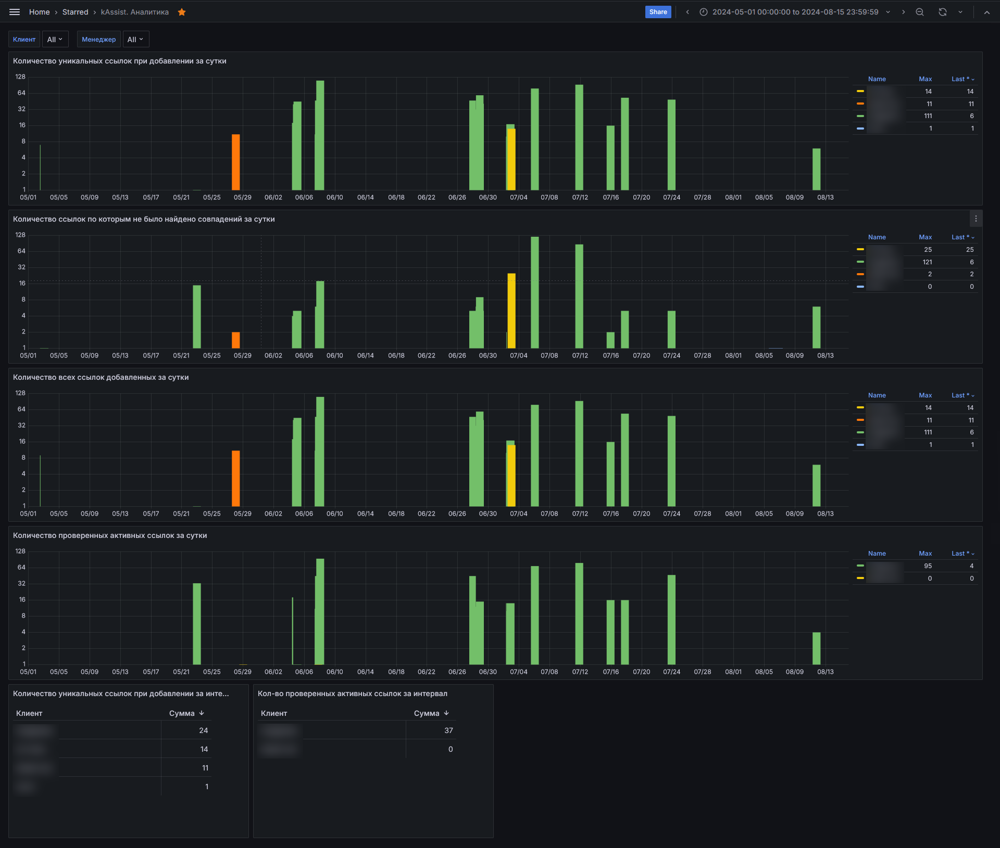

# kAssist. Аналитика

Данный дашборд содержит статистическую и аналитическую информацию о том, как, насколько часто и эффективно использовался
kAssist у того или иного клиента, находящегося под контролем СМАРТа.

Графики данного дашборда отражают информацию о том как много разных ссылок обработал kAssist за установленный промежуток
времени.

Данный дашборд можно и нужно использовать в дополнение к графику ["Среднее число запросов kAssist за месяц" дашборда 
"Кодекс аналитика"](062-kodeks-analytics#среднее-число-запросов-kassist-за-месяц) как более подробное раскрытие 
вопроса востребованности в сервисе kAssist на той или иной установке.

Также, дашборд kAssist. Аналитика можно и нужно использовать в дополнение к [дашборду "Данный для пролонгации"](064-prolongation)
как дополнительный источник статистических данных с целью наполнения отчета ЛПРу (если такая практика используется) данными,
необходимыми для объективного отражения картины востребованности внедренной системы К/ТЭ у клиента.

---
**ВНИМАНИЕ!** При выставлении временного интервала для данного дашборда следует учитывать, что он не покажет информацию 
ранее мая 2024 года, так как ранее этой даты такой информации не оседало в собираемых сисинфо.
---

[Листай дальше](079-server-availability.md)

[Вернуться назад](060-dashboards.md)

[Вернуться в Оглавление](Readme.md)