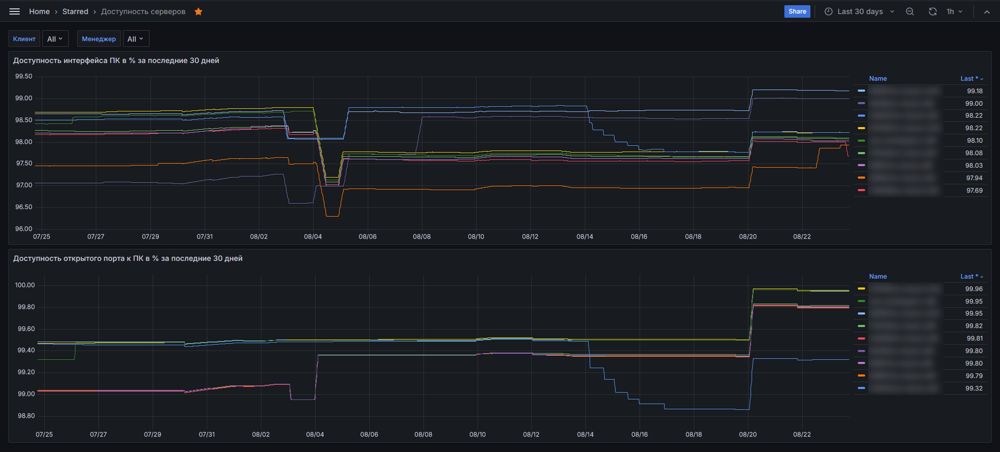

# Доступность серверов

Данный дашборд предназначен для получения ответа на вопрос: "Насколько стабильно работают и доступны сервера с внедренным 
у клиента Техэкспертом?". На дашборде отображается кривая по каждой подконтрольной СМАРТу установке, каждая точка на
которой показывает % доступности интерфейса ПК / % доступности порта, который назначен для ПК К/ТЭ из расчета "сейчас и 
30 дней назад". Т.е. % процент доступности в каждой точке "сейчас" рассчитывается с оглядкой на 30 дней от сейчас.

Таким образом, графики данного дашборда дают понимание общей картины "мира" по подконтрольным СМАРТу установкам.

---

**ВНИМАНИЕ!** Следует иметь в виду, что на графиках этого дашборда никогда не будет 100% доступность. 
Причина - ПК К/ТЭ, если не настроен иначе, по умолчанию имеет регламентные технологические перерывы на самоперезапуск, 
обновление, которые, в свою очередь, приводят к недоступности интерфейса на некоторое количество времени. Отсюда следует 
вывод, что доступность выше 95-99% может считаться нормой для целей контроля качества оказываемых услуг по сопровождению 
внедренного К/ТЭ.

---

Графики этого дашборда могут быть использованы для:
- контроля за выполнением KPI для цели оценки качества услуг технического сопровождения внедренной установки К/ТЭ, если
таковые показатели KPI нормированы у дистрибьютора;
- контроля за стабильностью внедренных установок К/ТЭ на любой перспективе, любые провалы в данном случае есть маркер 
ненормального поведения ПК К/ТЭ;
- включения данных из этого дашборда в отчеты ЛПРу, где этот уместно, как объективное доказательство стабильности работы
внедренного ПК К/ТЭ.

[Дальше](080-server-availability-online.md)

[Назад](078-kassist.md)

[Вернуться в Оглавление](Readme.md)
