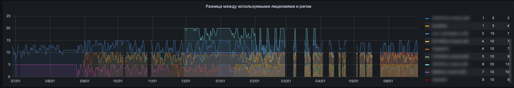
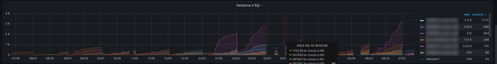
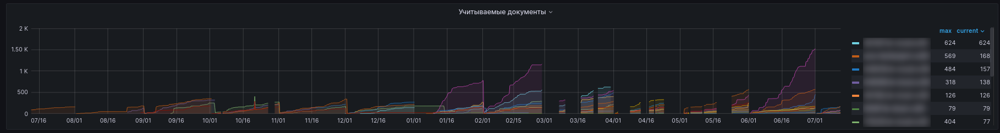
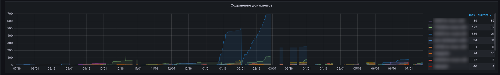
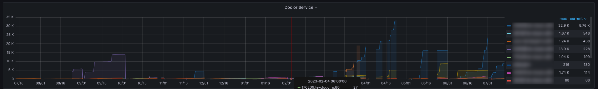

# Kodeks аналитика

Дашборд является одним из основных с точки зрения наполненности аналитической и статистической информацией. 
Данный дашборд крайне полезен менеджерам и отдела сопровождения, и отдела сбыта, так как отражает ситуацию по действующим и апробационным установкам, подконтрольным СМАРТу, по состоянию "здесь и сейчас" (с задержкой до 60 минут).
Данные для построения графиков этого дашборда берутся из отчетов sysinfo, снимаемых с подконтрольных установок каждые 55 минут.
Глубина хранения данных - 13 месяцев.

Клик по любой позиции из списка в легендах справа от графиков приведет к отображению на графике кривой, относящейся только к выбранной установке.
Вовзрат к отображению всех кривых осуществляется путем повторного клика по выбранной установке из списка в легенде.
Заданный временной отрезок напрямую влияет на отображаемые числовые значения.
Большое количество подконтрольных установок и/или большой заданный временной отрезок могут приводить к незначительной задержке в отображении графика. 
Причина - Grafana потребуется время, бОльшее, чем могло бы ожидаться, для отрисовки значений по заданным параметрам.

Графики этого дашборда позволяют выполнять с собой следующие манипуляции:
- изменять временной отрезок, за который необходимо отразить данные [Как это сделать](060-grafana-visualization.md#управление-временем-в-дашбордах);
- изменять отображаемые установки, данные по которым требуется проанализировать [Как это сделать](060-grafana-visualization.md#использование-grafana-для-визуализации-данных); 

Если на графиках этого дашборда видишь странные значения метрик, отрицательные значения или что-то непонятное - не стесняйся обращаться к разработчику СМАРТа за разъяснениями.
Сделать это можно либо в общем чате по СМАРТу https://t.me/+uRkrNE_SNYY0YTUy , либо в твоем личном чате с разработчиком СМАРТа.

Поскольку дашборд содержит в себе немало графиков, и, как следствие, немало полезной информации, то вот ниже оглавление для удобной навигации и изучения этого дашборда:
- [Используемые лицензии](082-kodeks-analytics.md#используемые-лицензии)
- [Разница между регом и лицензиями](082-kodeks-analytics.md#разница-между-используемыми-лицензиями-и-регом)
- [Количество неудачных поисков за сутки](082-kodeks-analytics.md#количество-неудачных-поисков-за-сутки)
- [Среднее число запросов kassist](082-kodeks-analytics.md#среднее-число-запросов-kassist-за-месяц)
- [Не пользуются системой в течение 60 дней](082-kodeks-analytics.md#не-пользуются-системой-в-течение-60-дней)
- [Запросы к БД](082-kodeks-analytics.md#запросы-к-бд)
- [Учитываемые документы](082-kodeks-analytics.md#учитываемые-документы)
- [Сохранение документов](082-kodeks-analytics.md#сохранение-документов)
- [Doc of Service](082-kodeks-analytics.md#doc-or-service)
- [Печать документов](082-kodeks-analytics.md#печать-документов)
- [Количество лицензий на инсталляции](082-kodeks-analytics.md#количество-лицензий-на-инсталляции)

## Используемые лицензии

График отражает потребление во времени лицензий по подконтрольным установкам. 
Количественные данные отображаются на графике с задержкой не более 60 минут.

---

**Интерпретация данных с графика**

Справа от графика присутствует легенда, содеражащая список подконтрольных установок и определенные числовые показатели по ним: 
  - min - минимально зафиксированное количество использованных лицензий;
  - max - максимально зафиксированное количество использованных лицензий;
  - current - крайнее зафиксированное количество лицензий (на момент снятия крайнего отчета sysinfo).

Клик по значениям min, max, current позволяет сортировать данный список по соотвествующим значениям: "от большего к меньшему", "от меньшего к большему", "отключить сортировку".
Клик по названию установки приведет к отображению кривой на графике только касательно этой установки.
Рекомендуется комбинировать с ручным выделением временных отрезков прямо на графике. 
Цель - подробнее, "под микроскопом", изучить колебания графика за очень короткий период.

---
**Применение полученных данных с данного графика**

Применяется менеджером по сопровождения/сбыту с целью: 
  - контроля использования установки, ее востребованности;
  - прогнозирования возможного исчерпания лицензий на установке (если часто наступает момент, когда количество использованных лицензий = количество допустимых лицензий согласно рег-файлу);
  - факт использования установки в моменте;
  - наполнения регулярного отчета ЛПРу (если таковой составляется с той или иной периодичностью) объективной информацией о том, что установка востребована, когда, и с какой нагрузкой востребована.

**Советы:**
- если на графике замечено, что значение max и/или значение current часто равно количеству лицензий по регу, то это повод менеджеру по сопровождению провести переговоры по допоставке лицензий в установку, а менеджеру по сбыту - провести переговоры о том, что выбранное количество лицензий потенциально недосаточно будет при последующей коммерческой эксплуатации;
- если на графике замечено, что значение min часто равно 0, то это повод менеджеру по сопровождению провести переговоры и, возможно, дообучения с конечными пользователями установки о вовзобновлении интереса к внедренной установке, а менеджеру по сбыту - напоминть о том, что апрбационный период еще длится и необходимо как можно плотнее тестировать внедренную установку;
- если на графике замечены отрицательные значения по любому из показателей и/или пропадания подконтрольных установок (при условии, что не было сознательного отключения оных), то это повод незамедлительно сообщить об этом разработчику СМАРТа для исправления ситуации; сообщить об этом можно в индивидуальных чатах по СМАРТу или в общий чат https://t.me/+uRkrNE_SNYY0YTUy .

## Разница между используемыми лицензиями и регом

График является логическим продолжением предыдущего графика с точки зрения аналитики собранных данных.
Здесь отображается разница, длящаяся во времени между тем, сколько лицензий было использовано на установке и сколько полагается по рег-файлу.

---

**Интерпретация полученных данных с данного графика**

Справа от графика присутствует легенда, содеражащая список подконтрольных установок и определенные числовые показатели по ним:
- min - минимально зафиксированная разница (в числовом выражении) между используемыми лицензиями и регом;
- max - максимально зафиксированная разница (в числовом выражении) между используемыми лицензиями и регом;
- current - крайнее зафиксированная разница (в числовом выражении) между используемыми лицензиями и регом (на момент снятия крайнего отчета sysinfo).

Клик по значениям min, max, current позволяет сортировать данный список по соотвествующим значениям: "от большего к меньшему", "от меньшего к большему", "отключить сортировку".
Клик по названию установки приведет к отображению кривой на графике только касательно этой установки.
Рекомендуется комбинировать с ручным выделением временных отрезков прямо на графике. 
Цель - подробнее, "под микроскопом", изучить колебания графика за очень короткий период.

---

**Применение полученных данных с данного графика**

Применяется менеджером по сопровождения/сбыту с целью:
- оценки нагрузки на установку;
- оценки качества проведенного внедрения установки, как в моменте, так и с течением времени;
- прогнозирования исчерпания лицензий в ближайшей перспективе (по оценке использования в прошлом).

## Количество неудачных поисков за сутки

График отображает во времени количественные показатели пустых поисков по всем подконтрольным установкам.
График подвержен влиянию настройки временных периодов, поэтому присутствие в названии словосочетания "в сутки" - условное и просто исторически сложившееся не более.
Количество пустых поисков на каждой установке есть сумма оных по каждому пользователю этой установки, получившего за указанный период пустой поиск.
Данные для этого берутся из собираемых отчетов sysinfo.

Данный график имеет логическое продолжение в виде дашборда Поисковые запросы, где тема пустых поисков в частности и поисков в целом раскрывается более подробно.
Кроме того, информация о том, что на какой-то подконтрольной установке произошел факт пустого поиска приходит на почту ответственного за установку менеджера в виде алерта [SearchEmpty](http://smart.uniclass.ru/docs/errors/KodeksSearchIsEmpty.md).

---

**Интерпретация полученных данных с данного графика**

Справа от графика присутствует легенда, содержащая список подконтрольных установок и определенные числовые показатели по ним:
- Mean - среднее значение количества пустых поисков, вычисляемое по каждой подконтрольной установке за заданный период;
- Last - крайнее полученное ненулевое количественное значение пустых поисков по каждой подконтрольной установке;
- max - максимально зафиксированное количество пустых поисков по каждой подконтрольной установке за заданный период.

Клик по значениям Mean, Last, Max позволяет сортировать данный список по соответствующим значениям: "от большего к меньшему", "от меньшего к большему", "отключить сортировку". 
Клик по названию установки приведет к отображению кривой на графике только касательно этой установки.
Рекомендуется комбинировать с ручным выделением временных отрезков прямо на графике. 
Цель - подробнее, "под микроскопом", изучить колебания графика за очень короткий период.

---

**Применение полученных данных с данного графика**

Применяется менеджером по сопровождению/сбыту с целью:
- оценки качества подобранного комплекта;
- получения неплохого инструмента для инфоповодов к клиенту с целью допродажи комплектов, документы из которых клиент не нашел в своей установке (дополнительно использовать дашборд Поисковые запросы и/или рассылки алерта SerachEmpty в почту;
- получения инструмента с целью провести дообучение пользователя;
- оценки качества внедерния приобретенных/апробируемых комплектов, удовлетворенности клиента приобретенных;
- использования данных для отчета ЛПРу, если необходимо показать рост качества внедрения ИСС Кодекс/Техэксперта в бизнес-процессы пользователей ИСС Кодекс/Техэксперта.

## Среднее число запросов kassist за месяц

График отображает количество (в штуках) запросов к БД через сервис kassist по каждой подконтрольной установке за заданный период времени.
По каждой подконтрольной установке на графике и в легенде справа от графика отображается суммарное количество всех запросов, сделанных с помощью сервиса kassist.
В легенде справа отображается крайнее зафиксированное значение.
На графике отображается тенденция, которая выстраивается на основе собранных значений.

---
**Интерпретация полученных данных с данного графика**

Справа от графика присутствует легенда, содержащая список подконтрольных установок и определенные числовые показатели по ним:
- Last - крайнее зафикасированное значение данной метрики по каждой подконтрольной установке, суммарно по всем учеткам на такой установке; значени не может быть нулевым.

Клик по значениям Mean, Last, Max позволяет сортировать данный список по соответствующим значениям: "от большего к меньшему", "от меньшего к большему", "отключить сортировку". 
Клик по названию установки приведет к отображению кривой на графике только касательно этой установки.
Рекомендуется комбинировать с ручным выделением временных отрезков прямо на графике. 
Цель - подробнее, "под микроскопом", изучить колебания графика за очень короткий период.

---
**Применение полученных данных с данного графика**

Применяется менеджером по сопровождению/сбыту с целью:
- анализа частоты использования сервиса kassist;
- анализа вовлеченности пользователей;
- анализа качества внедрения и первичных обучений работе с ИСС Кодекс/Техэксперт.

Если значение по какой-либо установке длительное время находятся в околонулевых значениях, то менеджеру это "звонок" о том, что:
- kassist не востребован, 
- пользователи не знают о нем, 
- есть технические проблемы, мешающие корректной работе надстройке kassist.

Любая из этих причин есть хороший инфоповод напомнить пользователю о сервисе, а если есть проблемы технического характера - устранить их.

## Не пользуются системой в течение 60 дней

График отображает количество учеток пользователей на каждой подконтрольной установке, кто не заходил в ПК в течение 60 дней от даты крайнего своего появления за заданный период времени.
На каждой подконтрольной установке отслеживаются учетные записи пользователей - кто часто заходит, кто редко заходит, кто изредка.
Данные такого отслеживания постоянно сравниваются и если выявляется учетка, которая не была детектирована с активной сессией 60 дней и более - попадает в этот график.

---
**Интерпретация полученных данных с графика**

Справа от графика присутствует легенда, содержащая список подконтрольных установок и определенные числовые показатели по ним:
- min - минимально зафиксированное количество учеток на конкретной установке, не заходивших в ИСС Кодекс/Техэксперт более 60 дней;
- max - максимально зафиксированное количество учеток на конкретной установке, не заходивших в ИСС Кодекс/Техэксперт более 60 дней;
- current - крайнее зафиксированное количество учеток на конкретной установке, не заходивших в ИСС Кодекс/Техэксперт более 60 дней(на момент снятия крайнего отчета sysinfo).

Клик по значениям min, max, current позволяет сортировать данный список по соответствующим значениям: "от большего к меньшему", "от меньшего к большему", "отключить сортировку".
Клик по названию установки приведет к отображению кривой на графике только касательно этой установки.
Рекомендуется комбинировать с ручным выделением временных отрезков прямо на графике. 
Цель - подробнее, "под микроскопом", изучить колебания графика за очень короткий период.

---
**Применение полученных данных с данного графика**

Применяется менеджером по сопровождению/сбыту с целью:
- отслеживания посещаемости;
- отслеживания момента, когда пользователи постепенно "утекают" с установки, дабы своевременно выяснить причины такого поведения и пресечь проблему потенциального отказа в зародыше;

Причины оттока пользователей могу быть разные:
- отпуска;
- больничные;
- увольнения/сокращения штата;
- появление конкурента, его активная сбытовая деятельность с целью "выдавить" конкурента;
- и прочие разные, более специфичные причины.

При обнаружении аномально резкого снижения количества пользователей (особенно вкупе с низкими показателями из графика [Используемые лицензии](082-kodeks-analytics.md#используемые-лицензии)) рекомендуется незамедлительно выяснить причины такого поведения и, опционально, своевременно отработать вторжение конкурента, если таковой будет иметь место быть.

## Запросы к БД

График отображает суммарное количественное значение всех запросов к БД, сделанных по всем подконтрольным установкам (всеми учетками на этих установках) за заданный период времени.
Запросом к БД считается любое обращение к любой подключенной базе данных корректно собранного комплекта.
Запрос может быть сделан как из ПК, так и через kassist.

---
**Интерпретация полученных данных с графика**

Справа от графика присутствует легенда, содержащая список подконтрольных установок и определенные числовые показатели по ним:
- max - максимально зафиксированное числовое значение по каждой установке суммарно со всех учеток этой установки;
- current - крайнее зафиксированное числовое значение по каждой установке суммарно со всех учеток этой установки.

---
**Применение полученных данных с данного графика**

Применяется менеджером по сопровождению/сбыту с целью:
- оценки, насколько система востребована в пике и на текущий момент;
- оценки, что система в принципе используется;
- косвенно прогнозирования на тему ближайшего апгрейда машины, на которой установлена система (слишком много запросов).

Здесь следует учитывать, что пилообразный силуэт графика есть нормальное явление - на выходных, праздниках обычно загрузка системы запросами к БД логично снижена, а нарастание нагрузки от понедельника в пятнице рабочей недели, так же логично.

## Учитываемые документы

График отображает суммарное количество открытых документов по каждой установке.
Количество открытых документов при этом суммируется по всем учеткам контролируемой установки.
Пилообразный профиль графиков есть нормальное явление, так как на графике отображается непрерывный процесс фиксации открытых документов с течением времени, и вполне логично что к выходным/праздникам этот процесс стихает.

---
**Интерпретация полученных данных с графика**

Справа от графика присутствует легенда, содержащая список подконтрольных установок и определенные числовые показатели по ним:
- max - максимально зафиксированное число открытых документов на данной установке за заданный период;
- current - крайнее зафиксированное (на момент снятия крайнего отчета sysinfo) число открытых документов на данной установке.

---
Применяется менеджером по сопровождению/сбыту с целью:
- оценки целесообразности и рисков перевода клиента с офисной лицензии на простой онлайн-доступ, если клиент просит/настаивает на этом;
- оценки вовлеченности, востребованности, нагруженности внедренной установки и потенциальных рисков, если значения на графике низкие;
- оценке необходимости в дообучениях пользователей, если значения на графике низкие.

Рекомендуется при оценке использовать данные с графиков [Запросы к БД](082-kodeks-analytics.md#запросы-к-бд), [Используемые лицензии](082-kodeks-analytics.md#используемые-лицензии), [Doc or service](082-kodeks-analytics.md#doc-or-service), а также с дашбордов Подключенные пользователи и "Поисковые запросы".
Комбинации данных с этих графиков могут дать очень интересные выводы, как в хорошую сторону, так и в плохую.

## Сохранение документов

График отображает количество сохраненных документов по каждой подконтрольной установке за заданный перииод времени.
По каждой установке суммируются все сохраненные документы со всех учеток этой установки.
Под сохраненными документами здесь понимаются:
- выгруженные из ИСС Кодекс/Техэксперт документы, путем сохранения их на рабочую машину пользователя в доступном формате;
- выгруженные из ИСС Кодекс/Техэксперт документы, путем открытия их в сторонних приложениях для просмотра (Word/Excel/any PDF Viewer);
- отправленные электронной почтой прямо из ИСС Кодекс/Техэксперт.

Пилообразный профиль графика есть нормальное явление, так как на графике отображается непрерывный процесс фиксации количества сохраненных документов с течением времени.
Вполне логично, что к выходным/праздника такой процесс затухает по отношению к рабочим дням.

---
**Интерпретация полученных данных с графика**

Справа от графика присутствует легенда, содержащая список подконтрольных установок и определенные числовые показатели по ним:
- max - максимально зафиксированное число сохраненных документов на данной установке за заданный период;
- current - текущее зафиксированное (на момент снятия крайнего sysinfo) число сохраненных документов на данной установке за заданный период.

---
Применяется менеджером по сопровождению/сбыту с целью:
- оценки целесообразности и рисков перевода клиента с офисной лицензии на простой онлайн-доступ, если клиент просит/настаивает на этом;
- оценки вовлеченности, востребованности, нагруженности внедренной установки и потенциальных рисков, если значения на графике низкие;
- оценке необходимости в дообучениях пользователей, если значения на графике низкие;
- оценке потенциала по пересмотру используемого состава обслуживания, особенно если при этом на графике Поисковые запросы наблюдается большое количество пустых запросов.

Рекомендуется при оценке использовать данные с графиков [Запросы к БД](082-kodeks-analytics.md#запросы-к-бд), [Используемые лицензии](082-kodeks-analytics.md#используемые-лицензии), [Doc or service](082-kodeks-analytics.md#doc-or-service), а также с дашбордов Подключенные пользователи и "Поисковые запросы".
Комбинации данных с этих графиков могут дать очень интересные выводы, как в хорошую сторону, так и в плохую.

## Doc or Service

График отображает количество всех "телодвижений" по всем учеткам суммарно по каждой установке.

Здесь под телодвижениями пользователя на той или ной установке понимается (в количественном выражении):
- количество запросов на поиск документов (через интеллектуальный поиск и через атрибутный поиск);
- количество открытых документов, по ссылкам из поисковой выдачи и по взаимным ссылкам и по ссылкам из статей, новостных блоков;
- количество раз использования сервисов в системе (всех сервисов, которые доступны всем пользователям на данной установке).

---
**Интерпретация полученных данных с графика**

Справа от графика присутствует легенда, содержащая список подконтрольных установок и определенные числовые показатели по ним:
- max - максимально зафиксированное значение для данной метрики;
- current - текущее (на момент снятия крайнего sysinfo) значение для данной метрики.

---
Применяется менеджером по сопровождению/сбыту с целью:
- оценки вовлеченности, востребованности, нагруженности внедренной установки и потенциальных рисков, если значения на графике низкие;
- оценке необходимости в дообучениях пользователей, если значения на графике низкие.

Следует помнить, что пилообразный профиль этого графика есть нормальное состояние, так как данные для графика фиксируются постоянно, а использование системы в выходные/праздники вполне логично может стихать.

## Печать документов

График отображает количество напечатанных документов по каждой подконтрольной установке, суммарно по всем учеткам по каждой такой установке, за заданный период времени.
Здесь под напечатанными документами понимается такие документы, которые прямо из ПК были отправлены на печать (при условии, что в ОС был настроен принтер по умолчанию).

---
**Интерпретация полученных данных с графика**

Справа от графика присутствует легенда, содержащая список подконтрольных установок и определенные числовые показатели по ним:
- max - максимально зафиксированное значение для данной метрики;
- current - текущее (на момент снятия крайнего sysinfo) значение для данной метрики.

---
Применяется менеджером по сопровождению/сбыту с целью:
- оценки вовлеченности, востребованности, нагруженности внедренной установки и потенциальных рисков, если значения на графике низкие и если при этом в дашборде Поисковые запросы высокие/частные значения по пустому поиску;
- оценке необходимости в дообучениях пользователей, если значения на графике низкие.

Следует помнить, что пилообразный профиль этого графика есть нормальное состояние, так как данные для графика фиксируются постоянно, а использование системы в выходные/праздники вполне логично может стихать.

## Количество лицензий на инсталляции

График отображает количество рабочих мест, зафиксированное в рег-файле на каждой подконтрольной установке, за заданный период времени.

---
**Интерпретация полученных данных с графика**

Справа от графика присутствует легенда, содержащая список подконтрольных установок и определенные числовые показатели по ним:
- max - максимально зафиксированное значение для данной метрики;
- current - текущее (на момент снятия крайнего sysinfo) значение для данной метрики.

---
Применяется менеджером по сопровождению/сбыту с целью оценки качества развития каждой подконтрольной установки в части наращивания или убавления рабочих мест по рег-файлу.
Если значение данной метрики приобретает в короткой и средней перспективе тенденцию к уменьшению по отношению к изначальному значению, то это может быть знаком менеджеру по сопровождению/сбыту и их руководителям к принятию превентивных мер.
Например - пересмотреть состав обслуживания, обратить внимание на:
- график [Не пользуются системой более 60 дней](082-kodeks-analytics.md#не-пользуются-системой-в-течение-60-дней) с целью выявить новых-старых пользователей, решить их проблемы неиспользования ТЭ и возобновить интерес к системе;
- график [Используемые лицензии](082-kodeks-analytics.md#используемые-лицензии) с целью учета данных при рассмотрении вопроса о пересмотре состава обслуживания;
- дашборд Поисковые запросы, с целью учета данных при пересмотре состава обслуживания - если пользователи часто и много не смогли найти документов, то либо состав обслуживания не совсем для них релевантаный, и/либо необходиом дообучить пользователй методам эффективного поиска информации в системе.

---
**P.S. Браво, друг! Ты дочитал до конца справочную информацию по дашборду "Kodeks аналитика"!**

Было непросто, да.

Здесь много информации, наверняка ты не за один подход все усвоил.

Но все же ты справился!

Теперь ты можешь смело:
- нырять [дальше](083-billing-online.md) в информационные глубины СМАРТа; 
- вернуться [назад](082-kodeks-analytics.md#kodeks-аналитика);
- вернуться совсем к [началу](080-dashboards.md#дашборды), чтобы выборочно перейти к другому подразделу;
- вернуться в [Оглавление](Readme.md).

