# Для менеджеров

Данный дашборд представляет собой собрание таблиц и графиков, дающих аналитическую информацию о том, как пользователи 
подконтрольных установок используют эти установки.
Дашборд предназначен в первую очередь для менеджеров отдела сопровождения.
Однако, менеджерам отдела сбыта, также будет полезен данный дашборд - в том случае, когда под контроль СМАРТа ставятся 
апробационные установки, и менеджер по сбыту нуждается в дополнительной аналитической информации о том, насколько на практике 
будут востребованы продаваемые установки и нуждаются ли они в коррекции по составу продуктов и/или по количеству рабочих мест до того, 
как клиент заплатит за это все счастье.

Все графики и таблицы данного дашборда, как и все остальные прочие, подвержены влиянию задаваемого временного периода.
Также имеет влияние применение фильтрующих элементов - в этом дашборде доступны фильтры "Клиент", "manager", "domain" и 
"Логин пользователя".
Комбинируя эти фильтры и временные интервалы можно (и нужно) получить широкий спектр вариативности аналитической информации.
Однако, "играясь" с фильтрами и временем, следует помнить, что они применяются КО ВСЕМ графикам и таблицам этого дашборда.
Если необходимо, чтобы эти изменения касались только одного графика или таблицы, то следует сначала раскрыть его, а потом уже
применять фильтры и игрища со временем.

С помощью этого дашборда менеджеры по сопровождению и менеджеры отдела сбыта могут получить ответы на следующие вопросы:
- насколько установка востребована у клиента (показатели активности и вовлеченности)?
- насколько установленные комплекты закрывают информационные потребности клиента (таблица по пустому поиску)?
- насколько корректно подобрано количество рабочих мест (=лицензий) на установке?
- были ли пользователи на установке, кто не смог подключиться за определенный период?
- насколько установка загружена запросами пользователей?
- насколько регулярно и регулярно ли вообще установки обновляются с помощью operup?
- насколько подробно заполнены карточки пользователей на установках?

Из ответов на перечисленные выше вопросы менеджеры могут сложить достаточно полную картину полезности внедренного Техэксперта у того или иного клиента.

Неоспоримым преимуществом данного дашблорда является то, что он предоставляет информацию ПО ВСЕМ подконтрольным установкам СРАЗУ.
Это, в свою очередь, является сильным фактором экономии времени менеджера на такую аналитическую работу в пользу траты времени в последующем на работу
непосредственно с пользователями.

Графики и таблицы, входящие в данный дашборд:
- [Параметры клиентов;](086-for-managers.md#параметры-клиентов)
- [Детектирование что ничего не нашлось;](086-for-managers.md#детектирование-что-ничего-не-нашлось)
- [Сколько часов назад обновились файлы в OperUp;](086-for-managers.md#сколько-часов-назад-обновились-файлы-в-operup)
- [Активность пользователей в текущем месяце;](086-for-managers.md#активность-пользователей-в-текущем-месяце)
- [Процент реальной вовлеченности в текущем месяце;](086-for-managers.md#процент-реальной-вовлеченности-в-текущем-месяце)
- [Максимальное число занятых лицензий на инсталляции;](086-for-managers.md#максимальное-число-занятых-лицензий-на-инсталляции)
- [billingDocs](086-for-managers.md#billigdocs);
- [Запросы к БД за час](086-for-managers.md#запросы-к-бд-за-час);
- [Print statistic](086-for-managers.md#print-statistic);
- [Сохранено документов за час](086-for-managers.md#сохранено-документов-за-1-час);
- [Пользователи и количество раз которые не смогли подключиться из-за использования всех лицензий в течении 1 дня](086-for-managers.md#пользователи-и-количество-раз-которые-не-смогли-подключиться-из-за-использования-всех-лицензий-в-течение-1-дня);
- [Количество пользователей не смогли подключиться за один час](086-for-managers.md#количество-пользователей-не-смогли-подключиться-за-1-час);
- [Ноль запросов к БД за 30 дней статистика](086-for-managers.md#ноль-запросов-к-бд-за-30-дней-статистика);
- [Работа Kassist за последние 30 дней](086-for-managers.md#работа-kassist-за-последние-30-дней);
- [Ноль запросов к БД за 60 дней](086-for-managers.md#ноль-запросов-к-бд-за-60-дней);
- [Процент заполненных карточек заходивших в систему пользователей](086-for-managers.md#процент-заполненных-карточек-заходивших-в-систему-пользователей).

## Параметры клиентов

Таблица предоставляет основную сводную информацию по подконтрольным клиентам о том, насколько востребована у клиента внедренная установка.
В таблице отражены данные по активности и вовлеченности(в том числе), высчитываемые на основе занятых рабочих мест (=лицензий), количества запросов к БД с каждого рабочего места,
количества переходов по взаимным ссылкам между документами, количества выгружаемых из системы документов (сохранение и/или печать прям из установки),
клики по ссылкам в установке (документы и сервисы).

Данными из таблицы можно управлять, сортируя и фильтруя их с помощью фильтров.
Фильтры размещены над таблицей.
Таблица подвержена настройкам времени.
Однако, практика показывает, что для данной таблицы эффективнее использовать временные периоды, указываемые либо с начала месяца, либо за месяц целиком, либо целыми неделями.
Обусловлено это тем, обычно показатели в данной таблице контролируются в рамках одного месяца.
Если указать период за 2 и более месяца, или период будет переходить через первые и/или последние числа, то данные, отраженные в таблице, будут не совсем корректные для последующей аналитики.
Причина - данные будут указаны суммарно, накопительно.
Редко именно в таких числах есть нужда.
Хотя технически их можно получить, СМАРТ позволяет это сделать просчитав такие данные.

Здесь следует помнить, что использование временных фильтров, равно как и использование фильтров в самом верху страницы влияет на весь дашборд.
Если необходимо фильтровать данные только в рамках одной какой-то конкретной таблицы/графика, то следует раскрыть только его и далее в нем уже применять фильтры.
Сделать это можно, щелкнув по названию графика/таблицы и в выпавшем меня выбрать пункт View.
Выйти из такого режима просто - нажать клавишу Esc.

Если таблица содержит больше чем 9 строк - будет создана 2 страница.
Перелистывать страницы таблицы можно с помощью соответствующего переключателя под самой таблицей.
Количество страниц ограничено лишь количеством строк, которые необходимо отображать.

Следует помнить, что с данными с данной таблицы сопряжены некоторые алерты: на активность и на вовлеченность.
Они проверяются 20го числа каждого месяца, за текущий месяц.

Если к 20му числу уровень вовлеченности по какой-либо установке (одной или нескольким) ниже 60% - 
срабатывает (приходит на почту ответственному менеджеру) алерт [KodeksUserAInvolvementIsLow](http://smart.uniclass.ru/docs/errors/KodeksUserAInvolvementIsLow.md)

Если к 20му числу уровень активности по какой-либо установке (одной или нескольким) ниже 20 пунктов -
срабатывает алерт [KodeksUserActivityIsLow](http://smart.uniclass.ru/docs/errors/KodeksUserActivityIsLow.md)

Алерты будут срабатывать до тех пор, пока или не истечет текущий месяц, или пороговые значения не будут преодолены (условия могут быть выполнены совокупно или по отдельности).

Пороговые значения взяты и Стандарта сопровождения.

Контроль на 20ое число каждого месяца сделан специально, чтобы у ответственного менеджера было достаточно времени для исправления ситуации.

## Детектирование что ничего не нашлось

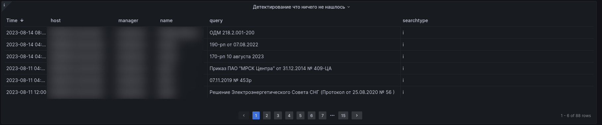

Таблица предоставляет собой сводную информацию о том, что на какой-то или каких-то установках какой-то конкретный пользователь не смог найти документ.
Под "не смог найти документ" здесь подразумевается, что пользователь осуществил запрос через интеллектуальный или атрибутный поиск,
и система не смогла что-либо найти по запросу пользователя.

Данную таблицу имеет смысл использовать совместно с дашбордом [Поисковые запросы.](092-search-query.md)

Пытливому и внимательному читателю может показаться, что данная таблица и упомянутый дашборд дублируют друг друга и потому назревает вопрос "а зачем так?"
Ответ - таблица по пустому поиску дана в дашблорде "Для менеджеров" именно для того, чтобы у менеджера в рамках одного окна была максимально полная картина о том,
что происходит на подконтрольной установке и насколько она удовлетворяет запросам пользователей этой установки.
Если менеджер видит, что пустой поиск таки имеет место быть - менеджер открывает дашборд именно по пустому поиску и уже дальше в нем
проводит более детальную аналитику по этим пустым поискам.
И делает соответствующие выводы.
Ну или не делает.

## Сколько часов назад обновились файлы в OperUp

Данная таблица отображает данные о установках и файлах, на которых обновление OperUP произошло более чем 3 дня назад. В "зелёной зоне" пилообразная
линия показывает как обновляются файлы - это нормальное поведение ПК. При выходе линии в "красную" зону это говорит о том что файлы OperUP не обновлялись
более трёх дней и необходимо обратить внимание на появление такой ситуации. Так же появление линии  в "красной" зоне может говорить о том
что файлы sysinfo на установках под 'smartupload' не присылают новые файлы 'sysinfo' и вы пропустили этот алерт.

Нормальные значения - в рамках текущих (на момент просмотра таблицы) суток, если иное не имеет место быть для конкретного клиента как договоренность.

Любые другие значения должны трактоваться как отклонение от нормы.
И должны приниматься соответствующие меры, для исправления ситуации.

Алерты, сигнализирующие том, что с процессом получения OperUp что-то пошло не так:
- [KodeksDBOperUpToOld](http://smart.uniclass.ru/docs/errors/KodeksDBOperUpToOld.md)
- [KodeksDBOperUpToOldCount](http://smart.uniclass.ru/docs/errors/KodeksDBOperUpToOldCount.md)

Второе применение данной таблицы - контроль за регулярностью получения OperUp на той и илиной установке, если на ней в прошлом были замечены проблемы с этим процессом.
Так, не дожидаясь даже алертов иной раз, можно отловить ситуацию с проблемой регулярности получения OperUp  и принять соответствующие меры для ее исправления:
- До того как это станет известно пользователю.
- Что, в свою очередь, ведет к повышению лояльности к бренду.
- Что, в свою очередь, ведет к увеличению КМ по данному клиенту. Так или иначе.

## Активность пользователей в текущем месяце

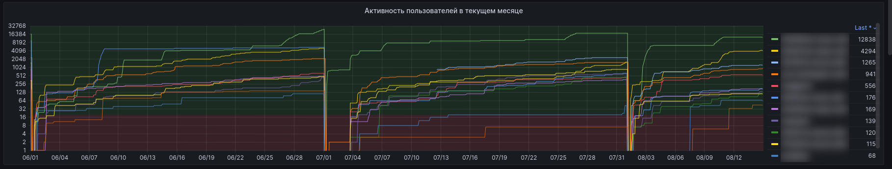

Данный график показывает в динамике активность пользователе на всех подконтрольных установках.
Под активностью здесь подразумевается и считается суммарно вся деятельность пользователя в системе: поиски, хождения по ссылкам, разделам, выгрузки, печати и т.д.

Следует помнить, что каждое первое число месяца данный показатель обнуляется, и подсчет начинается снова.
Сделано так для того, чтобы:
- иметь возможность оценить динамику в рамках конкретного месяца, получив при этом "чистую" динамику (при накопительной динамике, такое было бы сложно увидеть);
- получить более ясную тенденцию при просмотре данного показателя за несколько месяцев.

Справа от графика присутствует легенда, где цветовым меткам с графика проведены соотнесения с конкретной подконтрольной установке.
Клик по любому названию установки в легенде приведет к тому, что на графике будет отображена кривая только по этой установке.
Повторный клик по ней же вернет отображение всех кривых подконтрольных установок.

Данный график подвержен, в том числе, фильтрам, расположенным сразу под названием дашборда.

Если требуется фильтры, в том числе временные, применять только к данному графику, то следует раскрыть только его - сделать это можно, 
кликнув по его названию и выбрав выпавшем меню пункт View.
Выйти из данного режима просто - достаточно нажать Esc.
В противном случае фильтры будут применять ко всем графикам и таблицам данного дажборда.

## Процент реальной вовлеченности в текущем месяце

График отображает тенденцию реальной вовлеченности на всех подконтрольных установках или по какой-то одной выделенной.
В рамках данного графика реальная вовлеченность считается по формуле (пользователи с запросами) / (число в ключе/100), где:
- "пользователи с запросами" - подсчитывается общее количество всех пользователей, создававших за текущий месяц запросы к БД;
- "число в ключе" - количество р.м. по рег-файлу.

Если данному графику задавать временной период более одного месяца, то график будет иметь пилообразный профиль, так как
логика подсчета берет данные за текущий месяц каждый раз. То есть счетчик каждое первое число месяца обнуляется и подсчет ведется снова.
Таким образом, при введении периода, равного полному месяцу, менеджер получает чистую картину.
Допускается, впрочем, и введение периоды за 2 месяца и более, тогда менеджер будет видеть тенденцию за более длительный период.

Как и все остальные графики и таблицы этого дашборда (как и всех прочих), данный график подвержен действию фильтрующих элементов.

Как и все остальные графики и таблицы этого дашборда (как и всех прочих), данный график подвержен действию временных периодов.

Как и все остальные графики и таблицы этого дашборда (как и всех прочих), данный график можно и нужно открывать как единственный график и далее использовать фильтрующие и сортирующие инструменты.

Как и все остальные графики этого дашборда (как и всех прочих), данный график содержит легенду (справа список), содержащий соотношение цвета линии на графике с именем подконтрольной установки.
Клик по любому имени в этой легенде приведет к отображению кривой на графике только по этой установке.

## Максимальное число занятых лицензий на инсталляции

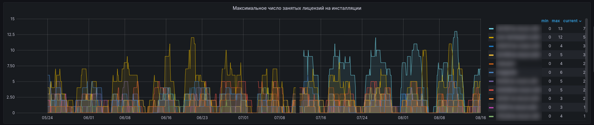

График отображает максимально зафиксированное занятое число лицензий на подконтрольной установке.
Число может быть больше чем число по рег-файлу.
Такое может быть видно в том случае, когда временной период указан больше чем 24ч (т.к. за каждым зашедшим в ПК на 24ч фиксируется его рабочее место).
Если ответственный менеджер видит такую картину на установке, более того - видит ее регулярно, то это весомый повод к 
проведению сбытовой работы по допродаже рабочих мест на такой установке.

Кроме того, в такой ситуации настоятельно рекомендуется дополнительно отслеживать графики и таблицы:
- [Пользователи и количество раз которые не смогли подключиться из-за использования всех лицензий в течении 1 дня](086-for-managers.md#пользователи-и-количество-раз-которые-не-смогли-подключиться-из-за-использования-всех-лицензий-в-течение-1-дня)
- [Количество пользователей не смогли подключиться за один час](086-for-managers.md#количество-пользователей-не-смогли-подключиться-за-1-час)

Данные графики и таблицы помогут выяснить кто именно (чьи учетки) и в каком количестве нуждаются в своих собственных рабочих местах и,
таким образом, целенаправленно идти уже к конкретным заинтересованным пользователям.

_Дорогой коллега, я думаю, что тут трудно не согласиться с мыслью, что использование этого инструмента потенциально ускорит
сбытовую работу по действующим установкам, так ведь? ;)_

Второй сценарий использования информации с данного графика - в том случае, если ответственный менеджер видит картину, когда
не все лицензии заняты (особенно если такая картина регулярная), то это повод к выявлению дополнительных пользователей/отделов клиента, которые 
еще не в курсе, что у них внедрена ИСС Кодекс/Техэксперт.

Как результат таких действий:
- повысится активность, вовлеченность;
- повысится количество регулярно занятых рабочих мест;
- в средней перспективе при успешной работе ответственного менеджера, усилиями последнего будет создана ситуация, когда рабочих мест станет не хватать на всех, что,
в свою очередь, приведет к допродажной работе и, в конечном счете, к увеличению КМ

И все счастливы, счастливы ;)

## BilligDocs

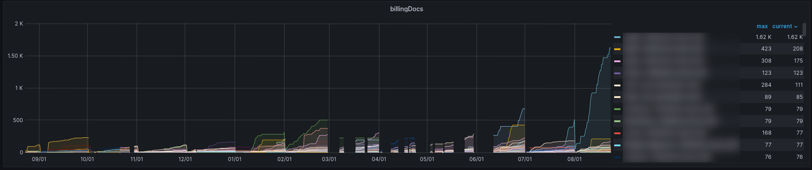

График отображает количественное использование внедренных ПК в части открытия документов, использования сервисов (суммарно)
в разрезе по каждому пользователю на каждой подконтрольной установке.

График аккумулирует собираемые данные в рамках календарного месяца, каждое первое число месяца счетчик сбрасывается на 0.
Для формирования графика берутся данные только с установок.
Для аналогичного контроля по простым онлайн-доступам следует использовать дашборд [Биллинг Онлайн.](083-billing-online.md)

График целесообразно использовать в двух вариантах:
- задавать период равный 1 календарному месяцу;
- задавать периоды кратные полным месяцам.

В первом случае графически оценивается динамика нагрузки на ПК, уровень участия всех или части учеток на короткой дистанции (1 месяц).
Во втором случае - оцениваются более длительные периоды, чтобы получить больше информации о прогнозировании и планировании работы с тем или иным клиентом.

Кроме того, график, как и многие прочие в СМАРТе, позволяет выполнять сортировку по данным, указанным справа от самого графика:
- можно отображать кривую графика только по какому-то конкретному пользователю;
- список содержит максимально зафиксированное значение открытых документов+использованных сервисом и значение, зафиксированное на момент
крайнего полученного в СМАРТ sysinfo - можно по этим столбцам выполнять сортировку списка.

Сортировка по максимальному значению позволит выявить наиболее активных пользователей и наименее активных пользователей, 
с тем чтобы потом менеджер мог провести с выявленными соответствующую работу: кого-то поддержать в таком похвальном стремлении,
а кого-то - смотивировать на бОльшую активность/вовлеченность.

_Что, в свою очередь, в конечном итоге, приведет к увеличению КМ. Ну ты понял, коллега. ;)_

## Запросы к БД за час

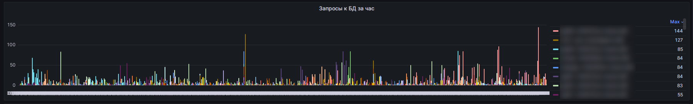

График отображает количественное значение запросов в базы данных (подключенные в рамках находящихся на сопровождении комплектов) 
за час в разрезе каждого пользователя на подконтрольных установках.

График отображает собранные данные накопительно в течение всего периода контроля за той и или иной установкой.
Глубина хранения накопленных данных - 13 месяцев.

Справа от графика присутствует легенда, с помощью которой можно фильтровать собранные данные:
- от большего к меньшему и обратно,
- выделить отображение на графике только конкретного пользователя на графике или обратно всех разом, кликая на нужные строки.

График подвержен изменениям временного периода - можно установить любой временной отрезок (из предустановленных или задать свой с точностью до суток),
чтобы получить данные по графику за конкретный период во времени из прошлого.

На самом графике так же можно курсором выделить заинтересовавший период, чтобы отобразить собранные значения только за выбранный период. 
Т.е. рассмотреть его более подробно, так сказать, "под микроскопом".

Данные с этого графика можно использовать для анализа того, насколько активны пользователи, в каком количестве активны 
пользователи на той или иной установке.
Такая аналитическая информация может быть использована для поиска ответа на вопрос о востребованности установки у того или иной клиента.

Кроме того, график может быть полезен для ситуации, когда очень точечно нужно:
- отслеживать нагрузку; 
- востребованность внедренного ПК;
- следить за конкретными учетками в том, используют ли они систему.

## Print statistic

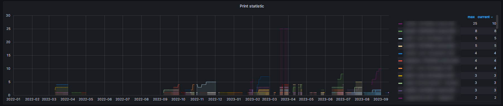

График отображает количественные значения выгруженных из системы документов посредством отправки на печать тех или иных документов
напрямую с оболочки ПК с конкретизацией до пользователя на той или иной подконтрольной СМАРТу установке.

График отображает накопленные данные в рамках месяца, каждое первое число счетчик сбрасывается, и подсчет начинается заново.
Сделано так специально - для аналитики деятельности пользователей в системе такая схема подсчета более релевантна, в сравнении
с непрерывным накоплением без сброса счетчика каждое первое число.
При таком формате подсчета суммирование накопленных значений за несколько месяцев даст более правильную картину потребления 
за интересующий период.

Как следует из описания схемы работы графика - логичнее использовать временные периоды кратные полным месяцам, для более
объективной картины.
Также можно задавать нестандартные временные периоды, визуально выделяя их на самом графике.

Справа от графика присутствует легенда, в которой фиксируются максимально выявленные количественные значения (столбец max) 
и текущие (столбец current) количественные значения выгруженных документов с дифференциацией по конкретным учеткам на подконтрольных установках.

Информация с данного графика будет полезна для понимания того:
- насколько подконтрольная установка нагружена;
- какие пользователи наиболее активные;
- сколько выгружается из системы документов за определенный период (если у клиента такой показатель критичен);
- выловить ситуацию, когда и кем именно создается ситуация внезапно большого количества выгружаемых объектов, приводящих
к необоснованно (с точки зрения клиента) повышенной нагрузке на сервер с ПК (в ситуации когда машина слабовата).

## Сохранено документов за 1 час

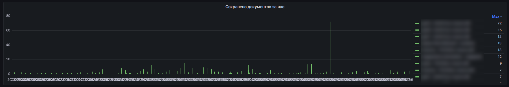

Этот график схож с графиком [Print statistic](086-for-managers.md#print-statistic) с той лишь разницей, что здесь ведется контроль
за количеством выгруженных из системы документов через СОХРАНЕНИЕ документа в рамках часа.

График, в отличие от вышеупомянутого, собирает и отражает данные накопительно в течение заданного периода.
Срок хранения таких данных - на глубину в 13 месяцев.

График подвержен изменению глобального временного периода.
Также на нем можно вручную выделить интересующий отрезок - и график перестроится исходя из этого выделения.

Справа от графика присутствует легенда, в которой фиксируется максимально выявленные количественные значения (столбец max) 
выгруженных документов с дифференциацией по конкретным учеткам на подконтрольных установках.

Информация с данного графика будет полезна для понимания того:
- насколько подконтрольная установка нагружена;
- какие пользователи наиболее активные;
- сколько выгружается из системы документов за определенный период (если у клиента такой показатель критичен);
- выловить ситуацию, когда и кем именно создается ситуация внезапно большого количества выгружаемых объектов, приводящих
к необоснованно (с точки зрения клиента) повышенной нагрузке на сервер с ПК (в ситуации когда машина слабовата).

## Пользователи и количество раз которые не смогли подключиться из-за использования всех лицензий в течение 1 дня

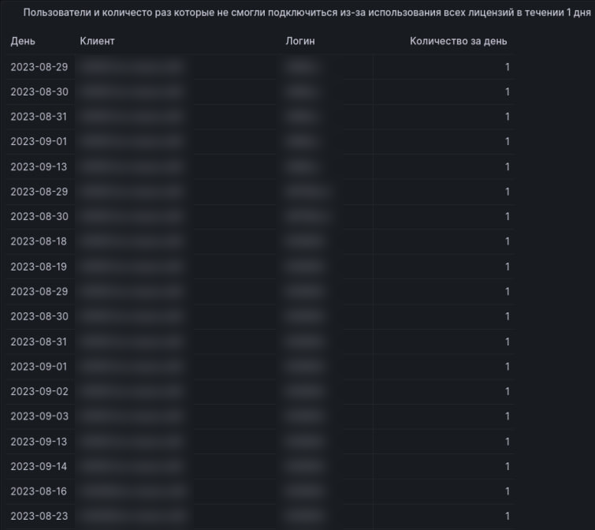

Таблица содержит в себе информацию о том, кто, когда, на каких установках и сколько раз за час не смог зайти в Техэксперт,
потому как исчерпались все доступные рабочие места.

Таблица подвержена влиянию как устанавливаемого временного интервала, так и фильтрам, доступным в этом дашборде.

Таблица работает в паре с алертом [KodeksDetectOverUserError](http://smart.uniclass.ru/docs/errors/KodeksDetectOverUserError.md).

Информация с данной таблицы может быть использована:
- для выявления новых пользователей;
- для выявления обоснования к допродаже дополнительных рабочих мест на установке.

## Количество пользователей не смогли подключиться за 1 час

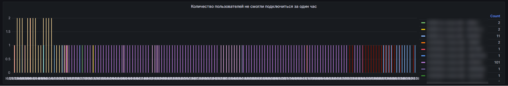

График отображает по каким подконтрольным установкам какое количество учеток не смогло подключиться за 1 час.
Причины этому могут быть разные - ошибка авторизации, исчерпание лицензий.
График фиксирует именно отказ в подключении.

Для определения причины можно обратиться к таблице "Пользователи и количество раз которые не смогли подключиться из-за использования всех лицензий в течение 1 дня",
описанной [выше](086-for-managers.md#пользователи-и-количество-раз-которые-не-смогли-подключиться-из-за-использования-всех-лицензий-в-течение-1-дня),
для определения конкретных учеток, которые не смоли подключиться.
Также стоит обратить внимание на показания алерта [KodeksLimitsUsers](http://smart.uniclass.ru/docs/errors/KodeksLimitsUsers.md) -
он подскажет, опять же, оперативно, по ситуациям когда какие пользователи не смогли попасть в ТЭ.

Информация с данного графика, а также с упомянутых сопутствующих графика и алерта, поможет в ситуации когда:
- необходимо обосновать увеличение количества р.м.;
- необходимо обосновать конкретное число увеличения р.м.;
- необходимо обосновать увеличение количества р.м. для конкретных пользователей (даже если они уже зарегистрированы в ПК);
- необходимо провести допродажную работу.

## Ноль запросов к БД за 30 дней статистика

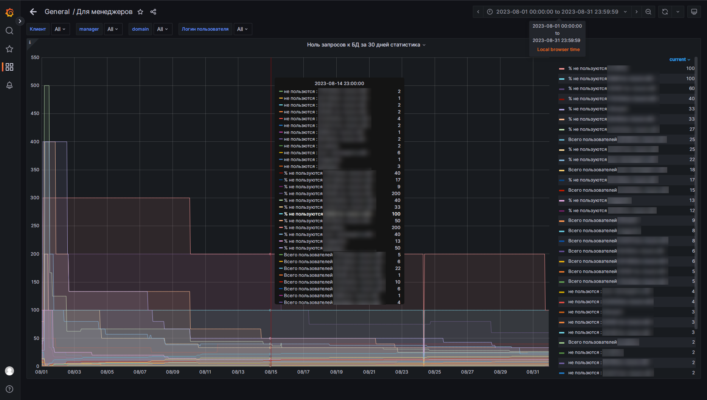

График достаточно информативен - он отражает использование внедренного ТЭ через анализ того, было ли какое-либо обращение 
к установленным БД за определенный срок на подконтрольных установках по всем зарегистрированным в нем учеткам (включая новоприбывших
за указанный период).

График отображает сразу несколько показателей:
- % не пользуется - высчитывается в процентном выражении значение использования системы (чем ниже значение, тем более востребована была система за указанный период);
- не пользуются - количественное значение, которое подсчитывается исходя из того сколько учеток из известных (=зарегистрированных) 
не зашло ни разу в систему за указанный период; значение может быть больше чем количество рабочих мест, положенных по лицензии; 
_(коллега, думаю ты понимаешь, почему так может быть)_
- всего пользователей - сколько всего зарегистрированных пользователей зафиксировано за указанный период как не заходившие ни разу; 
значение может быть больше чем количество рабочих мест, положенных по лицензии; 
_(коллега, думаю, ты и тут понимаешь, почему так может быть)_

---

ВНИМАНИЕ! Общее количество пользователей вычисляется по статистике работы в течение месяца. 
Если брать промежуток графика за границами одного месяца могут быть неверные данные.
Поэтому временной период для этого графика целесообразно указывать равный одному месяцу.

---

Информация с данного графика может быть полезна:
- когда выявлена низкая активность/вовлеченность и надо понимать масштабы "бедствия";
- когда необходимо контролировать, что системой пользуются
- вовремя отловить момент, когда системой перестали пользоваться (совсем или частично);

График, с точки зрения информационного обеспечения, работает в паре с алертами (косвенно):
- [KodeksUserActivityIsLow](http://smart.uniclass.ru/docs/errors/KodeksUserActivityIsLow.md)
- [KodeksUserAInvolvementIsLow](http://smart.uniclass.ru/docs/errors/KodeksUserAInvolvementIsLow.md)

## Работа Kassist за последние 30 дней

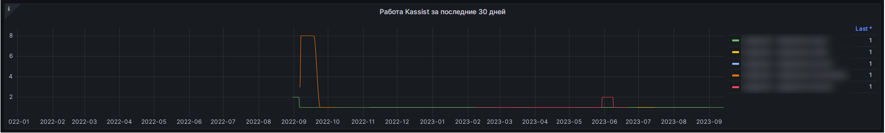

График отображает количественное значение запросов к установленным БД с использованием сервиса kassist.

График отображает также на какой подконтрольной установке какие именно учетки использовали этот сервис.

График является более информативной версией графика [Среднее число запросов kassist за месяц](082-kodeks-analytics.md#среднее-число-запросов-kassist-за-месяц).

---

ВНИМАНИЕ! Количество запросов от kassist к БД за 30 дней с разбивкой по пользователям.
Таким образом, временной период на этом графике целесообразно использовать кратный полному месяцу.

---

Информация с данного графика полезна в том случае, если:
- новый пользователь и необходимо проконтролировать использование именно этого сервиса;
- необходимо проконтролировать, что данный сервис вообще используется пользователями.

## Ноль запросов к БД за 60 дней

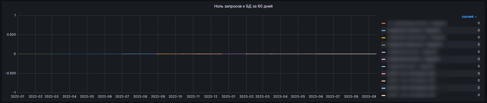

## Процент заполненных карточек заходивших в систему пользователей

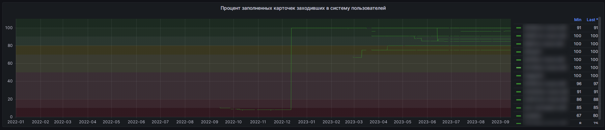

[Листай дальше](087-upload-sysinfo-into-ASRP.md)

[Вернуться в Оглавление](Readme.md)

