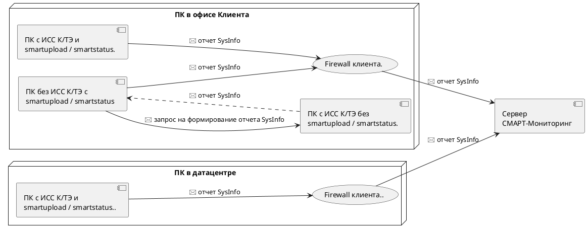

# СМАРТ-Мониторинг и отдел ИБ у клиента: как подружить?

В зависимости от "размерности" клиента, в орг.структуре последнего помимо "сисадминов" может присутствовать отдел ИБ 
(Информационная Безопасность).
Этот отдел отвечает за цифровую безопасность на предприятии, особенно если в цифровом обороте его сотрудников используются
чувствительные данные. Контроль за обращением таких данных внутри предприятия и выгрузка их наружу, иногда может быть 
возложен и на отдел ИБ.
Также этот отдел может контролировать все внешнее ПО, которое так или иначе используется на предприятии для разных задач
разными отделами.
Логично предположить, что такой софт как СМАРТ-Мониторинг, который что-то там постоянно посылает в Интернет, может привлечь
к себе лишнее внимание и замедлить процесс внедрения СМАРТа на предприятии-клиенте.

Ниже дана пояснительная записка для отдела ИБ, которая поможет закрыть излишнее любопытство отдела ИБ и снять вопросы к
СМАРТ-Мониторингу.

[Скачать можно здесь](https://disk.yandex.ru/i/dHJfoHoG59UU9Q)

Также текст пояснительной записки доступен ниже, для знакомства:

## Пояснительная записка по сервису "СМАРТ-Мониторинг" для отделов ИБ

### Оглавление

- [Общее описание](/docs/090-smartupload-smartstatus-client-cybersecurity.md#общее-описание)
- [Основная задача скриптов SmartUpload и SmartStatus](/docs/090-smartupload-smartstatus-client-cybersecurity.md#основная-задача-скриптов-smartupload-и-smartstatus)
- [SmartUpload](/docs/090-smartupload-smartstatus-client-cybersecurity.md#smartupload)
- [SmartStatus](/docs/090-smartupload-smartstatus-client-cybersecurity.md#smartstatus)


#### Общее описание

Программное обеспечение (далее – ПО) «Информационно-справочная система (ИСС) Кодекс/Техэксперт» (далее – ИСС «Кодекс/Техэксперт») 
развёрнутое у клиента, в процессе функционирования требует постоянного контроля со стороны поставщика данного программного 
комплекса (далее – ПК). Контроль необходим как в плане общей работоспособности ПК, так и в плане контроля состава и 
целостности томов баз данных (далее – БД), актуальности версии используемого ПК, версий его модулей и вспомогательных утилит 
и множества других параметров и значений. Для автоматизации данной задачи был создан сервис «СМАРТ-Мониторинг», который, 
получая отчетные файлы с параметрами работы ПК, формирует информационные сообщения о наличии аварийных ситуаций с ПК ИСС 
«Кодекс/Техэксперт». Для пересылки информации в систему «СМАРТ-Мониторинг» используется два скрипта с условными названиями 
«smartupload» и «smartstatus». Данные скрипты выполняются по расписанию и отправляют информацию через сеть Интернет, на 
сервер сервиса «SMART-Мониторинг». Схема взаимодействия:


<div hidden>

</div>


#### Основная задача скриптов SmartUpload и SmartStatus

В режиме реального времени информировать поставщика ПО о проблемах в работе с ПК, уменьшить время недоступности 
ИСС «Кодекс/Техэксперт»для пользователей, поддержание БД в целостности и актуальном состоянии.

#### SmartUpload

Скрипт может быть размещён как на компьютере с ИСС «Кодекс/Техэксперт», так и на любом ПК имеющим к нему доступ. 
Скрипт запускается раз в час и формирует файл для отправки в систему «СМАРТ-Мониторинг» информации о версиях БД, 
их целостности, наличию аварийных состояний у сервера ИСС «Кодекс/Техэксперт», работоспособности системы 
лицензирования и тд. 
После формирования файла он пересылается в систему «СМАРТ-Мониторинг» на обработку. 
Скрипт написан на языке Bash или CMD в зависимости от ОС. Для работы с сетью использует утилиту Curl ( https://curl.se/ )

#### SmartStatus

Скрипт может быть размещён как на компьютере с ИСС «Кодекс/Техэксперт», так и на любом ПК имеющим к нему доступ. 
Скрипт запускается раз в 15 минут и формирует файл для отправки в систему «СМАРТ-Мониторинг» информации о метриках 
работы сервера ИСС «Кодекс/Техэксперт», по которым определяется работоспособность сервиса и его отдельных компонентов.

Пример значений метрик:
```
# Sysinfo metrics
# Path /docs
kserver_main_page{service="kodweb",path="/docs"} 0
kserver_product_control{service="kodweb",path="/docs"} 0
# End
```
Скрипт написан на языке Bash или CMD в зависимости от ОС. Для работы с сетью использует утилиту Curl ( https://curl.se/ )

