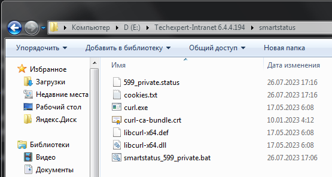

# Внедрение СМАРТ.Статус у клиентов в ОС Windows

Скрипт smartstatus основным своим назначением преследует цель отслеживания технического состояния подконтрольных установок, имеющих выход в интернет.
Под техническим состоянием здесь понимается:
- работает или нет ПК (доступен ли);
- корректно собрана или нет Главная Старинца ПК;
- имеются или нет ошибки в виртуальных каталогах, где собраны комплекты.

Smartstatus отслеживает в режиме реального времени, каждые 15 минут, с задержкой до 10 минут, необходимой на обработку поступающих отчетов.

Функционал скрипта smartstatus:
- собирает необходимую информацию с самого ПК; 
- формирует свой собственный отчет на основе собранных данных;
- отправляет его на сервер СМАРТа для последующей обработки.

Общий принцип внедрения скрипта smartstatus весьма похожа на [принцип внедрения smartupload](71-smartupload-implementation-windows.md).

Для работы скрипта в пару ему так же необходима утилита curl.

Кроме того, до внедрения smartstatus необходимо убедиться, что: 
- версия модуля sysinfo - не старше 2.0.6.5; 
- версию ПК лучше обновить до крайнего стабильного релиза - обычно свежий модуль sysinfo.dbs идет комплектом к нему;
- выпуск базы 7475.db6 не старше 2306.

Так же как и smartupload, smartstatus может работать как в ОС Windows, так и в ОС Linux.
Принципиальной разницы в скриптах в зависимости от ОС нет, есть нюансы в процессе внедрения, обусловленные самой ОС, но никак не скриптом.

Если тебе нужно внедрить smartstatus в ОС Windows, то [читай дальше.](73-smartstatus-implementation-windows.md#подготовка-скрипта-smartstatus)

Если тебе нужно внедрить smartstatus в ОС Linux, то [тебе сюда.](75-smartstatus-implemetation-linux.md)

## Подготовка скрипта smartstatus

Скрипт, ввиду его функционала, содержит исходные данные, индивидуальные для каждой конкретной установки, которую необходимо поставить под контроль smartstatus.

Как видно из скриншота, для подготовки скрипта нужно определить и заменить в самом скрипте некоторые входные данные:
- НАЗВАНИЕКЛИЕНТА - название клиента, установку которого необходимо поставить под контроль smartstatus.
**НАСТОЯТЕЛЬНО РЕКОМЕНДУЕТСЯ** использовать такое же название клиента, которое использовалось при внедрении smartupload.
Эта рекомендация обусловлена исключительно удобством последующей интерпретации данных в Grafana и соотнесения с данными от smartupload.
С точки зрения функционирования обоих скриптов совершенно все равно какое будет НАЗВАНИЕКЛИЕНТА, если только мя не противоречит общим правилам именования файлов в любой ОС.

Этот параметр задается и контролируется пользователем СМАРТа.

Не выдумывай сложносоставленных имен, иначе самому потом будет трудно верно идентифицировать клиента в Grafana.

- АДРЕСПК:ПОРТ - здесь заменить на адрес ПК, на котором развернута установка, подлежащая контролю с помощью smartstatus.
Адрес может быть как в виде IP-адреса, так и в виде имени компьютера в сети.
Этот параметр задается и контролируется пользователем СМАРТа.

Если с течением времени возникла необходимость поменять порт, через который должен будет работать ПК, 
то после его замены в административной части самого ПК, 
актуальный порт также необходимо прописать и в этом скрипте вручную.

- ИМЯДИСТРИБЬЮТОРА - имя твоего предприятия-дистрибьютора, с которым заключен договор на СМАРТ-мониторинг.
Этот параметр задается разработчиком СМАРТа и передается пользователю СМАРТа для внесения в скрипты.

Этот параметр в скриптах служит своего рода меткой, необходимой для корректной сортировки всех приходящих отчетов обработчиком СМАРТа.

Параметр задается по маске XXXXYYYYYYYY, где:
    - XXXX это код дистрибьютора;
    - YYYYYYYY это краткое, но однозначно трактуемое имя дистрибьютора.

- ТОКЕНБЕЗОПАСНОСТИ - параметр, служащий проверочным ключом при сортировке и валидации поступающих в обработчик отчетов СМАРТа.
Уникален для каждого дистрибьютора.
Един для всех скриптов СМАРТа у каждого дистрибьютора.
Не подлежит обмену между дистрибьюторами, так как может привести к нарушению процесса проверки и сортировки приходящих отчетов внутри обработчика СМАРТа.

Этот параметр задается и контролируется разработчиком СМАРТа и передается пользователю СМАРТа для внесения последним этого параметра в скрипты СМАРТа.

Подготовленный скрипт smartstatus может находиться:
- на той же машине (виртуальной или физической), где развернут ПК;
- где-то на локальной сети, в которой доступен ПК;
- ОС не имеет значения.

Для удобства и повышения быстродействия рекомендуется его размещать на той же машине, на которой развернут ПК.
Можно даже в той же директории, где развернут ПК.
Работе самого ПК это НИКАК не помешает.

Для удобства и однозначности восприятия папку с файлами для smartstatus рекомендуется так и назвать - smartstatus.

НАСТОЯТЕЛЬНО рекомендуется в имени каталога для smartstatus использовать ТОЛЬКО английские буквы, верхнего или нижнего регистра, без цифр, без спец.символов.

Не выдумывай здесь сложного и витиеватого, в этом нет никакой нужды.

## Разворачиваyие утилиты Curl, внедрение скрипта

Можно и нужно использовать ту же последовательность действий, которая [описана для smartupload.](71-smartupload-implementation-windows.md#разворачиваyие-утилиты-curl-внедрение-скрипта) 

В итоге у тебя должно получится вот такое:

## Тестовый запуск, оценка результатов запуска

После того как ты все разместил там где требуется, можно попробовать запустить скрипт smartstatus.bat (запускать от имени администратора) и оценить результаты тестового запуска.

Что делаем:
- Необходимо запустить командную строку Windows от имени администратора.

Для этого нажимаем кнопку "Пуск", далее в строке поиска приложения набираем cmd. 
В предложенных вариантах видим приложение cmd.exe, кликаем по нему правой кнопкой мыши и в выпавшем меню выбираем "Запуск от имени администратора".

Откроется окно командной строки Windows с отображением активного пути по умолчанию.
Нужно перейти в директорию, где лежит smartstatus.bat, скорректированный под клиента.

Путь показан как пример.
В твоем случае он будет отличаться от того, который в примере.

И вот теперь нажать на Enter, отправив скрипт на исполнение.

В результате в консоли можно будет наблюдать вот такой результат:

Как можно заметить, в результатах можно увидеть HTTP-коды результатов.
Если видишь код 200 - все ок, скрипт отработал успешно.
Можешь еще, для очистки совести, уточнить у разработчика СМАРТа, что твой отчет действительно доставлен в обработчик СМАРТа.

Если же видишь код 404 или любой другой HTTP-код, говорящий о сетевых ошибках, то:
- проверь скрипт на предмет ошибок в адресе ПК и/или адресе куда отсылать собранный отчет;
- если в скрипте все верно, а выполнение все равно с ошибкой, то делаешь скриншот, отсылаешь его в чат с разработчиком СМАРТа и далее совместно решаете проблему.

Еще одним фактором успешной отработки скрипта является тот факт, что в той же папке, где находится скрипт, появились файлы: собранный отчет и файл cookies.txt:

При успешности выполнения этого этапа можно переходить к автоматизации последующего исполнения корректного скрипта по расписанию.

## Автоматизация исполнения скрипта

После того как первый тестовый запуск smartupload прошел успешно - можно этот процесс автоматизировать.

В ОС Windows это можно сделать с помощью стандартных средств самой ОС - Планировщик заданий.

Пуск -> Панель управления -> Администрирование -> Планировщик задач

Далее в планировщике необходимо создать задачу (не выбирать создать ПРОСТУЮ задачу!!!) со следующими настройками (см. картинки ниже):

Обязательно выставить исполнение вне зависимости от пользователя и с наивысшими правами - при некоторых настройках групповых и локальных политик безопасности, 
программе может оказаться невозможно писать файлы в свою же папку.
А это недопустимо.

Периодичность выполнения задачи - каждые 15 минут, бесконечно.

Здесь важно выдержать хоронометраж выполняемых фоновых заданий - чтобы задача smartstatus не пересекалась с ежедневными процедурами самого ПК: бэкап, перезапуск, обновление.
В эти моменты ПК может быть недоступен.

Здесь задается параметр того, что должно быть выполнено в рамках данной задачи - в нашем случае это "Запуск программы", а именно запуск smartstatus.bat.

Пути указываются абсолютные.

---

**ВАЖНО!!!** Обязательно необходимо указать рабочую папку, в которой лежит сам файл smartstatus.bat.
Если этого не сделать, то скрипт не сможет сохранить собранный отчет, и, следовательно, его отправить.
Таким образом, скрипт не будет работать как положено.

---

На этих двух скриншотах показано, какие еще должны быть выставлены условия для запуска и функционирования задачи.

После всех настроек задачи система спросит пароль, если была выставлена галочка "Выполнять с наивысшими правами".

Если учетка, под которой заводилась задача, обладает локальными правами администратора, то ввести ее пароль.
Иначе - ввести имя и пароль такой учетки, чьи права позволяют завершить выставление задачи в планировщик.

После постановки задачи, успешность ее исполнения можно отследить в журнале планировщика, а также спросив разработчика СМАРТа о регулярности поступления отчетов с этой установки.
Кроме того, если по этой установке стали строиться графики в Grafana - значит все верно настроено.

После загрузки отчета на сервер потребуется от 10 минут на его обработку.
На графиках обновлённые данные появятся где-то в этом промежутке.
Аварийные сообщения имеют различный период срабатывания\задержки поэтому появятся позднее.

[Вернуться к началу](70-intro-smartuload-smartstatus.md)

[Вернуться к Оглавлению, если стало страшно](Readme.md)