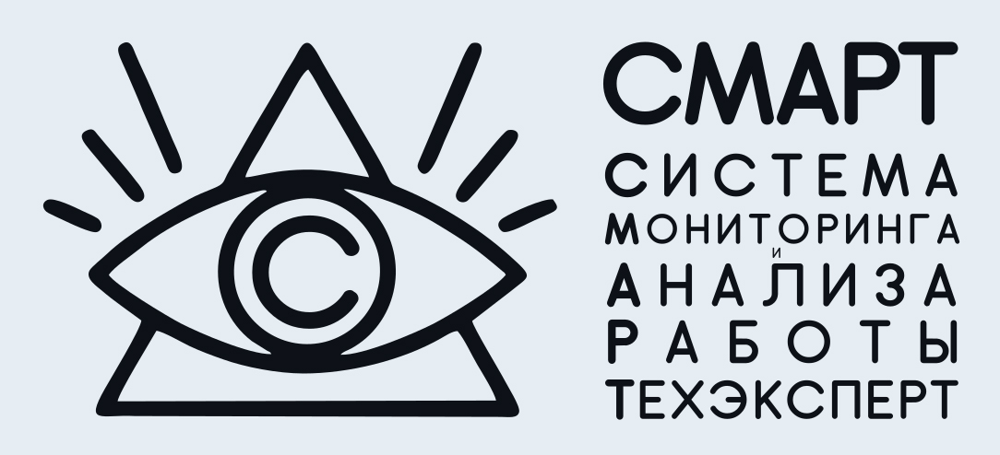

# Инструкция

# Оглавление

## Введение

[Вступительное слово](000-intro.md)

## Как это устроено

- [Как это устроено?](010-how-it-works.md)
- [Система сбора отчетов](020-auto-collect-sysinfo.md)
- [Алертинг](030-alert.md)
- [Grafana](040-grafana.md) 
- [Интерфейс](050-grafana-interface.md)
- [Настройки](060-grafana-visualization.md)
- [Как это работает и как это применять](080-dashboards.md)
- [Как это внедрять у клиентов](070-intro-smartuload-smartstatus.md)

## Бизнес кейсы

Живые примеры с пользой от СМАРТа:
- [пример номер 1](100-smart-real-cases-1.md)
- [пример номер 2](101-smart-real-cases-2.md)
- [пример номер 3](102-smart-real-cases-3.md)
- [пример номер 4](103-smart-real-cases-4.md)

## Непридуманные истории

[Удивительное](000-fuckups.md)

## Приложение №1

- [Полный список алертов](000-appendix-1.md)
- [Полный список ошибок работы ПК, с кодами и описанием](000-appendix-2.md)
