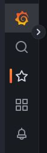

# Использование Grafana для визуализации данных

Рис.3 Настройки Grafana (некоторые).

Блок с Настройками предельно минималистичен и содержит все необходимое для достаточной настройки комфортной работы пользователя СМАРТа с Grafana. Название открытого дашборда находится вверху слева и формируется по маске «Папка с дашбордами / Название дашборда». 
Рядом с названием расположена пиктограмма звездочки и пиктограмма связи. 
Клик по пиктограмме звездочки означает присвоение открытому на текущий момент дашборду свойства «Избранное» с размещением в соответствующей папке с дашбордами. Список таких дашбордов можно увидеть, наведя или кликнув мышью на пиктограмму звездочки слева в вертикальном меню.
Клик по пиктограмме связи вызовет всплывающее меню, в котором будет предложено сформировать прямую ссылку на данный дашборд, чтобы в последующем переслать ее кому-то другому.

_При отправке прямой ссылки на дашборд следует помнить, что открыть такую ссылку сможет лишь тот, кто тоже является пользователем СМАРТа и имеет доступ к данному дашборду. Делитесь такой ссылкой внимательно, если менеджеров у пользователя СМАРТа больше чем один._

Под названием открытого на текущий момент дашборда присутствуют следующие элементы настройки (на разных дашбордах – разные комбинации элементов настройки):
- Manager – менеджер пользователя СМАРТа, к которому принадлежит тот и иной объект, контролируемый СМАРТом, используется не на всех дашбордах;
- Domain – список всех, когда-либо попавших из отчетов sysinfo в СМАРТ, групп пользователей установок ИСС Кодекс/Техэксперт (фиксируется в ПК ИСС Кодекс/Техэксперт из Active Directory), используется не на всех дашбордах;
- Клиент - объект, который контролируется СМАРТом, используется не на всех дашбордах;
- Логин пользователя – учетная запись пользователя ПК ИСС Кодекс/Техэксперт, когда-либо попавшая в собранный отчет sysinfo и, соответственно, зафиксированная в Grafana, используется не на всех дашбордах;
- Response – метка об успешности или провале исполнения автоматической отправки собранных sysinfo в АСРП пользователя СМАРТа, используется только на дашборде «Загрузка sysinfo в АСРП»;
- Тип ошибки – список ВСЕХ созданных на момент написания этого Руководства алертов, доступных пользователю СМАРТа, используется только на дашборде «Текущие аварийные ситуации»;
- Приоритет – список приоритета алертов, используется только на дашборде «Текущие аварийные ситуации».

В вертикальной полосе слева от названия открытого на текущий момент дашборда присутствуют следующие объекты настройки:

Рис.3.2. – Настройки Grafana (дашборды).

Пиктограмма логотипа Grafana – клик по данной пиктограмме откроет страницу с установленным по умолчанию дашбордом, то есть откроется дашборд «Кодекс аналитика».

Пиктограмма «Лупа» - используется для поиска нужного дашборда по его названию. При клике по этой пиктограмме Grafana открывает страницу, на которой отображаются ВСЕ доступные дашборды. Поиск дашборда можно осуществлять: 
- по его имени в строке поиска: при вводе текста в строку поиска страница моментально отображает все подходящие результаты поиска по введенному набору букв на этой же странице;
- визуально, прокручивая открытую страницу со списком всех доступных дашбордов;
- используя сочетание клавиш Ctrl + F для поиска по контексту на самой странице (поиск средствами браузера).

Пиктограмма «Звездочка» - при наведении мыши на данную пиктограмму будет отображен список тех дашбордов, которые были помечены ранее звездочкой при просмотре самих дашбордов: избранные дашборды, "Избранное". По умолчанию, в этом списке уже есть дашборд «Kodeks server metrics» и дашборд «Kodeks аналитика». Список не имеет ограничений по количеству добавленных объектов.

Рис.3.3. – Настройки Grafana (профиль).

Пикторграма аватара профиля – клик по данной пиктограмме откроет страницу с настройками профиля пользователя СМАРТа. 
При желании здесь можно внести изменения по доступным полям, персонифицуря таким образом безликого пользователя СМАРТа. Здесь же можно отслеживать текущие сессии с Сервисом и отключать те, которые показались несанкционированными. Отключение происходит если кликнуть по пиктограмме выключения.

Рис.3.4. – Настройки Grafana (время).

Пиктограмма часов – клик по этой пикторамме вызывает выпадающее меню, в котором возможно:
- выбрать свой период времени в полных сутках, в течение которого необходимо отразить тот или иной дашборд;
- выбрать предустановленные временные периоды, с точностью от прошедших 5 минут до 2 лет назад;
- выбрать ранее отображенные временные периоды.

Слева и справа от отображаемого периода есть кнопки «влево» и «вправо» - клик по ним сместит выбранный период на 10 дней ранее («влево») или на 10 дней позднее («вправо), безотносительно того, был ранее задан свой период или выбран предустановленный.

Рис.3.5. – Настройки Grafana (время).

При назначении индивидуального периода времени следует нажать на кнопку «Apply time range», чтобы установленный период применился на открытом дашборде. 
При выборе предустановленного временного интервала, его применение происходит сразу же.
После применения желаемого временного периода Grafana сама автоматически обновит открытый дашборд на соответствие выбранному периоду, однако в некоторых случаях можно дополнительно обновить саму станицу, нажав F5 или Ctrl + F5 на клавиатуре.

Пиктограмма «Лупа со знаком минус внутри» - клик по этой пиктограмме означает расширение выбранного периода:
- на +10 дней в начале периода и +10 дней в конце периода, если был задан свой период времени;
- на следующую позицию вниз по списку предустановленных временных периодов, если был выбран один из них (укрупнение временного периода).

Пиктограмма «Круговые стрелки» - клик по этой пиктограмме произведет обновление текущего открытого дашборда. Можно применять самостоятельно эпизодически или при введении нового периода времени. Клик по рядом кнопке со стрелочкой вниз вызовет выпадающее меню, где предложит задать автоматическое обновление открытого дашборда с определенной периодичностью («свою» периодичность задать нельзя, только выбрать из предложенного списка): от 5 секунд до 1 суток.

Такая же пиктограмма, отображаемая крутящейся в правом верхнем углу любого графика/таблицы, означает, что этот открытый дашборд (то есть его графики и/или таблицы) получает новые данные для своей перестройки ввиду измененных настроек (зачастую – после смены временного периода). Следует или дождаться обновления дашборда (моргнет, перестроившись), или нажать на клавиатуре F5 или Ctrl + F5 для принудительного обновления всей страницы целиком. Информация на дашборде при этом обновится согласно крайним выставленным настройкам, в том числе временным.

Пиктограма «Монитор»   - клик по этой пиктограмме производит смену схем наполняемости текущего дашборда элементами управления и настройки. Существует 3 схемы:
- Схема «Полная» - отображаются все элементы управления и настройки, все таблицы и графики и наименование открытого дашборда, данная схема используется и отображается по умолчанию на всех дашбордах;
- Схема «Только наименование» - отображаются все графики и таблицы открытого дашборда, отображается наименование открытого дашборда, элементы управления и настройки не отображаются, кроме возможности поменять временной период, за который необходимо отобразить графики и таблицы дашборда, а также остальные элементы этого блока с настройками;
- Схема «Минималистичная» - отображаются только все графики и таблицы открытого дашборда и ничего больше; чтобы выйти из этого режима необходимо нажать кнопку Esc на клавиатуре – будет отображена схема «Полная».

Урезанные схемы отображения дашбордов целесообразно применять на презентациях либо для постоянной демонстрации на весь отдел какого-либо из дашбордов, как источник рабочей информации. Полноценную схему целесообразнее использовать для более индивидуальной работы непосредственно пользователем СМАРТа, для получения аналитической и статистической информации.

...to be continued...
