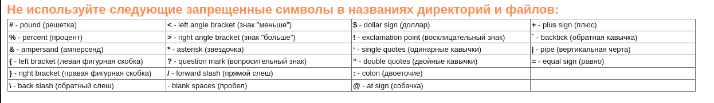
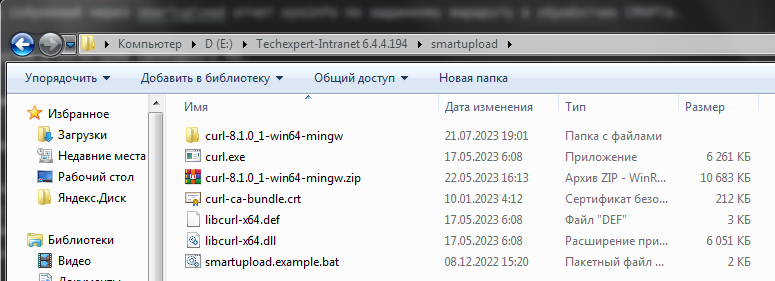
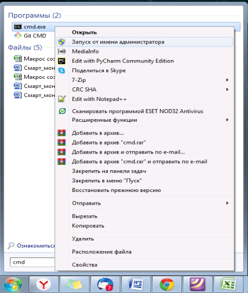
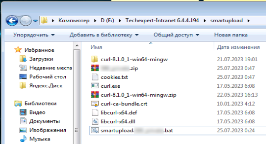

# Внедрение СМАРТ-мониторинга (smartupload) у клиентов

В данной главе описан процесс внедрения smartupload на установке у клиента-пользоватея ИСС.
Процесс сей несложный, не требует каких-то специальных навыков и при "набитой руке" выполняется в среднем минут за 15-20, а то и быстрее.

СМАРТ-мониторинг (smartupload) условно можно разделить на 2 части:
- скрипт smartupload.bat (для ОС Windows) или smartupload.sh (для ОС Linux);
- вспомогательная общедоступная бесплатная утилита Сurl.

Скрипт smartupload выполняет следующие функции:
- получение из текущей установки файла sysinfo;
- сохранение его в заданную для скрипта рабочую папку; 
- загрузка в СМАРТ для последующей обработки. 

Скрипт написан на языке shell cmd. 
Скрипт содержит в себе параметры, обеспечивающие сортировку файлов по дистрибьюторам-пользователям СМАРТа и установкам каждого конкретного дистрибьютора.

Скрипт работает вместе с утилитой Curl. 
Ее функционал - обеспечивать отправку собранного отчета sysinfo по заданному в скрипте адресу к обработчику СМАРТа. 
Больше описания утилиты Curl можно найти тут https://ru.wikipedia.org/wiki/CURL или где угодно на просторах Интернета.

Весь процесс внедрения условно можно разделить на несколько этапов.
Для удобства навигации оглавление представлено ниже.

Процесс внедрения состоит из следующих этапов:
- [Подготовка скрипта smartupload, его размещение](chapter-71.md#подготовка-скрипта-smartupload)
- [Скачивание утилиты Curl](chapter-71.md#скачивание-утилиты-curl)
- [Разворачивание утилиты Curl, внедрение скрипта](chapter-71.md#разворачиваyие-утилиты-curl-внедрение-скрипта)
- [Тестовый запуск, оценка результатов запуска](chapter-71.md#тестовый-запуск-оценка-результатов-запуска)
- Автоматизация исполнение скрипта
- Проверка факта загрузки отчета на сервер со СМАРТом

Для целей эффективности и быстроты внедрения специалисту, выполняющему внедрение smartupload желательно быть на уровне Уверенного Пользователя ПК (для ОС Windows).

В случае затруднений всегда можно обратиться к разработчику СМАРТа, как в личном чате, так и в общем - https://t.me/joinchat/uRkrNE_SNYY0YTUy .

Процесс внедрения smartupload в ОС Windows и ОС Linux радикально ничем не отличается, однако имеет свои небольшие нюансы.

Если тебе нужно внедрить smartupload в ОС Windows, то читай [дальше.](chapter-71.md#подготовка-скрипта-smartupload)

Если тебе нужно внедрить smartupload в ОС Linux, то тебе [сюда.](chapter-72.md)

## Подготовка скрипта smartupload

Скрипт, ввиду его функционала, содержит исходные данные, индивидуальные для каждой конкретной установки, которую необходимо поставить под контроль СМАРТа.

Как видно из скриншота - есть некоторые данные, которые необходимо поменять, заменив русские буквы на английские:
- АДРЕСПК:ПОРТ - здесь заменить на адрес ПК, на котором развернута установка, подлежащая мониторингу.
Адрес может быть как в виде IP-адреса, так и в виде имени компьютера в сети.

Этот параметр задается и контролируется пользователем СМАРТа.

Если с течением времени возникла необходимость поменять порт, через который должен будет работать ПК, то после его замены в административной части самого ПК, актуальный порт также необходимо прописать и в этом скрипте вручную.

- НАЗВАНИЕКЛИЕНТА - имя клиента для последующей корректной сортировки его обработчиком СМАРТа и успешной идентификации его потом в Grafana на ее таблицах и графиках.

Этот параметр задается и контролируется пользователем СМАРТа.

Допускает использовать: 
- ТОЛЬКО английские буквы верхнего и нижнего регистра;
- использовать цифры;
- допускается использовать спецсимволы, не противоречащие общим правилам для имен файлов в любой ОС.

Имя должно быть максимально понятным и сходу однозначно трактуемым.
Не выдумывай сложного иначе потом самому будет сложно.

- ИМЯДИСТРИБЬЮТОРА - имя твоего предприятия-дистрибьютора, с которым заключен договор на СМАРТ-мониторинг.
Этот параметр задается разработчиком СМАРТа и передается пользователю СМАРТа для внесения в скрипты.

Этот параметр в скриптах служит своего рода меткой, необходимой для корректной сортировки всех приходящих отчетов обработчиком СМАРТа.

Параметр задается по маске XXXXYYYYYYYY, где:
    - XXXX это код дистрибьютора;
    - YYYYYYYY это краткое, но однозначно трактуемое имя дистрибьютора.

- ТОКЕНБЕЗОПАСНОСТИ - параметр, служащий проверочным ключом при сортировке и валидации поступающих в обработчик СМАРТа отчетов.
Уникален для каждого дистрибьютора.
Един для всех скриптов СМАРТа у каждого дистрибьютора.
Не подлежит обмену между дистрибьюторами, так как может привести к нарушению процесса проверки и сортировки приходящих отчетов внутри обработчика СМАРТа.

Этот параметр задается и контролируется разработчиком СМАРТа и передается пользователю СМАРТа для внесения последним этого параметра в скрипты СМАРТа.

Подготовленный скрипт smartupload может находиться:
- на той же машине (виртуальной или физической), где развернут ПК;
- где-то на локальной сети, в которой доступен ПК;
- ОС не имеет значения.

Для удобства и повышения быстродействия рекомендуется его размещать на той же машине, на которой развернут ПК.
Можно даже в той же директории, где развернут ПК.
Работе самого ПК это НИКАК не помешает.

Для удобства и однозначности восприятия папку с файлами для smartupload рекомендуется так и назвать - smartupload.

НАСТОЯТЕЛЬНО рекомендуется в имени каталога для smartupload использовать ТОЛЬКО английские буквы, верхнего или нижнего регистра, без цифр, без спец.символов

Не выдумывай здесь сложного и витиеватого, в этом нет никакой нужды.

## Скачивание утилиты Curl

Вторая часть smartupload это утилита Сurl.
Ее функционал - отправлять собранный через smartupload отчет sysinfo по заданному маршруту в обработчик СМАРТа.

Утилита бесплатная и относится к категории свободного ПО.

Скачать ее можно с ее официального ресурса: https://curl.se/download.html

На странице представлены архивы и приложения для установки практически по всем известным или менее известным операционным средам, существующим на данный момент.

Для целей внедрения утилиты Curl рядом с smartupload необходимо скачать АРХИВ утилиты, подходящей под твою операционную среду.
Сохранить архив можно в ту же папку, в которой лежит скрипт smartupload. 
Так можно сделать для собственного удобства.
Впрочем, ты можешь сохранить архив куда угодно на машине с ПК.

Для удобства поиска желаемого архива на сайте утилиты используй Crtl+F (для поиска по ключевым словам на странице сайта).

## Разворачиваyие утилиты Curl, внедрение скрипта

После загрузки архива, распакуй его там же, где лежит сам архив.
Должно по итогу это выглядеть вот так:

Далее тебе нужно содержимое папки bin. 
Оно находится в разархивированном каталоге.
Содержимое папки копируешь в тот же каталог, в котором находится скрипт smartupload.
Должно по итогу это выглядеть вот так:

## Тестовый запуск, оценка результатов запуска

После того как ты все разместил там где требуется, можно попробовать запустить скрипт smartupload.bat (запускать от имени администратора) и оценить результаты тестового запуска.

Что делаем:
- Необходимо запустить командную строку Windows от имени администратора.

Для этого нажимаем кнопку "Пуск", далее в строке поиска приложения набираем cmd. 
В предложенных вариантах видим приложение cmd.exe, кликаем по нему правой кнопкой мыши и в выпавшем меню выбираем "Запуск от имени администратора".

Откроется окно командной строки Windows с отображением активного пути по умолчанию.
Нужно перейти в директорию, где лежит smartupload.bat, скорректированный под клиента.

Путь показан как пример.
Вполне возможно, что в твоем случае он будет отличаться от того, который в примере.

И вот теперь нажать на Enter, отправив скрипт на исполнение.

В результате в консоли можно будет наблюдать вот такой результат:

Как можно заметить, в результатах можно увидеть HTTP-коды результатов.
Если видишь код 200 - все ок, скрипт отработал успешно.
Можешь еще, для очистки совести, уточнить у разработчика СМАРТа, что твой отчет действительно доставлен в обработчик СМАРТа.

Если же видишь код 404 или любой другой HTTP-код, говорящий о сетевых ошибках, то:
- проверь скрипт на предмет ошибок в адресе ПК и/или адресе куда отсылать собранный отчет;
- если в скрипте все верно, а выполнение все равно с ошибкой, то делаешь скриншот, отсылаешь его в чат с разработчиком СМАРТа и далее совместно решаете проблему.

Еще одним фактором успешной отработки скрипта является тот факт, что в той же папке, где находится скрипт, появились файлы: собранный отчет и файл cookies.txt:

При успешности выполнения этого этапа можно переходить к автоматизации последующего исполнения корректного скрипта по расписанию.

## Автоматизация исполнения скрипта

