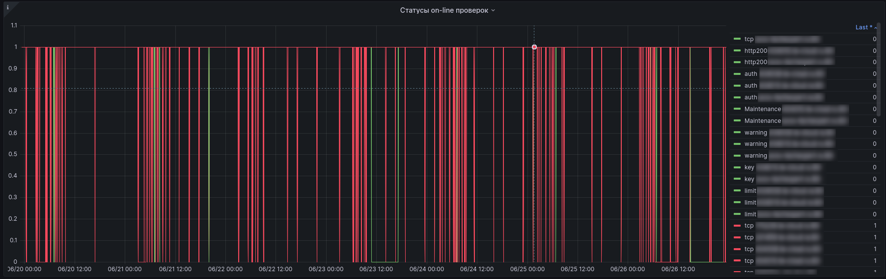

## Kodeks server metrics

Таблицы и графики дашборда Kodeks server metrics предназначены по большей части для отладки и отслеживания состояния самого СМАРТа, а также для технического контроля за подконтрольными СМАРТу установками.

Клик по названию таблицы/графика в этом дашборде приведет к выпадающему меню. 

Выбор в выпадающем меню пункта View (на прочие пункты выпадающего меню не обращай внимания, они нас не касаются) приведет к тому что будет отображаться только выбранный график/таблица.
Соответственно, все последующие манипуляции касательно временных отрезков (ручных или предустановленных), выбора host, manager, checktype и их комбинаций приводят к изменению отображаемой информации строго в выбранном графике/таблице.
Выход из такого состояния в снова отображение всех графиков/таблиц открытого дашборда происходит очень просто - достаточно нажать клавишу Ecs на клавиатуре.

### Время нештатного состояния сервера

График служит для получения информации о том, были ли срабатывания по подконтрольным СМАРТу установкам по следующим состояниям неработоспособности установок:
- Режим обслуживания
- Требуется обслуживание
- Сервер не работает
- Ключ не найден
- Сервер не стартовал
- Ошибки на сервере
- Кончились лицензии

График можно строить по временной шкале путем:
- выбора предзаданного периода;
- ввода своего периода через календарь;
- выбрав на самом графике временной отрезок.

После ввода временного отрезка график перестроится автоматически (в крайнем случае нажать F5 / Ctrl+F5 / Обновить страницу).

Интерпретация значений:
- 0 значит все хорошо, описанных выше нештатных состояний не было обнаружено на подконтрольных установках;
- любое число, отличное от 0 (кроме отрицательных значений) - возвращенный http код обнаруженной ошибки, т.е. код состояния http

Полный список возможных обнаруженых ошибок можно почерпнуть тут:

<a href="https://ru.wikipedia.org/wiki/%D0%A1%D0%BF%D0%B8%D1%81%D0%BE%D0%BA_%D0%BA%D0%BE%D0%B4%D0%BE%D0%B2_%D1%81%D0%BE%D1%81%D1%82%D0%BE%D1%8F%D0%BD%D0%B8%D1%8F_HTTP">Список кодов состояния HTTP</a>

Данные с графика могут быть использованы техническими специалистами для оценки и прогнозирования техниеческого состояния подконтрольных установок.
Если на установке слишком часто стали случаться ошибки - это повод обратить внимание на его программное и/или аппаратное состояние для нивелирования потенциальных проблем в ближайшей перспективе.
Кроме того, данные с графика могут быть использованы для оценки ситуации в прошлом, если работа с клиентом, для которого эта установка развернута, требует получения такой информации.

### Разделы с менее чем 10Gb свободного места

График/таблица задуман как средство отслеживания оставшегося свободного места в каталоге, в котором развернут и работает сам ПК.
Ибо все мы прекрасно знаем, что на иных установках это весьма узкое и больное место. ПРоблема, решаемая за несколько дней, либо за несколько лет.
И держать руку на пульсе в этом моменте - порой критически важно. Поэтому и заложен фундамент для такого контроля.
Пока что это только заготовка на будущее самое ближайшее развитие.
Следи за анонсами, коллега.

### Статусы on-line проверок

График предназначен для отладки работы самого СМАРТа. 
График отображает информацию о том, что контролируемые СМАРТом состояния из графика "Время нештатного состояния сервера" выполняются штатно или не выполняются.
График отображает состояние "работает / не работает" по каждому отслеживаемомму нештатному состоянию в разрезе каждой подконтрольной СМАРТу установки.

Интерпретация значений:
- 0 значит, что какое-то отслеживаемое нештатное состояние на какой-то подконтрольной установке более не может быть корректно отслеживаемым
- 1 значит, что все работает штатно

Данные с графика могут быть использованы в том, случае когда необходимо убедиться в корректной работе СМАРТа после нововведений/исправлений аварийных падений.
Таким образом, данный график это самоконтроль работы СМАРТа. Можно использовать для сигнализирования разработчику СМАРТа в индивидуальные чаты или в общий чат по СМАРту о том, что что-то пошло не так.
Несмотря на то, что у разработчика СМАРТа есть свои внутернние методы объективного контроля за работоспособностью СМАРТа, тем не мнее он будет тебе, коллега, безмерно благодарен за такие сигналы.
Такая твоя помощь мгновенно воздастся плюсами в карму и ускорит исправление аварийной ситуации, а также - продвинет вперед развитие самого сервиса. 
Не проходи мимо. 
Все мы в одной лодке.

[Углубляемся дальше](chapter-7_2.md)