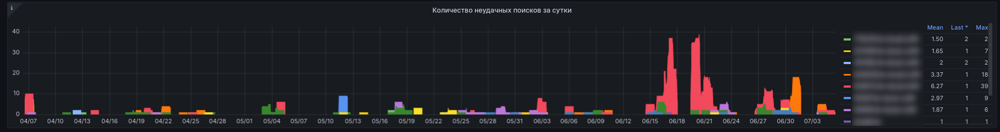

# Kodeks аналитика

Дашборд является одним из основных с точки зрения наполненности аналитической и статистической информацией. 
Данный дашборд крайне полезен менеджерам и отдела сопровождения, и отдела сбыта, так как отражает ситуацию по действующим и апробационным установкам, подконтрольным СМАРТу, по состоянию "здесь и сейчас" (с задержкой до 60 минут).
Данные для построения графиков этого дашборда берутся из отчетов sysinfo, снимаемых с подконтрольных установок каждые 55 минут.
Глубина хранения данных - 13 месяцев.

Клик по любой позиции из списка в легендах справа от графиков приведет к отображению на графике кривой, относящейся тоько к выбранной установке.
Вовзрат к отображению всех кривых осуществляется путем повторного клика по выбранной установке из списка в легенде.
Заданный временной отрезок напрямую влияет на отображаемые числовые значения.
Большое количество подконтроьных установок и/или большой заданный временной отрезок могут приводить к незначительной задержке в отображении графика. 
Причина - Grafana потребуется время, бОльшее, чем могло бы ожидаться, для отрисовки значений по заданным параметрам.

Графики этого дашборда позволяют выполнять с собой следующие манипуляции:
- изменять временной отрезок, за который необходимо отразить данные [Как это сделать](chapter-6.md#управление-временем-в-дашбордах);
- изменять отображаемые установки, данные по которым требуется проанализировать [Как это сделать](chapter-6.md#использование-grafana-для-визуализации-данных); 

Если на графиках этого дашборда видишь странные значения метрик, отрицательные значения или что-то непонятное - не стесняйся обращаться к разработчику СМАРТа за разъяснениями.

## Используемые лицензии

График отражает потребление во времени лицензий по подконтрольным установкам. 
Количественные данные отображаются на графике с задержкой не более 60 минут.

---

**Интерпретация данных с графика**

Справа от графика присутствует легенда, содеражащая список подконтрольных установок и определенные числовые показатели по ним: 
  - min - минимально зафиксированное количество использованных лицензий;
  - max - максимально зафиксированное количество использованных лицензий;
  - current - крайнее зафиксированное количество лицензий (на момент снятия крайнего отчета sysinfo).

Клик по значениям min, max, current позволяет сортировать данный список по соотвествующим значениям: "от большего к меньшему", "от меньшего к большему", "отключить сортировку".
Клик по названию установки приведет к отображению кривой на графике только касательно этой установки.
Рекомендуется комбинировать с ручным выделением временных отрезков прямо на графике. 
Цель - подробнее, "под микроскопом", изучить колебания графика за очень короткий период.
---

**Применение полученных данных с данного графика**

Применяется менеджером по сопровождения/сбыту с целью: 
  - контроля использования установки, ее востребованности;
  - прогнозирования возможного исчерпания лицензий на установке (если часто наступает момент, когда количество использованных лицензий = количество допустимых лицензий согласно рег-файлу);
  - факт использования установки в моменте;
  - наполнения регулярного отчета ЛПРу (если таковой составляется с той или иной периодичностью) объективной информацией о том, что установка востребована, когда, и с какой нагрузкой востребована.

**Советы:**
- если на графике замечено, что значение max и/или значение current часто равно количеству лицензий по регу, то это повод менеджеру по сопровождению провести переговоры по допоставке лицензий в установку, а менеджеру по сбыту - провести переговоры о том, что выбранное количество лицензий потенциально недосаточно будет при последующей коммерческой эксплуатации;
- если на графике замечено, что значение min часто равно 0, то это повод менеджеру по сопровождению провести переговоры и, возможно, дообучения с конечными пользователями установки о вовзобновлении интереса к внедренной установке, а менеджеру по сбыту - напоминть о том, что апрбационный период еще длится и необходимо как можно плотнее тестировать внедренную установку;
- если на графике замечены отрицательные значения по любому из показателей и/или пропадания подконтрольных установок (при условии, что не было сознательного отключения оных), то это повод незамедлительно сообщить об этом разработчику СМАРТа для исправления ситуации; сообщить об этом можно в индивидуальных чатах по СМАРТу или в общий чат https://t.me/+uRkrNE_SNYY0YTUy .

## Разница между используемыми лицензиями и регом

График является логическим продолжением предыдущего графика с точки зрения аналитики собранных данных.
Здесь отображается разница, длящаяся во времени между тем, сколько лицензий было использовано на установке и сколько полагается по рег-файлу.

---

**Интерпретация полученных данных с данного графика**

Справа от графика присутствует легенда, содеражащая список подконтрольных установок и определенные числовые показатели по ним:
- min - минимально зафиксированная разница (в числовом выражении) между используемыми лицензиями и регом;
- max - максимально зафиксированная разница (в числовом выражении) между используемыми лицензиями и регом;
- current - крайнее зафиксированная разница (в числовом выражении) между используемыми лицензиями и регом (на момент снятия крайнего отчета sysinfo).

Клик по значениям min, max, current позволяет сортировать данный список по соотвествующим значениям: "от большего к меньшему", "от меньшего к большему", "отключить сортировку".
Клик по названию установки приведет к отображению кривой на графике только касательно этой установки.
Рекомендуется комбинировать с ручным выделением временных отрезков прямо на графике. 
Цель - подробнее, "под микроскопом", изучить колебания графика за очень короткий период.

---

**Применение полученных данных с данного графика**

Применяется менеджером по сопровождения/сбыту с целью:
- оценки нагрузки на установку;
- оценки качества проведенного внедрения установки, как в моменте, так и с течением времени;
- прогнозирования исчерпания лицензий в ближайшей перспективе (по оценке использования в прошлом).

## Количество неудачных поисков за сутки

График отображает во времени количественные показатели пустых поисков по всем подконтрольным установкам.
График подвержен влиянию настройки временных периодов, поэтому присутствие в названии словосочетания "в сутки" - условное и просто исторически сложившееся не более.
Количество пустых поисков на каждой установке есть сумма оных по каждому пользователю этой установки, получившего за указанный период пустой поиск.
Данные для этого берутся из собираемых отчетов sysinfo.

Данный график имеет логическое продолжение в виде дашборда Поисковые запросы, где тема пустых поисков в частности и поисков в целом раскрывается более подробно.
Кроме того, информация о том, что на какой-то подконтрольной установке произошел факт пустого поиска приходит на почту ответственного за установку менеджера в виде алерта [SearchEmpty](http://smart.uniclass.ru/docs/errors/KodeksSearchIsEmpty.md).

---

**Интерпретация полученных данных с данного графика**

Справа от графика присутствует легенда, содержащая список подконтрольных установок и определенные числовые показатели по ним:
- Mean - среднее значение количества пустых поисков, вычисляемое по каждой подконтрольной установке за заданный период;
- Last - крайнее полученное ненулевое количественное значение пустых поисков по каждой подконтрольной установке;
- max - максимально зафиксированное количество пустых поисков по каждой подконтрольной установке за заданный период.

Клик по значениям Mean, Last, Max позволяет сортировать данный список по соответствующим значениям: "от большего к меньшему", "от меньшего к большему", "отключить сортировку". 
Клик по названию установки приведет к отображению кривой на графике только касательно этой установки.
Рекомендуется комбинировать с ручным выделением временных отрезков прямо на графике. 
Цель - подробнее, "под микроскопом", изучить колебания графика за очень короткий период.

---

**Применение полученных данных с данного графика**

Применяется менеджером по сопровождению/сбыту с целью:
- оценки качества подобранного комплекта;
- получения неплохого инструмента для инфоповодов к клиенту с целью допродажи комплектов, документы из которых клиент не нашел в своей установке (дополнительно использовать дашборд Поисковые запросы и/или рассылки алерта SerachEmpty в почту;
- получения инструмента с целью провести дообучение пользователя;
- оценки качества внедерния приобретенных/апробируемых комплектов, удовлетворенности клиента приобретенных;
- использования данных для отчета ЛПРу, если необходимо показать рост качества внедрения ИСС Кодекс/Техэксперта в бизнес-процессы пользователей ИСС Кодекс/Техэксперта.

## Среднее число запросов kassist за месяц

График отображает количество (в штуках) обращение к БД через сервис kassist по каждой подконтрольной установке за заданный период времени.
По каждой подконтрольной установке на графике и в легенде справа отображается суммарное количество всех запросов, сделанных с помощью сервиса kassist.
В легенде справа отображается крайнее зафиксированное значение.
На графике отображается тенденция, которая выстраивается на основе собранных значений.

