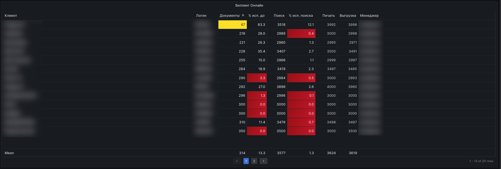
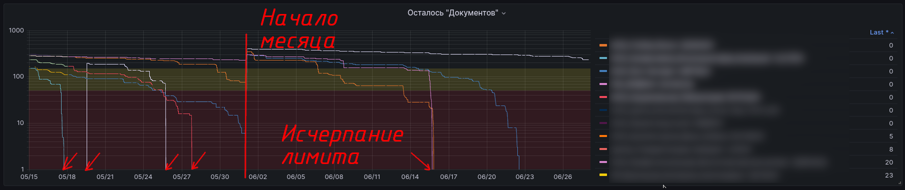

# Биллинг Онлайн

Данный дашборд по степени значимости с точки зрения получения аналитической и статистической информации ничем не уступает дашборду [Kodeks аналитика](chapter-7_2.md#kodeks-аналитика).
Его назначение - собирать и предоставлять аналитику по простым онлайн-доступам к ИСС Кодекс/Техэксперт, поставленным под контроль СМАРТ.Онлайн.

СМАРТ.Онлайн является частью СМАРТ-мониторинга и на данный момент (16.07.2023) выполняет практически тот же статистический и аналитический функционал, который выполняет СМАРТ-мониторинг.
Исходные данные для построения графиков и таблиц СМАРТ.Онлайн получает из профиля пользователя, доступ к которому предоставляется путем передачи адреса оналйн-доступа, логина и пароля к нему.

Управление данным на данном дашборде осуществляется ровно так же как, и на всех прочих. (см. [как это сделать описано вот тут](chapter-6.md)).

Для удобной навигации по графикам и таблицам этого дашборда есть оглавление:
- [Биллинг онлайн](chapter-7_3.md#биллинг-онлайн-1)
- [Осталось "Документы"](chapter-7_3.md#осталось--документы-)
- [Осталось "Поиск"](chapter-7_3.md#осталось--поиск-)
- [Осталось "Печать", "Выгрузка", графики аналитики](chapter-7_3.md#осталось--печать----выгрузка---графики-аналитики)
- [Ошибки подключения к серверам](chapter-7_3.md#ошибки-подключения-к-серверам)

## Биллинг онлайн

Данная таблица содержит в себе сводную информацию по остаточным биллингам по всем подконтрольным СМАРТу простым онлайн-доступам.

Здесь можно увидеть остатки (статистическую информацию):
- по документам (сколько еще можно открыть в рамках текущего календарного месяца по каждому онлайн-доступу конкретного клиента ИСС);
- по поиску (сколько еще поисковых запросов можно выполнить, через ПК ли, или через kassist, в рамках текущего календарного месяца по каждому онлайн-доступу конкретного клиента ИСС);
- по печати (сколько еще можно отправить на печать документов прямо из ИСС в рамках текущего календарного месяца по каждому онлайн-доступу конкретного клиента ИСС);
- по выгрузке (сколько еще можно выгрузить, т.е. сохранить на компьютер и/или из ИСС сразу открыть тот или иной документ в стороннем соответствующем приложении в рамках текущего календарного месяца по каждому онлайн-доступу конкретного клиента ИСС).

Кроме того, в этой же таблице можно увидеть некоторую аналитическую информацию:
- % исп. док - показывает в процентном выражении объем использования лимита по количеству открытых документов за календарный месяц;
- % исп. поиска - показывает в процентном выражении объем использования лимита по количеству поисковых запросов за календарный месяц.

По данным с этой таблицы также работает целая группа алертов, а именно:
- [OnlineBillingDocsLeft150](http://smart.uniclass.ru/docs/errors/OnlineBillingDocsLeft150.md)
- [OnlineBillingDocsLeft50](http://smart.uniclass.ru/docs/errors/OnlineBillingDocsLeft50.md)
- [OnlineBillingDocsLeftZero](http://smart.uniclass.ru/docs/errors/OnlineBillingDocsLeftZero.md)
- [OnlineBillingPrintLeft150](http://smart.uniclass.ru/docs/errors/OnlineBillingPrintLeft150.md)
- [OnlineBillingPrintLeft50](http://smart.uniclass.ru/docs/errors/OnlineBillingPrintLeft50.md)
- [OnlineBillingPrintLeftZero](http://smart.uniclass.ru/docs/errors/OnlineBillingPrintLeftZero.md)
- [OnlineBillingSearch150](http://smart.uniclass.ru/docs/errors/OnlineBillingSearch150.md)
- [OnlineBillingSearch50](http://smart.uniclass.ru/docs/errors/OnlineBillingSearch500.md)
- [OnlineBillingSearchLeftZero](http://smart.uniclass.ru/docs/errors/OnlineBillingSearchLeftZero.md)
- [OnlineBillingUploadLeft150](http://smart.uniclass.ru/docs/errors/OnlineBillingUploadLeft150.md)
- [OnlineBillingUploadLeft50](http://smart.uniclass.ru/docs/errors/OnlineBillingUploadLeft50.md)
- [OnlineBillingUploadLeftZero](http://smart.uniclass.ru/docs/errors/OnlineBillingUploadLeftZero.md)

Алераты сигнализируют о достижении пороговых значений в 150, 50 и 0 по показателям:
- документы;
- поиск;
- печать;
- выгрузка.

Алерты приходят в указанную почту ответственного менеджера и в телеграм-канал его же 
Такое оповещении сделано для целей оперативнейшего реагирования со стороны ответственного менеджера на сложившуюся ситуацию ДО того как об этом скажет сам клиент.

Пороговые значения выражаются в штуках.

Пороговое значение 150 трактуется как привлечение внимания. В зависимости от числа месяца, в котором наступило событие, менеджер по сопровождению/сбыту должен самостоятельно принимать решение о срочности реагирования.
Однако не рекомендуется затягивать с реакцией, в какой бы день месяца ни наступило событие.

Пороговое значение 50 трактуется как срочное вмешательство с предупреждением и переговорами с клиентом.

Особенно если при этом (совокупно или по отдельности):
- на календаре первые/десятые числа месяца;
- клиент неоднократно был замечен в тенденции к излишне быстрому исчерпанию лимита показателя.

Пороговое значение 0 трактуется как немедленное вмешательство и переговоры с клиентом по факту полного досрочного исчерпанию показателя.

Характер переговоров может зависеть от (совокупно или по отдельности, или в комбинациях):
- дня месяца;
- привычек и тенденций к исчерпанию показателя в прошлом (за дополнительной информацией смотри [вот этот график](chapter-7_3.md#осталось--документы-));
- частота случаев досрочного исчерпания в прошлом;
- уровня взаимоотношений с клиентом;
- длительности договорных отношений на предоставление онлайн-доступа;
- финансового состояния клиента;
- уровня вовлеченности (дорогой коллега, следи за анонсами, этот показатель СМАРТ будет уметь вычислять и по простым онлайн-доступам в ближайшей перспективе);
- уровня лояльности к продукту и бренду;
- и много другое аналогичное.

---
**Интерпретация полученных данных из таблицы**

Как можно видеть на картинке-примере выше - некоторые ячейки по некоторым клиентам ИСС залиты желтым и красным.
Это означает, что по выделенным цветом метрикам-ячейкам достигнуты пороговые значения.
Следовательно, по некоторым из них требуется внимание, анализ и, возможно, соответствующая реакция со стороны менеджера по сопровождению/сбыту с целью корректировки ситуации здесь и сейчас и/или на ближайшее будущее.

Принципы цветовой дифференциации ячеек указаны в таблице в конце всего дашборда.

Кроме того, коллега, все мы в подавляющем большинстве своем имеем активных онлайн-доступов явно больше чем один. И это хорошо.
Однако, таблица на одной своей "страице" может отображать данные по не более 13 подконтрольным онлайн-доступам.
И для удобного пролистывания на следующие "страницы" сделан их переключатель.
Он расположен внизу таблицы.

Помимо этого, внизу таблицы имеется строка с аналитической информацией.
Строка Mean показывает средние значения по каждому столбцу самой таблицы.
Эта информация (особенно среднее значение по столбцам "Документы", "% исп. док." и "%исп. поиска") могут быть использованы для комплексной оценки вовлеченности в целом по всем подконтрольным онлайн-доступам.

---
**Применяется менеджером по сопровождению/сбыту:**
- с целью прогнозирования и последующих переговоров с клиентом-пользователем ИСС с целью предупреждения последнего о скором исчерпании лимитов и необходимости обхода такой ситуации в ближайшем будущем;
- с целью оперативного и массового получения информация об остатках биллинга по всем подконтрольным онлайн-доступам и дальнейшего планирования будущей сбытовой работы по каждому подконтрольному онлайн-доступу;
- с целью оценки уровня вовлеченности по каждому подконтрольному онлайн-доступу и планирования дальнейшей работы исходя их выводов.

Данная таблица, как и прочие таблицы и графики этого и любого другого дашборда, подвержены влиянию назначенного временного периода, за который необходимо отражать данные.
Поэтому данную таблицу настоятельно НЕ рекомендуется применять к периоду, бОльшему чем сутки.
Причина - при периоде, бОльшем чем сутки в таблице могут быть отражены данные, которые могут привести к неверным выводам.
И виной тому не математические и/или технические проблемы работоспособности самой таблицы, а статистические погрешности.
А особенно тот факт, что длительные тенденции логично отображать на графиках, а не в таблицах.

## Осталось "Документы"

Данный график отображает процесс исчерпания показателя "Документы" по каждому подконтрольной онлайн-доступу за заданный период времени.

При выставлении определенного временного интервала рекомендуется через календарь выставлять календарные полные месяцы (т.е. с первого по последнее число), для более полной и объективной картины исчерпания данного показателя.
Или вручную выставлять более короткие периоды (несколько недель), если в том есть нужда.
Предустановленные временные интервалы могут быть не совсем удобными, так как будут отсчитывать назад от текущей даты.

---
**Интерпретация полученных данных из графика**

Слева от графика присутствует легенда к этому графику, на которой строками отображены все подконтрольные онлайн-доступы с указанием логина по каждому онлайн-доступу (так как на одного клиента-пользователя ИСС может быть заведено более чем 1 онлайн-доступ).
Там же столбец Last содержит данные по крайнему наименьшему на текущий момент зафиксированному значения для данного графика по каждому подконтрольному онлайн-доступу.

Клик по любой строчке таблицы в легенде приведет к тому, что на графике будет отображена кривая именно по этому подконтрольному онлайн-доступу.
Повторный клик вернет на график все кривые по всем подконтрольным онлайн-доступам.

---
**Применяется менеджером по сопровождению/сбыту:**
- с целью выявления тенденций к досрочному исчерпанию показателя "Документы" в короткой и средней перспективе;
- с целью планирования и сбора аргументации для сбытовых переговоров с клиентом о допродаже;
- с целью определения уровня вовлеченности;
- с целью определения факта, что клиент вообще пользуется доступом.

Алерты, работающие "в паре" с данным графиком:
- [OnlineBillingDocsLeft150](http://smart.uniclass.ru/docs/errors/OnlineBillingDocsLeft150.md)
- [OnlineBillingDocsLeft50](http://smart.uniclass.ru/docs/errors/OnlineBillingDocsLeft50.md)
- [OnlineBillingDocsLeftZero](http://smart.uniclass.ru/docs/errors/OnlineBillingDocsLeftZero.md)

## Осталось "Поиск"

Данный график отображает процесс исчерпания показателя "Поиск" по каждому подконтрольной онлайн-доступу за заданный период времени.

При выставлении определенного временного интервала рекомендуется через календарь выставлять календарные полные месяцы (т.е. с первого по последнее число), для более полной и объективной картины исчерпания данного показателя.
Или вручную выставлять более короткие периоды (несколько недель), если в том есть нужда.
Предустановленные временные интервалы могут быть не совсем удобными, так как будут отсчитывать назад от текущей даты.

---
**Интерпретация полученных данных из графика**

Слева от графика присутствует легенда к этому графику, на которой строками отображены все подконтрольные онлайн-доступы с указанием логина по каждому онлайн-доступу (так как на одного клиента-пользователя ИСС может быть заведено более чем 1 онлайн-доступ).
Там же столбец Last содержит данные по крайнему наименьшему на текущий момент зафиксированному значения для данного графика по каждому подконтрольному онлайн-доступу.

Клик по любой строчке таблицы в легенде приведет к тому, что на графике будет отображена кривая именно по этому подконтрольному онлайн-доступу.
Повторный клик вернет на график все кривые по всем подконтрольным онлайн-доступам.

---
**Применяется менеджером по сопровождению/сбыту:**
- с целью определения уровня вовлеченности;
- с целью определения факта, что клиент вообще пользуется доступом.

Алерты, работающие "в паре" с данным графиком:
- [OnlineBillingSearch150](http://smart.uniclass.ru/docs/errors/OnlineBillingSearch150.md)
- [OnlineBillingSearch50](http://smart.uniclass.ru/docs/errors/OnlineBillingSearch500.md)
- [OnlineBillingSearchLeftZero](http://smart.uniclass.ru/docs/errors/OnlineBillingSearchLeftZero.md)

## Осталось "Печать", "Выгрузка", графики аналитики

Группа графиков "Осталось "Печать"" и "Осталось "Выгрузка"" отображают процесс исчерпания показателей "Печать" и "Выгрузка", соответственно.

При выставлении определенного временного интервала рекомендуется через календарь выставлять календарные полные месяцы (т.е. с первого по последнее число), для более полной и объективной картины исчерпания данного показателя.
Или вручную выставлять более короткие периоды (несколько недель), если в том есть нужда.
Предустановленные временные интервалы могут быть не совсем удобными, так как будут отсчитывать назад от текущей даты.

---
**Интерпретация полученных данных из графика**

Слева от графика присутствует легенда к этому графику, на которой строками отображены все подконтрольные онлайн-доступы с указанием логина по каждому онлайн-доступу (так как на одного клиента-пользователя ИСС может быть заведено более чем 1 онлайн-доступ).
Там же столбец Last содержит данные по крайнему наименьшему на текущий момент зафиксированному значения для данного графика по каждому подконтрольному онлайн-доступу.

Клик по любой строчке таблицы в легенде приведет к тому, что на графике будет отображена кривая именно по этому подконтрольному онлайн-доступу.
Повторный клик вернет на график все кривые по всем подконтрольным онлайн-доступам.

---
**Применяется менеджером по сопровождению/сбыту:**
- с целью определения уровня вовлеченности;
- с целью определения факта, что клиент вообще пользуется доступом.

Алерты, работающие "в паре" с данными графиками:

- Осталось "Печать":
  - [OnlineBillingPrintLeft150](http://smart.uniclass.ru/docs/errors/OnlineBillingPrintLeft150.md)
  - [OnlineBillingPrintLeft50](http://smart.uniclass.ru/docs/errors/OnlineBillingPrintLeft50.md)
  - [OnlineBillingPrintLeftZero](http://smart.uniclass.ru/docs/errors/OnlineBillingPrintLeftZero.md)
- Осталось "Выгрузка":
  - [OnlineBillingUploadLeft150](http://smart.uniclass.ru/docs/errors/OnlineBillingUploadLeft150.md)
  - [OnlineBillingUploadLeft50](http://smart.uniclass.ru/docs/errors/OnlineBillingUploadLeft50.md)
  - [OnlineBillingUploadLeftZero](http://smart.uniclass.ru/docs/errors/OnlineBillingUploadLeftZero.md)

## Средний процент использования лимита документов по всем клиентам

Данный график отображает средний процент (единой кривой), вычисляемый на основе данных, собранных по показателю "% исп.док" (% использования лимита по документам) по всем подконтрольным онлайн-доступам за заданный период времени.

---
**Интерпретация полученных данных из графика**

Слева от графика присутствует легенда, в которой фиксируется в столбце Last крайнее зафиксированное значение данного показателя за заданный период времени.

Поскольку Стандартом сопровождения такой показатель не нормирован - он может быть нормирован локально у каждого дистрибьютора.
Ну или не нормирован.

---
**Применяется менеджером по сопровождению/сбыту:**
- с целью выявления картины в целом по всем подконтрольным онлайн-доступам в вопросе общей удовлетворенности, вовлеченности;
- если данный показатель локально нормирован, то график поможет отслеживать, удерживать и повышать данный показатель, если в том есть нужда.

## Средний процент использования лимита документов по всем клиентам менеджера

Данный график отображает средний процент по каждому менеджеру (их может быть больше чем один), вычисляемый на основе данных, собранных по показателю "% исп.док" (% использования лимита по документам) по всем подконтрольным онлайн-доступам КАЖДОГО МЕНЕДЖЕРА за заданный период времени.

---
**Интерпретация полученных данных из графика**

Слева от графика присутствует легенда, в которой фиксируется в столбце Last крайнее зафиксированное значение данного показателя за заданный период времени.

Данный параметр нормирован Стандартом сопровождения - должен быть не менее 15%, что и отражено на графике в виде границы.
Пересечение данной границы каждым менеджером в рамках месяца косвенно означает хорошую результативность работы каждого такого менеджера.

---
**Применяется менеджером по сопровождению/сбыту:**
- с целью самоконтроля, как объективная оценка приложенных усилий в работе с клиентами;
- с целью контроля повышения и дотягивания данного показателя до приемлемого уровня в случае, если граница к контрольному сроку еще не преодолена.

## Ошибки подключения к серверам

В таблице "Проблема с получением статистики" фиксируются все возникающие ошибки, препятствовавшие корректной работе СМАРТа с подконтрольными онлайн-доступами.

Расшифровка зафиксированных ошибок дается ниже, в следующей таблице "Варианты ошибок".

---
**Интерпретация полученных данных из группы таблиц**

Если таблица "Проблема с получением статистики" не содержит никаких данных - это ее нормальное состояние.
Оно означает, что не было зафиксировано ни одной ошибки, препятствовавшей работе Смарт.Онлайн.

---
**Применяется менеджером по сопровождению/сбыту:**
- сбора и анализа всех возникших ошибок с целью их устранения здесь и сейчас, а также недопущения в будущем, чтобы ошибки снова случались
- хранения такой информации с целью последующего использования ее в переговорах с клиентом, если в такой информации возникает нужда.

P.S. ВАУ! Ты дочитал до конца и эту главу, посвященную дашборду "Биллинг Онлайн"!

Здесь, конечно, не так насыщенно, как с дашбордом ["Kodeks аналитика"](chapter-7_2.md), но все равно - немало полезной информации.

Но ты и здесь справился! МОЛОДЕЦ!

Теперь ты можешь смело:
- нырять [дальше](chapter-7_4.md) в информационные глубины СМАРТа; 
- вернуться [назад](chapter-7_3.md#биллинг-онлайн);
- вернуться совсем к [началу](chapter-7.md#дашборды), чтобы выборочно перейти к другому подразделу;
- вернуться в [Оглавление](Readme.md).