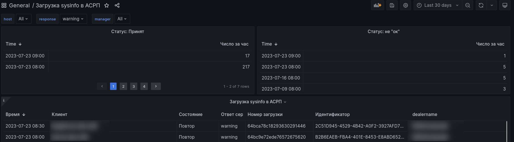

# Загрузка Sysinfo в АСРП

## Назначение

Данный дашбор позволяет визуализировать статус выгрузки данных в систему построению отчётности "АСРП". 

## Статус: Принят

Отображает количество файлов sysinfo которые были успешно отправлены и были приняты в обработку системой "АСРП" в течении часа. У крупных инсталляциях или
перегруженным "АСРП" делает это не всегда быстро. Позволяет оценить все ли выгрузки с клиентов были выгружены на обработку

## Cтатус: Не "ок"

Показывает количество файлов sysinfo которые не были приняты системой "АСРП" в обработку в течении часа. Позволяет быстро оценить маштаб проблемы.

## Загрузка sysinfo в АСРП

Показывает статус выгрузки файлов на обработку. Важным является колонка "Ответ сервера". Значения в ней могут быть нескольких видов:

- ок - выгрузка принята в обработку.
- warinig - что то пошло не так и файл который имеется в SMART не был принят в обработку

Для оценки причины есть колонка "Состояние" с которой отображается статус загрузки:

- Принят - файл встал в очередь на обработку
- Повтор - файл который пытается быть загружен УЖЕ имеется в АСРП:
  -  СМАРТ в течении недели не смог получить актуальную выгрузку
  -  скрипты "smartupload" не работают должным образом
  -  ПК, с которого забирается выгрузка с помощью "smartupload" не работает
  -  неправильные настройки авторизаци у ПК
  -  другое

## Фильтры

В верхней части есть переключатель "response" - у него есть состояния:
- ОК
- Warning

Позволяет быстро фильтровать по успешным\неуспешным выгрузкам и понять какие клиенты требуют внимания.

Типовые фильтры по клиенту и менеджеру.

