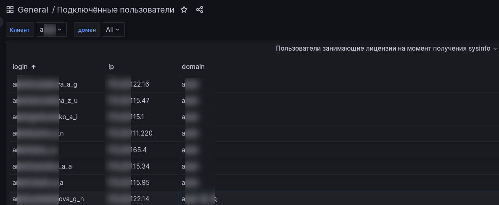

# Подключенные пользователи

## Назначение

Отображает список пользователей которые были подключены к ПК в момент получения sysinfo и **занимали лицензию**.
Позволяет оценить кто был подключен к ПК в текущий момент, без необходимости подключаться через удалённый доступ
к установкам в закрытом контуре.

В верхней части переключатель в котором можно выбрать клиента. 

В колонке "login" отображается имя пользователя, под которой он подключается к ПК.

В колонке "IP" отображается IP с которого пользователь подключался к ПК. Если установка доступна через интернет или "ТЕ.Облако"
то IP может быть один для всех пользователей.

В колонке "domain" отображается домен в ActiveDirectory.
