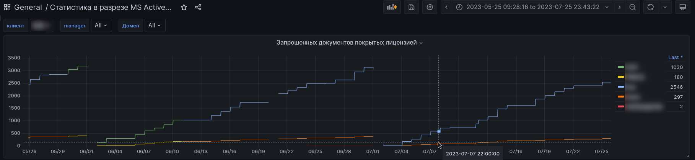
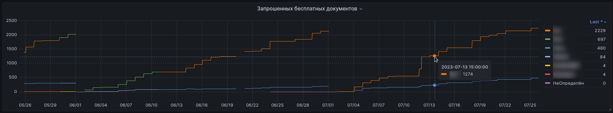
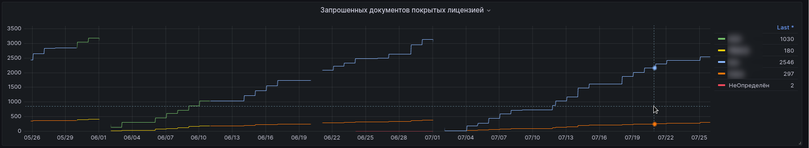
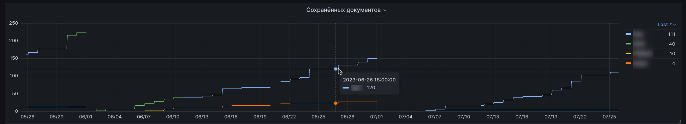
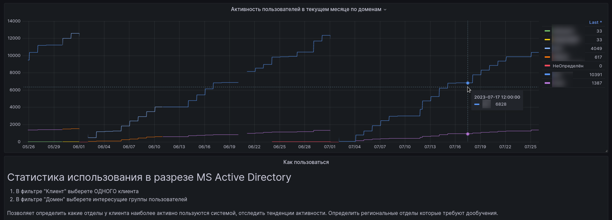

# Статистика в разрезе Active Directory

## Предназначение

Отслеживать аналитику по группам в ActiveDirectory в крупных установках. Обычно осуществляется разделение
пользователей по группам (отделам) внутри компании. 

В верхней части отображаются фильтр "Домен" где можно выбрать группу или группы для анализа. 

## Позволяет отследить:

- динамику использования ПК по основным параметрам (запросы к БД, сохранённые документы, наспечатанные и тд) в разрезе отделов\групп клиента
- оценить вклад каждого из отделов\группы на количество занятых лицензий
- **УВИДЕТЬ ОТДЕЛЫ КОТОРЫЕ ПОЛЬЗУЮТСЯ ПК, НО С КОТОРЫМИ НЕ ПРОВОДИЛОСЬ ОБУЧЕНИЕ ИЛИ ИХ НЕ УЧИТЫВАЛИ ПРИ ВНЕДРЕНИИ И ДЛЯ КОТОРЫХ ПОТРЕБУЮТСЯ НОВЫЕ КОМПЛЕКТЫ БАЗ
  (что автоматически увеличивает КМ).**
- увидеть **региональные филиалы** которые могут стать **точками роста** количеста требуемых лицензий или **дополнительных комплектов**.
- увидеть вклад каждого отдела в занятые лицензии и в переговорах иметь аргументацию, если у клиента разные подразделения имеют свой бюджет на внедрение

